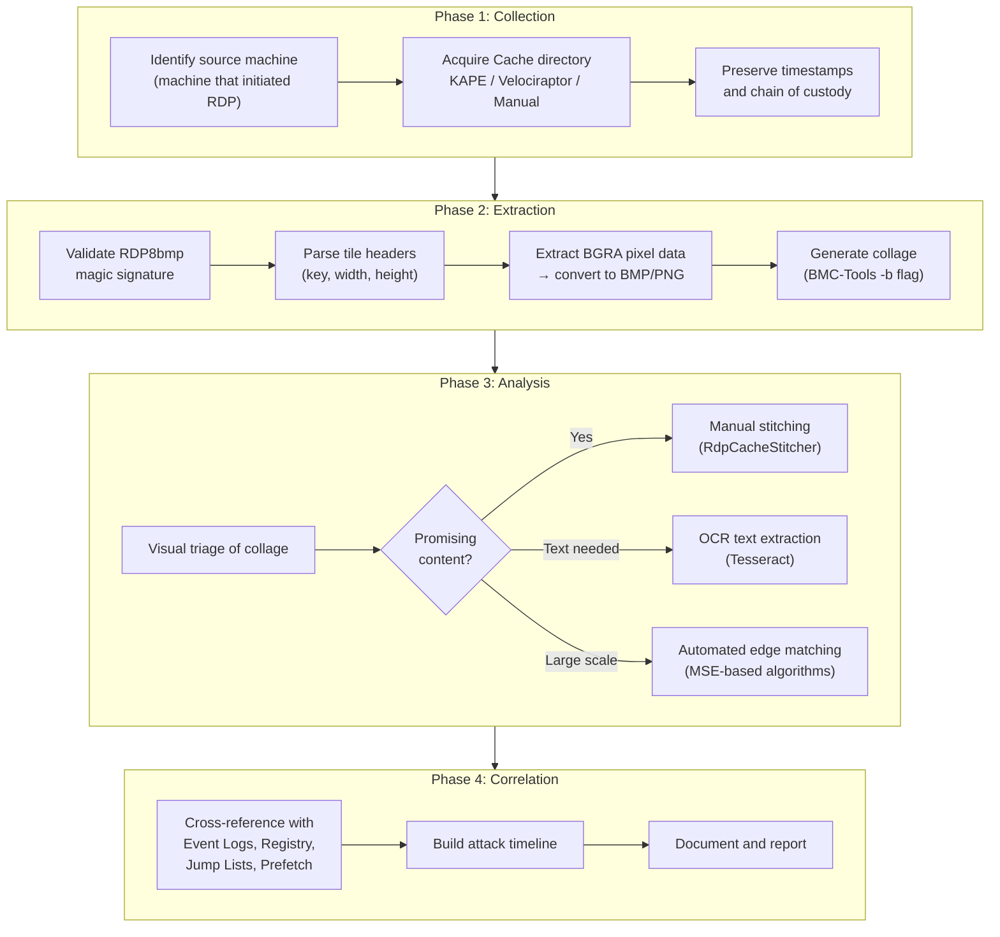

Every pixel an attacker sees during a remote desktop session can become evidence — even when they think they've covered their tracks. Welcome to the definitive guide on **RDP Bitmap Cache Forensics**.

---

## 1. Introduction: The Hidden Goldmine

In most incident response engagements involving lateral movement, the investigation begins and ends with event logs, registry keys, and network telemetry. But there's a forensic artifact hiding in plain sight on every Windows machine that has ever initiated an RDP connection — **the persistent bitmap cache**.

This cache is a local, on-disk archive of **every graphical element** the RDP client rendered during remote sessions. Icons, window borders, file names in Explorer, commands typed into terminals, login screens, even sensitive documents — all fragmented into 64×64 pixel tiles and silently written to disk.

**The forensic power of this artifact:**
- It exists on the **client/source machine**, not the server — resilient to server-side log clearing
- It **persists across reboots** and session disconnections
- It's **enabled by default** on all modern Windows systems
- It provides **visual evidence** that is immediately understandable to non-technical stakeholders

The challenge? These tiles are stored in a proprietary binary format, out of order, and fragmented like a jigsaw puzzle with no box cover. This guide will take you from zero to expert — from the raw bytes on disk to reconstructed visual evidence.

---

## 2. Under the Hood: How RDP Bitmap Caching Actually Works

### 2.1 The RDP Graphics Pipeline

When you connect to a remote machine via RDP (`mstsc.exe`), the server-side **Graphics Device Interface (GDI)** renders the desktop into a framebuffer. Instead of streaming the entire framebuffer as video (which would require enormous bandwidth), the RDP protocol — specifically the **[MS-RDPBCGR]** specification (*Remote Desktop Protocol: Basic Connectivity and Graphics Remoting*) — implements a **tile-based differential update system**.

Here's how it works at the protocol level:

```
┌─────────────────────────────────────────────────────────────────────────┐
│                    RDP BITMAP CACHING LIFECYCLE                         │
├─────────────────────────────────────────────────────────────────────────┤
│                                                                         │
│  ┌──────────────────┐            ┌──────────────────┐                   │
│  │   RDP SERVER      │            │   RDP CLIENT      │                  │
│  │   (Target Host)   │            │   (Source Host)    │                  │
│  └────────┬─────────┘            └────────┬─────────┘                   │
│           │                               │                              │
│  1. GDI renders screen                    │                              │
│  2. Divide into 64×64 tiles              │                              │
│  3. Compute 64-bit hash                  │                              │
│     (persistent key) per tile            │                              │
│           │                               │                              │
│           │──── "Do you have key           │                              │
│           │      0xA3F7B2C1...?" ────────▶│                              │
│           │                               │                              │
│           │                    4. Client checks local cache              │
│           │                               │                              │
│           │◀── CACHE HIT ────────────────│  → Render from local cache   │
│           │    (no data sent)             │     (zero bandwidth cost)     │
│           │                               │                              │
│           │◀── CACHE MISS ───────────────│                               │
│           │                               │                              │
│  5. Transmit full bitmap data            │                              │
│     via Cache Bitmap (Rev2) SDO ────────▶│                              │
│           │                               │                              │
│           │                    6. Client stores tile on disk             │
│           │                       with persistent key                    │
│           │                       in Cache####.bin                       │
│           │                               │                              │
│           │                    7. Client renders tile on screen          │
│           │                               │                              │
│           │         ┌─────────────────────┘                              │
│           │         │                                                    │
│           │         ▼                                                    │
│           │    ┌──────────────────────────────────┐                      │
│           │    │      LOCAL DISK CACHE             │                     │
│           │    │  %LOCALAPPDATA%\Microsoft\        │                     │
│           │    │  Terminal Server Client\Cache\    │                     │
│           │    │                                    │                     │
│           │    │  Cache0000.bin                     │                    │
│           │    │  Cache0001.bin                     │                    │
│           │    │  ...                               │                    │
│           │    │                                    │                     │
│           │    │  ┌────┬────┬────┬────┐            │                     │
│           │    │  │Tile│Tile│Tile│Tile│ ← 64×64px  │                     │
│           │    │  │ #1 │ #2 │ #3 │ #4 │   BGRA     │                    │
│           │    │  └────┴────┴────┴────┘            │                     │
│           │    └──────────────────────────────────┘                      │
│           │                               │                              │
│           │                    8. On next session:                        │
│           │                       Persistent Key List PDU               │
│           │                       sent to server listing                │
│           │                       all cached keys                        │
│           │                               │                              │
│           │◀── Client sends cached ───────│                              │
│           │    key inventory              │                              │
│           │                               │                              │
│  9. Server skips retransmitting           │                              │
│     any tiles already cached             │                              │
│                                                                         │
└─────────────────────────────────────────────────────────────────────────┘
```

### 2.2 The MS-RDPBCGR Specification

The protocol mechanics are defined in Microsoft's **[MS-RDPBCGR]** open specification. The key structures involved are:

| Protocol Element | Specification | Role |
|:---|:---|:---|
| **Persistent Key List PDU** | [MS-RDPBCGR] §2.2.1.17 | Client → Server: "Here are the 64-bit keys of tiles I already have cached" |
| **Cache Bitmap (Rev2) SDO** | [MS-RDPEGDI] §2.2.2.2.1.2.3 | Server → Client: "Here's new bitmap data to cache" — includes the persistent key and raw pixels |
| **Bitmap Cache Capability Set** | [MS-RDPBCGR] §2.2.7.1.4 | Negotiated during connection setup — defines cache cell counts, max tile sizes, and whether persistent caching is supported |

The **Persistent Key** is a 64-bit value derived from a cryptographic hash of the bitmap content. This key is what allows the server and client to efficiently determine whether a tile needs retransmission — it's also what we find in the binary cache files on disk.

### 2.3 Storage Path

| Windows Version | Path |
|:---|:---|
| **Windows 7 / 8 / 10 / 11 / Server 2008+** | `%LOCALAPPDATA%\Microsoft\Terminal Server Client\Cache\` |
| **Windows XP and earlier** | `%USERPROFILE%\Local Settings\Application Data\Microsoft\Terminal Server Client\Cache\` |

Fully expanded:
```
C:\Users\<username>\AppData\Local\Microsoft\Terminal Server Client\Cache\
```

---

## 3. The Anatomy of a Cache File: Byte-Level Deep Dive

This is where we stop talking about concepts and start reading bytes.

### 3.1 Legacy Format: `.bmc` Files (Pre-Windows 7)

On Windows XP-era systems, the cache used the **BMC** (Bitmap Cache) format. Each file is dedicated to a specific color depth:

| Filename | Color Depth | Bits Per Pixel | Colors |
|:---|:---|:---|:---|
| `bcache2.bmc` | 8 BPP | 8 | 256 (palette-indexed) |
| `bcache22.bmc` | 16 BPP | 16 | 65,536 (High Color) |
| `bcache24.bmc` | 24 BPP | 24 | 16,777,216 (True Color) |

The `.bmc` format uses a simpler internal structure where tiles are stored sequentially with minimal metadata. Modern tools like BMC-Tools still support this format, but you'll mainly encounter it in legacy forensic images.

### 3.2 Modern Format: `.bin` Files (Windows 7+)

Starting with Windows 7, Microsoft introduced the `Cache####.bin` format. This is what you'll encounter in 99% of modern investigations.

#### File Naming Convention

| Filename | Purpose |
|:---|:---|
| `Cache0000.bin` | Primary cache container |
| `Cache0001.bin` | Additional cache data (overflow or separate session) |
| `Cache0002.bin` – `Cache0005.bin` | Created as needed for larger cache volumes |

#### Container Header: The `RDP8bmp` Magic Signature

Every `.bin` file starts with a **12-byte container header**:

```
Offset   Hex                          ASCII       Field
──────   ──────────────────────────   ─────────   ───────────────────────
0x00     52 44 50 38 62 6D 70 00     RDP8bmp.    Signature (8 bytes)
0x08     01 00 00 00                  ....        Version (4 bytes, LE)
```

**Breakdown:**

| Offset | Size | Field | Value | Description |
|:---|:---|:---|:---|:---|
| `0x00` | 8 bytes | **Signature** | `RDP8bmp\0` | ASCII magic bytes + null terminator. **This is the forensic fingerprint** — search for hex `52 44 50 38 62 6D 70 00` to identify cache files, even in unallocated space or carved data. |
| `0x08` | 4 bytes | **Version** | `0x00000001` | Container format version (little-endian DWORD) |

#### Individual Tile Entries

Immediately after the 12-byte container header (at offset `0x0C`), the tile entries begin. Each tile has its own **12-byte tile header** followed by raw bitmap data:

```
Offset   Hex                          Field
──────   ──────────────────────────   ───────────────────────
0x0C     XX XX XX XX XX XX XX XX     Persistent Key (8 bytes)
0x14     40 00                        Width = 64 pixels (LE uint16)
0x16     40 00                        Height = 64 pixels (LE uint16)
0x18     [16,384 bytes of pixels]     Raw BGRA bitmap data
         ...
0x4018   [Next tile header begins]    Next entry
```

**Tile Header Breakdown:**

| Offset (relative) | Size | Field | Typical Value | Description |
|:---|:---|:---|:---|:---|
| `+0x00` | 8 bytes | **Persistent Key** | Varies | 64-bit cryptographic hash of the bitmap content — uniquely identifies this tile |
| `+0x08` | 2 bytes | **Width** | `0x0040` (64) | Width in pixels (little-endian uint16) |
| `+0x0A` | 2 bytes | **Height** | `0x0040` (64) | Height in pixels (little-endian uint16) |

#### Raw Pixel Data: BGRA Color Space

The pixel data immediately follows the 12-byte tile header. Each pixel is **4 bytes** in **BGRA** order (not RGBA!):

```
Byte 0: Blue   (0x00–0xFF)
Byte 1: Green  (0x00–0xFF)
Byte 2: Red    (0x00–0xFF)
Byte 3: Alpha  (0x00–0xFF, typically 0xFF = fully opaque)
```

For a standard 64×64 tile at 32 BPP:
```
Tile data size = 64 × 64 × 4 = 16,384 bytes (0x4000)
Total entry size = 12 (header) + 16,384 (pixels) = 16,396 bytes
```

> **Critical for Tool Developers:** If you're writing a custom parser and your output images have a blue/red color swap, you're treating BGRA data as RGBA. Always swap the B and R channels during conversion.
{: .prompt-warning }

#### Full File Layout Visual

```
┌─────────────────────────────────────────────────────┐
│              Cache0000.bin File Layout               │
├─────────────────────────────────────────────────────┤
│                                                     │
│  ┌───────────────────────────────────────────────┐  │
│  │ Container Header (12 bytes)                   │  │
│  │  Magic: "RDP8bmp\0"  (52 44 50 38 62 6D 70 00│) │
│  │  Version: 0x00000001                          │  │
│  └───────────────────────────────────────────────┘  │
│                                                     │
│  ┌───────────────────────────────────────────────┐  │
│  │ Tile Entry #0                                 │  │
│  │  Persistent Key: 0xA3F7B2C1DE4589AB [8 bytes] │  │
│  │  Width:  64  (0x0040)              [2 bytes]  │  │
│  │  Height: 64  (0x0040)              [2 bytes]  │  │
│  │  Pixel Data: 16,384 bytes BGRA               │  │
│  └───────────────────────────────────────────────┘  │
│                                                     │
│  ┌───────────────────────────────────────────────┐  │
│  │ Tile Entry #1                                 │  │
│  │  Persistent Key: 0x1122334455667788 [8 bytes] │  │
│  │  Width:  64  (0x0040)              [2 bytes]  │  │
│  │  Height: 64  (0x0040)              [2 bytes]  │  │
│  │  Pixel Data: 16,384 bytes BGRA               │  │
│  └───────────────────────────────────────────────┘  │
│                                                     │
│  ... (hundreds to thousands of tile entries) ...    │
│                                                     │
│  ┌───────────────────────────────────────────────┐  │
│  │ Tile Entry #N                                 │  │
│  │  ...                                          │  │
│  └───────────────────────────────────────────────┘  │
│                                                     │
└─────────────────────────────────────────────────────┘
```

---

## 4. Hunting the Magic: Code Snippets for the Practitioner

### 4.1 Detecting RDP Cache Files — The `RDP8bmp` Signature

Use this Python snippet to scan a disk image or directory for `RDP8bmp` magic headers — useful for file carving from unallocated space:

```python
#!/usr/bin/env python3
"""
RDP8bmp Magic Header Scanner
Scans a binary file (raw disk, dd image, or .bin file) for the
RDP bitmap cache signature: 52 44 50 38 62 6D 70 00
"""
import sys

MAGIC = b'RDP8bmp\x00'

def scan_for_rdp_cache(filepath):
    """Scan a file for RDP8bmp magic signatures."""
    hits = []
    with open(filepath, 'rb') as f:
        data = f.read()

    offset = 0
    while True:
        pos = data.find(MAGIC, offset)
        if pos == -1:
            break
        # Read the version DWORD (4 bytes after signature)
        version = int.from_bytes(data[pos+8:pos+12], 'little')
        hits.append((pos, version))
        print(f"[+] RDP8bmp signature at offset 0x{pos:08X} "
              f"(version: {version})")
        offset = pos + 1

    print(f"\n[*] Total signatures found: {len(hits)}")
    return hits

if __name__ == '__main__':
    if len(sys.argv) != 2:
        print(f"Usage: {sys.argv[0]} <file_to_scan>")
        sys.exit(1)
    scan_for_rdp_cache(sys.argv[1])
```

### 4.2 Extracting Tiles: Raw Bytes to Viewable Pixels

This script parses a `Cache####.bin` file, extracts every tile, converts from BGRA to RGB, and saves as PNG:

```python
#!/usr/bin/env python3
"""
RDP Cache Tile Extractor
Parses Cache####.bin files and extracts tiles as PNG images.
Handles BGRA → RGB color space conversion.
"""
import struct
import os
from PIL import Image   # pip install Pillow

MAGIC = b'RDP8bmp\x00'
CONTAINER_HEADER_SIZE = 12
TILE_HEADER_SIZE = 12

def extract_tiles(cache_path, output_dir):
    """Extract all tiles from a Cache####.bin file."""
    os.makedirs(output_dir, exist_ok=True)

    with open(cache_path, 'rb') as f:
        data = f.read()

    # Validate magic signature
    if data[:8] != MAGIC:
        print(f"[-] Not an RDP cache file: {cache_path}")
        return

    version = struct.unpack_from('<I', data, 8)[0]
    print(f"[+] RDP8bmp v{version} — File size: {len(data):,} bytes")

    offset = CONTAINER_HEADER_SIZE
    tile_count = 0

    while offset + TILE_HEADER_SIZE <= len(data):
        # Parse tile header (12 bytes)
        key = struct.unpack_from('<Q', data, offset)[0]
        width = struct.unpack_from('<H', data, offset + 8)[0]
        height = struct.unpack_from('<H', data, offset + 10)[0]

        # Sanity check dimensions
        if width == 0 or height == 0 or width > 256 or height > 256:
            break

        pixel_data_size = width * height * 4  # 4 bytes per pixel (BGRA)

        if offset + TILE_HEADER_SIZE + pixel_data_size > len(data):
            break  # Incomplete tile at end of file

        # Extract raw BGRA pixel data
        pixel_start = offset + TILE_HEADER_SIZE
        raw_pixels = data[pixel_start:pixel_start + pixel_data_size]

        # Convert BGRA → RGBA for PIL
        img = Image.frombytes('RGBA', (width, height), raw_pixels,
                              'raw', 'BGRA')

        # Save as PNG
        out_path = os.path.join(
            output_dir,
            f"tile_{tile_count:05d}_key_{key:016X}_{width}x{height}.png"
        )
        img.save(out_path)
        tile_count += 1

        # Advance to next tile entry
        offset += TILE_HEADER_SIZE + pixel_data_size

    print(f"[+] Extracted {tile_count} tiles to {output_dir}")

if __name__ == '__main__':
    import sys
    if len(sys.argv) != 3:
        print(f"Usage: {sys.argv[0]} <cache_file.bin> <output_dir>")
        sys.exit(1)
    extract_tiles(sys.argv[1], sys.argv[2])
```

### 4.3 Quick Hex Analysis with PowerShell

For a fast triage directly on a suspect machine:

```powershell
# Check if RDP cache files exist and show their sizes
$cachePath = "$env:LOCALAPPDATA\Microsoft\Terminal Server Client\Cache"
if (Test-Path $cachePath) {
    Get-ChildItem $cachePath | Format-Table Name, Length, LastWriteTime -AutoSize

    # Validate magic header of each .bin file
    Get-ChildItem "$cachePath\*.bin" | ForEach-Object {
        $bytes = [System.IO.File]::ReadAllBytes($_.FullName)
        $magic = [System.Text.Encoding]::ASCII.GetString($bytes[0..6])
        $tileCount = [math]::Floor(($bytes.Length - 12) / (12 + 16384))
        Write-Host "[+] $($_.Name): Magic='$magic' " `
                   "EstimatedTiles=~$tileCount Size=$($_.Length) bytes"
    }
} else {
    Write-Host "[-] No RDP cache directory found"
}
```

---

## 5. The Forensic Pipeline: Step-by-Step Extraction



### Phase 1: Collection

Acquire cache files using triage tools. Always preserve file system timestamps.

| Tool | Command / Method | Best For |
|:---|:---|:---|
| **KAPE** | `kape.exe --tsource C: --tdest D:\out --target RemoteDesktopCacheFiles` | Automated artifact triage |
| **Velociraptor** | `Windows.Applications.RDPCache` artifact | Remote fleet-wide collection |
| **Manual Copy** | `robocopy` with `/COPY:DATSOU` flag | Preserving timestamps |
| **Forensic Image** | Mount with Arsenal Image Mounter or FTK Imager | Full disk analysis |

### Phase 2: Extraction with BMC-Tools

```bash
# Clone the tool
git clone https://github.com/ANSSI-FR/bmc-tools.git && cd bmc-tools

# === Single file extraction ===
python bmc-tools.py -s Cache0001.bin -d ./tiles/

# === Full directory + collage (recommended) ===
python bmc-tools.py -s /path/to/Cache/ -d ./tiles/ -b

# === Custom collage width (tiles per row) ===
python bmc-tools.py -s /path/to/Cache/ -d ./tiles/ -b -w 50

# === KAPE-compatible output format ===
python bmc-tools.py -s /path/to/Cache/ -d ./tiles/ -b -k
```

**BMC-Tools internals — what happens under the hood:**
1. Reads the 12-byte container header, validates `RDP8bmp\0` signature
2. Iterates through tile entries, parsing 12-byte tile headers
3. Reads `width × height × 4` bytes of raw BGRA pixel data per tile
4. Writes each tile as a `.bmp` file (BMP format uses BGRA natively, no color swap needed)
5. If `-b` flag: composites all tiles into a single large BMP collage

### Phase 3: Reconstruction

#### Option A: RdpCacheStitcher (Manual — Highest Quality)

1. Download from [GitHub - BSI-Bund/RdpCacheStitcher](https://github.com/BSI-Bund/RdpCacheStitcher)
2. Launch the GUI → **New Case** → Import tiles directory
3. Set canvas to target resolution (e.g., 1920×1080)
4. Drag tiles onto the canvas — the heuristic engine suggests placements
5. Export reconstructed screenshots

#### Option B: OCR for Text Recovery at Scale

```bash
# Install Tesseract
sudo apt install tesseract-ocr   # Linux
# or: choco install tesseract     # Windows

# OCR on the full collage
tesseract collage.bmp - | tee extracted_text.txt

# Batch process tiles + search for IOCs
for f in tiles/*.bmp; do
    tesseract "$f" stdout 2>/dev/null
done | grep -iE "mimikatz|psexec|cobalt|password|admin|cmd\.exe" \
     | tee ioc_hits.txt
```

#### Option C: Automated Edge Matching (Advanced)

For large-scale investigations with thousands of tiles, you can use MSE-based edge matching to programmatically identify adjacent tiles:

```python
"""
Edge Matching via Mean Squared Error (MSE)
Compares the edge pixels of two tiles to determine adjacency.
Lower MSE = higher probability of being neighbors.
"""
import numpy as np
from PIL import Image

def get_edges(img_array):
    """Extract the 4 edges of a tile as 1D pixel arrays."""
    return {
        'top':    img_array[0, :, :],        # First row
        'bottom': img_array[-1, :, :],       # Last row
        'left':   img_array[:, 0, :],        # First column
        'right':  img_array[:, -1, :],       # Last column
    }

def mse(edge_a, edge_b):
    """Calculate Mean Squared Error between two edge arrays."""
    return np.mean((edge_a.astype(float) - edge_b.astype(float)) ** 2)

def find_right_neighbor(tile_path, candidate_paths, threshold=100):
    """Find the best right-neighbor for a given tile."""
    tile = np.array(Image.open(tile_path))
    right_edge = get_edges(tile)['right']

    best_match = None
    best_score = float('inf')

    for candidate in candidate_paths:
        cand = np.array(Image.open(candidate))
        left_edge = get_edges(cand)['left']

        score = mse(right_edge, left_edge)
        if score < best_score:
            best_score = score
            best_match = candidate

    if best_score < threshold:
        return best_match, best_score
    return None, best_score
```

---

## 6. The Tooling Landscape

| Tool | Developer | Input Formats | Key Features | Limitations | License | Platform |
|:---|:---|:---|:---|:---|:---|:---|
| **[BMC-Tools](https://github.com/ANSSI-FR/bmc-tools)** | ANSSI (France) | `.bmc`, `.bin` | Tile extraction, collage generation, KAPE compatibility | No reconstruction / stitching capability | Open Source | Python (cross-platform) |
| **[RdpCacheStitcher](https://github.com/BSI-Bund/RdpCacheStitcher)** | BSI (Germany) | BMP tiles (from BMC-Tools) | GUI workspace, heuristic placement engine, edge matching | Windows-only, manual process, no batch automation | Open Source | Windows (Qt) |
| **[RDPieces](https://github.com/brimorlabs/rdpieces)** | BriMor Labs | `.bmc`, `.bin` | Automated screenshot reconstruction attempt | Perl-based, limited accuracy, aging codebase | Open Source | Perl (cross-platform) |
| **Custom Python Parser** | You (see §4.2) | `.bin` | Full control, BGRA handling, integration with ML pipelines | Requires development effort | N/A | Python |
| **[KAPE](https://www.kroll.com/en/insights/publications/cyber/kroll-artifact-parser-extractor-kape)** | Eric Zimmerman | N/A (collector) | Automated collection of cache files + integration with BMC-Tools as module | Collection only, no analysis | Free (closed) | Windows |
| **[Velociraptor](https://github.com/Velocidex/velociraptor)** | Rapid7 | N/A (collector) | Remote fleet-wide cache collection via VQL | Collection only, no analysis | Open Source | Cross-platform |
| **[Tesseract OCR](https://github.com/tesseract-ocr/tesseract)** | Google | BMP/PNG images | Text extraction from tile images for IOC hunting | Not designed for small tiles; accuracy varies with font/resolution | Open Source | Cross-platform |

### Where the Industry Falls Short

The current tooling ecosystem has significant gaps:

1. **No fully automated reconstruction** — Every tool requires manual intervention for meaningful stitching
2. **No temporal correlation** — Tools don't correlate tile creation timestamps with the sessions they belong to
3. **No ML-based matching** — Production tools still rely on simple heuristics rather than deep learning for tile assembly
4. **No cross-session differentiation** — If multiple RDP sessions used the same machine, there's no built-in way to separate tiles by session

These gaps represent an opportunity for future tool development and research.

---

## 7. Advanced Concepts: Beyond Basic Extraction

### 7.1 Strip Detection

An RDP screen update often covers a **horizontal strip** of the display — for example, when a window title bar redraws. This means tiles from the same strip tend to be **sequentially adjacent in the cache file**.

**Forensic implication:** Tiles stored consecutively in the `.bin` file often belong to the **same horizontal row** on the original screen. By preserving extraction order and arranging tiles in file-offset order rather than random order, you can sometimes reconstruct partial strips without any stitching algorithm.

```
Cache File Order:    [Tile 47] [Tile 48] [Tile 49] [Tile 50] [Tile 51]
                         ↓         ↓         ↓         ↓         ↓
Screen Position:     ┌────────────────────────────────────────────────┐
                     │ [47] [48] [49] [50] [51]    ← One strip!     │
                     │                                                │
                     │  (These tiles were part of the same            │
                     │   screen update and cached together)           │
                     └────────────────────────────────────────────────┘
```

### 7.2 Temporal Grouping

The file system `LastWriteTime` of a cache `.bin` file tells you when the last tile was written — but not when individual tiles were created. However, you can exploit these facts:

1. **Tile ordering within a file maps roughly to chronological order** — newer tiles are appended at higher offsets (until the cache wraps)
2. **Cache file creation/modification timestamps** can be correlated with RDP Event Log entries (EID 1024, 1149, 4624 Type 10) to **associate tiles with specific sessions**
3. By grouping tiles by their approximate file offset ranges and matching those to event log timestamps, you can **separate tiles from different sessions**

### 7.3 Edge Matching via MSE

**Mean Squared Error (MSE)** measures the average squared difference between corresponding pixels of two edge arrays. For edge matching:

```
MSE = (1/N) × Σ(pixel_A[i] - pixel_B[i])²
```

Where:
- **N** = number of edge pixels (64 pixels × 3 color channels = 192 values for an RGB edge)
- **Lower MSE = better match** (the two edges are more visually similar)

**Thresholding strategy:**
- `MSE < 50` → Very high confidence match (likely adjacent)
- `MSE 50–200` → Moderate confidence (worth visual verification)
- `MSE > 200` → Unlikely to be adjacent

**Limitations of MSE:**
- Tiles with solid-color edges (e.g., white backgrounds) will match falsely with many tiles
- Window borders create repetitive patterns that cause ambiguous matches
- Text tiles with similar fonts produce high false-positive rates

**More advanced approaches** use:
- **Structural Similarity Index (SSIM)** — perceptual similarity metric
- **Feature-based matching** — SIFT/SURF descriptors on larger tile regions
- **Deep learning** — CNN-based embeddings for tile similarity scoring

### 7.4 File-Order to Screen-Order Mapping

A key insight for automated reconstruction:

```
File Order ≠ Screen Order

But: Within a single screen update (SDO batch),
     tiles are often written LEFT→RIGHT, TOP→BOTTOM

Strategy:
┌─────────────────────────────────────────────────┐
│ 1. Extract tiles preserving file offset order   │
│ 2. Identify "runs" — consecutive tiles with     │
│    similar background colors/patterns            │
│ 3. Arrange each run as a horizontal strip       │
│ 4. Stack strips vertically                       │
│ 5. Use edge matching to refine placement        │
└─────────────────────────────────────────────────┘
```

---

## 8. The Complete RDP Artifact Ecosystem

### Source Machine (Client) Artifacts

| Artifact | Location / Key | What It Reveals |
|:---|:---|:---|
| **Bitmap Cache** | `%LOCALAPPDATA%\Microsoft\Terminal Server Client\Cache\` | Visual fragments of remote sessions |
| **Registry — MRU Servers** | `HKCU\Software\Microsoft\Terminal Server Client\Servers` | IPs/hostnames of all machines connected to |
| **Registry — Default** | `HKCU\Software\Microsoft\Terminal Server Client\Default` | Last 10 connections (MRU list) |
| **Default.rdp** | `%USERPROFILE%\Documents\Default.rdp` | Last target server address and connection settings |
| **Jump Lists** | `%APPDATA%\Microsoft\Windows\Recent\AutomaticDestinations\` | Recent `mstsc.exe` targets with timestamps |
| **Prefetch — mstsc.exe** | `C:\Windows\Prefetch\MSTSC.EXE-*.pf` | Execution count and timestamps of RDP client |
| **ShimCache / Amcache** | Registry hives | mstsc.exe execution evidence |
| **Event Logs** | `TS-RDPClient/Operational` | EID 1024 (attempt), EID 1102 (connected) |

### Target Machine (Server) Artifacts

| Artifact | Location / Key | What It Reveals |
|:---|:---|:---|
| **Security Log** | `Security.evtx` | EID 4624 (Type 10 logon), 4625 (failed), 4778/4779 (reconnect/disconnect) |
| **RemoteConnectionManager** | `TS-RemoteConnectionManager/Operational` | EID 1149 — authentication success with source IP |
| **LocalSessionManager** | `TS-LocalSessionManager/Operational` | EID 21 (logon), 22 (shell start), 23 (logoff), 24 (disconnect), 25 (reconnect) |
| **Prefetch — rdpclip.exe** | `C:\Windows\Prefetch\RDPCLIP.EXE-*.pf` | Confirms interactive RDP session occurred |
| **Prefetch — tstheme.exe** | `C:\Windows\Prefetch\TSTHEME.EXE-*.pf` | RDP theme handler — confirms RDP session |

### Event Log Quick Reference

| Machine | Log | Event ID | Description |
|:---|:---|:---|:---|
| **Target** | `Security.evtx` | **4624** | Logon success — **Logon Type 10** = RDP |
| **Target** | `Security.evtx` | **4625** | Logon failure (brute force indicator) |
| **Target** | `Security.evtx` | **4778 / 4779** | Session reconnect / disconnect |
| **Target** | `TS-RemoteConnectionManager` | **1149** | Auth success with source IP + domain |
| **Target** | `TS-LocalSessionManager` | **21** | Session logon — user + source IP |
| **Target** | `TS-LocalSessionManager` | **22** | Shell start (desktop loaded) |
| **Target** | `TS-LocalSessionManager` | **23** | Session logoff |
| **Target** | `TS-LocalSessionManager` | **24** | Session disconnected |
| **Target** | `TS-LocalSessionManager` | **25** | Session reconnected |
| **Source** | `TS-RDPClient/Operational` | **1024** | Connection attempt (destination IP/hostname) |
| **Source** | `TS-RDPClient/Operational` | **1102** | Connection successful |

---

## 9. Real-World Attack Chain

```mermaid
sequenceDiagram
    participant Attacker
    participant WS as Workstation A<br/>(Initial Compromise)
    participant DC as Domain Controller
    participant FS as File Server

    rect rgb(80, 20, 20)
    Note over Attacker,WS: Phase 1 — Initial Access
    Attacker->>WS: Spear-phishing → Macro → Beacon
    end

    rect rgb(80, 60, 20)
    Note over WS: Phase 2 — Credential Access
    Attacker->>WS: Mimikatz → sekurlsa::logonpasswords<br/>Obtains Domain Admin hash
    end

    rect rgb(20, 20, 80)
    Note over WS,DC: Phase 3 — Lateral Movement (RDP)
    WS->>DC: mstsc.exe → RDP to DC
    Note right of WS: 🔴 CACHE: Tiles of Mimikatz window,<br/>DC desktop, user management MMC<br/>stored in Cache0000.bin on WS
    end

    rect rgb(20, 60, 80)
    Note over DC,FS: Phase 4 — Pivoting
    DC->>FS: mstsc.exe → RDP to File Server
    Note right of DC: 🔴 CACHE: Tiles of File Explorer<br/>with sensitive folder names,<br/>7-Zip dialog on DC
    end

    rect rgb(60, 20, 60)
    Note over FS: Phase 5 — Data Exfiltration
    Attacker->>FS: Stage data → compress → exfil
    end

    rect rgb(60, 20, 20)
    Note over Attacker,FS: Phase 6 — Cleanup Attempt
    Attacker->>DC: wevtutil cl Security
    Attacker->>FS: del *.7z & clear logs
    end

    rect rgb(20, 80, 20)
    Note over WS: ✅ Evidence Survives!
    Note over WS: Cache0000.bin on Workstation A<br/>still contains visual evidence of<br/>Mimikatz + DC activity
    Note over DC: Cache0001.bin on DC<br/>still contains visual evidence of<br/>File Server browsing
    end
```



**What the forensic team recovers:**

| Machine | Cache Contains | Forensic Value |
|:---|:---|:---|
| **Workstation A** | Mimikatz GUI tiles, DC desktop, Active Directory Users & Computers, PowerShell window with commands | Proves credential dumping and lateral movement to DC |
| **Domain Controller** | File Server's Explorer window showing sensitive directories, 7-Zip compression dialog, cloud upload page | Proves data staging and exfiltration method |

---

## 10. Anti-Forensics and Detection

### What Attackers Might Do

| Technique | MITRE Mapping | Detection |
|:---|:---|:---|
| Delete cache files | T1070.004 | `$MFT`/`$UsnJrnl` deletion records; empty cache dir with EID 4624 Type 10 in logs |
| Clear event logs | T1070.001 | EID 1102 (Security log cleared), EID 104 (System log cleared), gaps in Record IDs |
| Disable bitmap caching | — | `bitmapcachepersistenable:i:0` in `.rdp` files; no cache with confirmed RDP sessions |
| Timestomp cache files | T1070.006 | `$STANDARD_INFORMATION` vs `$FILE_NAME` timestamp mismatch in MFT analysis |
| Use third-party RDP clients | T1219 | No `mstsc.exe` artifacts but EID 4624 Type 10 present; check for FreeRDP, Remmina, etc. |
| Add anti-forensic cleanup script | T1059 | Script execution in Prefetch/Amcache; `del` commands in PowerShell logs |

> **Key Principle:** The *absence* of expected artifacts is itself evidence. Missing cache + existing RDP logs = anti-forensic activity. Investigate the `$MFT`, `$UsnJrnl`, and `$LogFile` for deletion evidence.
{: .prompt-warning }

### Configuration: Controlling the Cache

Analysts should know how the cache is configured — both to understand normal behavior and to detect attacker modifications:

| Setting | Location | Default | Forensic Relevance |
|:---|:---|:---|:---|
| `bitmapcachepersistenable` | `.rdp` file or GPO | `1` (enabled) | If set to `0`, no cache files will be created |
| `BitmapPersistCacheSize` | Registry `HKCU\..\Terminal Server Client` | Varies | Controls max cache size in KB |
| **Group Policy** | `Computer Config → Admin Templates → Windows Components → Remote Desktop Services → RD Connection Client → "Do not allow Persistent Bitmap Caching"` | Not configured (caching allowed) | If enabled, prevents cache creation |

---

## 11. MITRE ATT&CK Mapping

| Technique ID | Name | Relevance to RDP Cache |
|:---|:---|:---|
| **T1021.001** | Remote Services: Remote Desktop Protocol | Primary technique — RDP sessions create the cache |
| **T1078** | Valid Accounts | Stolen creds enable RDP auth — login screens may appear in tiles |
| **T1003** | OS Credential Dumping | Mimikatz/lsass tools visible in cached tiles |
| **T1070.001** | Indicator Removal: Clear Event Logs | Even after log clearing, bitmap cache persists |
| **T1070.004** | Indicator Removal: File Deletion | Cache file deletion as anti-forensics |
| **T1074** | Data Staged | File staging activity visible in Explorer tiles |
| **T1560** | Archive Collected Data | Compression tools (7-Zip, WinRAR) visible in tiles |
| **T1219** | Remote Access Software | Non-mstsc.exe RDP clients leave different artifacts |

---

## 12. Investigation Checklist

```
 COLLECTION
 ├─ □ Identify all machines that initiated RDP connections
 ├─ □ Collect %LOCALAPPDATA%\Microsoft\Terminal Server Client\Cache\
 ├─ □ Collect Default.rdp from %USERPROFILE%\Documents\
 ├─ □ Preserve file system timestamps (use robocopy /COPY:DATSOU)
 └─ □ Hash all collected files for chain of custody
 
 EXTRACTION
 ├─ □ Validate RDP8bmp magic signature on each .bin file
 ├─ □ Run BMC-Tools with -b flag (collage generation)
 ├─ □ Note tile count per cache file
 └─ □ Run custom parser if BMC-Tools fails on corrupted files
 
 ANALYSIS
 ├─ □ Review collage for recognizable content
 ├─ □ Identify "anchor tiles" (title bars, terminal text, login screens)
 ├─ □ Stitch key areas with RdpCacheStitcher
 ├─ □ Run OCR on tiles/collage → grep for IOCs
 └─ □ Attempt strip detection using file-offset ordering
 
 CORRELATION
 ├─ □ Match cache timestamps with Event Logs (EID 4624/1149/1024)
 ├─ □ Check registry: Terminal Server Client\Servers
 ├─ □ Check Jump Lists for mstsc.exe targets
 ├─ □ Check Prefetch for rdpclip.exe/tstheme.exe on targets
 ├─ □ Check for anti-forensic indicators (missing caches, cleared logs)
 └─ □ Map findings to MITRE ATT&CK for reporting
```

---

## 13. Conclusion and Future Directions

RDP bitmap cache forensics transforms invisible, binary blobs on disk into the **visual story of an attacker's actions**. In a world where log clearing and timestomping are trivial, the bitmap cache remains a remarkably resilient artifact — hiding in plain sight on every Windows machine that has ever initiated a remote desktop connection.

### Current State
The tools exist. The methodology is sound. BMC-Tools and RdpCacheStitcher provide a serviceable pipeline from raw bytes to visual evidence. But the process is still fundamentally **manual** — an analyst solving a jigsaw puzzle one tile at a time.

### Where the Field is Heading

| Area | Current State | Future Direction |
|:---|:---|:---|
| **Tile Reconstruction** | Manual stitching with heuristic suggestions | Deep learning models (CNNs) trained on RDP screenshots for automated assembly |
| **OCR Integration** | Standalone Tesseract post-processing | Integrated OCR pipelines that index tile text for keyword search |
| **Session Separation** | No built-in capability | Timestamp correlation algorithms to sort tiles by RDP session |
| **Carving** | Basic file signature matching | ML-based identification of cache fragments in unallocated space and memory dumps |
| **Real-time Monitoring** | Not implemented | Endpoint detection rules monitoring cache directory writes for anomalous RDP sessions |

As DFIR matures, expect to see RDP cache analysis become a standard, automated step in every lateral movement investigation — not a niche technique known only to specialists.

---

## Resources

| Resource | Link |
|:---|:---|
| **Video: RDP Cache Forensics** | [YouTube — 13Cubed](https://www.youtube.com/watch?v=NnEOk5-Dstw) |
| **MS-RDPBCGR Specification** | [Microsoft Open Specifications](https://learn.microsoft.com/en-us/openspecs/windows_protocols/ms-rdpbcgr/) |
| **BMC-Tools** | [GitHub — ANSSI-FR](https://github.com/ANSSI-FR/bmc-tools) |
| **RdpCacheStitcher** | [GitHub — BSI-Bund](https://github.com/BSI-Bund/RdpCacheStitcher) |
| **MITRE ATT&CK T1021.001** | [attack.mitre.org](https://attack.mitre.org/techniques/T1021/001/) |
| **SANS Lateral Movement** | [SANS Blog](https://www.sans.org/blog/tracking-lateral-movement-part-one-special-groups-and-specific-service-accounts/) |
| **13Cubed — Windows Forensics** | [YouTube Channel](https://www.youtube.com/c/13Cubed) |

---

*Every tile tells a story. Your job is to put the puzzle together.*

Happy hunting! 🔍
