In our previous deep dive on the [theory and protocol-level mechanics of RDP Bitmap Cache](/posts/rdp-cache-forensics/), we stripped away the proprietary binary wrappers of `.bin` files to understand exactly how Windows caches remote graphics. But when you are in the middle of a high-pressure triage, you rarely have time to hex-edit individual files to track lateral movement. You need actionable intelligence, and you need it fast.

Today, we're taking a strictly **hands-on, practical approach** to RDP visualization, heavily inspired by the exceptional breakdown in [13Cubed's "Remote Desktop Protocol (RDP) Cache Forensics" video](https://www.youtube.com/watch?v=NnEOk5-Dstw).

---

## 1. The Scenario: Blind Spots in the Event Logs

Imagine you're investigating a workstation (`WS-01`). You have strong evidence that threat actors compromised this host and successfully dumped credentials. You suspect they moved laterally to a Domain Controller (`DC-01`) using Remote Desktop Protocol (RDP).

Here is the problem: **The threat actors wiped the Security Event Logs on the DC.** 

We know an RDP session occurred because we have Event ID `1102` (Connection Successful) in `WS-01`'s `TS-RDPClient/Operational` log. But what did the attackers *do* on the DC? Without event logs or EDR telemetry from the target, your visibility drops to zero. 

**This is where RDP Bitmap Cache comes in.** It lives on the *source* machine (`WS-01`), safely out of reach of the log wipers on the DC. We are going to extract the cache and visually rebuild the attacker's session.

---

## 2. Fast Acquisition 

The first step in any practical forensic engagement is identifying and collecting the artifact without destroying timestamps.

### Where to Look
Depending on the Windows OS version of your *source* machine, the target directory is:
- **Windows 7/10/11:** `%LOCALAPPDATA%\Microsoft\Terminal Server Client\Cache\`
- **Legacy (XP):** `%USERPROFILE%\Local Settings\Application Data\Microsoft\Terminal Server Client\Cache\`

### Triage Collection
While you can simply copy the folder out, it's best to use structured collection tools like KAPE to ensure forensic integrity (preserving the $MFT timestamps).

```bash
# Using KAPE to acquire the RDP Cache
kape.exe --tsource C: --tdest D:\Acquisition\ --tflush --target RemoteDesktopCacheFiles
```

You are looking for files named `Cache0000.bin`, `Cache0001.bin`, etc. 

---

## 3. Execution: Enter BMC-Tools

While there are a few tools capable of parsing these files, the gold standard for rapid triage—as highlighted by 13Cubed—is **bmc-tools** by ANSSI. 

It takes the compressed `Cache####.bin` files, extracts every individual 64x64 pixel tile, decompresses them, converts the BGRA data to renderable bitmaps, and most importantly, **generates a single collage image** of all tiles.

### 3.1 Setup
```bash
# Clone the repository
git clone https://github.com/ANSSI-FR/bmc-tools.git
cd bmc-tools
```

### 3.2 The Command
To perform a complete extraction and auto-generate a collage matrix, use the following syntax:

```bash
# -s : Source directory containing .bin files
# -d : Destination directory for the extracted tiles
# -b : Generate the bitmap collage 
python bmc-tools.py -s D:\Acquisition\Cache\ -d D:\Output_Tiles\ -b
```

Behind the scenes: `bmc-tools` parses the 12-byte headers of each entry, extracts the 64-bit persistent keys, decodes the raw pixels, and writes them back to disk. 

---

## 4. Visual Triage: Interpreting the Collage

If you open the resulting `collage_Cache0000.bmp`, you will not see a perfect reconstruction of the attacker's screen. Because the cache protocol stores these tiles based on *hash uniqueness* and not temporal screen positions, the output looks like abstract digital art. 

> [!CAUTION]
> **Warning on false expectations:** Do not expect a high-res screenshot. Expect a massive quilt of 64x64 pixel squares in random order. Your job as an analyst is to spot anomalies within the noise.

### What are you looking for?

| Visual Element | Forensic Implication |
|:---|:---|
| **Posh/CMD Windows** | Evidence of terminal execution. Look for recognizable command syntax, file paths, or encoded payloads snippet. |
| **Tool Interfaces** | Specific UI elements belonging to malicious tools (e.g., the distinct black background and white font of Mimikatz, BloodHound UI, Cobalt Strike dialogs). |
| **Ransomware Notes** | Partial text displaying instructions, TOR links, or cryptocurrency addresses. |
| **File Explorer** | Folder names, file names, or network share paths proving data staging or exfiltration interest. |
| **Login Screens** | Indicates what application or portal the attacker was attempting to access on the remote system. |

### Advanced Trick: Reading Text
Because the tiles are only 64x64 pixels, reading text can be difficult if it spans multiple tiles. *Do not rely solely on your eyes.* 
Run the collage through an OCR (Optical Character Recognition) engine like Tesseract.

```bash
# Extract all legible text from the collage to a text file for grepping
tesseract collage_Cache0000.bmp extracted_strings.txt
```
You can then grep `extracted_strings.txt` for keywords like `admin`, `password`, `\$\C`, or execution paths.

---

## 5. Artifact Correlation: Completing the Picture

Visual evidence from the bitmap cache is incredibly powerful, particularly for non-technical stakeholders (e.g., showing a C-Suite executive a picture of a ransomware note vs. a JSON log entry). However, a single tile cannot prove *when* the session occurred or *who* initiated it.

To build an air-tight timeline, you must correlate your cache findings with other artifacts on the source machine.

```mermaid
graph TD
    A[RDP Bitmap Cache<br>Visual Evidence] <--> |Correlate| B(Windows Event Logs<br>TS-RDPClient)
    A <--> |Target Info| C(Registry:<br>Terminal Server Client\Servers)
    A <--> |Target Execution| D(Jump Lists:<br> mstsc.exe targets)
    A <--> |Execution Time| E(Prefetch:<br> mstsc.exe execution)
    
    style A fill:#420,stroke:#f66,stroke-width:2px
    style B fill:#042,stroke:#0f0,stroke-width:2px
```



### Correlation Checklist

1. **When did `mstsc.exe` run?** 
   Check `C:\Windows\Prefetch\MSTSC.EXE-*.pf` to get the last execution times.
2. **Where did they connect?**
   Check the `HKCU\Software\Microsoft\Terminal Server Client\Servers` registry key to find the MRU (Most Recently Used) list of target IP addresses.
3. **When did the connection start/succeed?**
   Check the `Microsoft-Windows-TerminalServices-ClientActiveXCore/Operational` Event log. 
   - `Event ID 1024`: Attempting to connect.
   - `Event ID 1102`: Connected successfully.

---

## 6. Closing Thoughts

The RDP Bitmap Cache is an artifact that attackers frequently forget to wipe because it resides on the source system, far away from their typical log-clearing scripts running on the target. As demonstrated extensively by 13Cubed, taking a few minutes to run `bmc-tools` can turn an investigation completely around when you've hit a telemetry dead-end. 

In DFIR, the absence of logs is not the absence of evidence—you just have to look closer.
