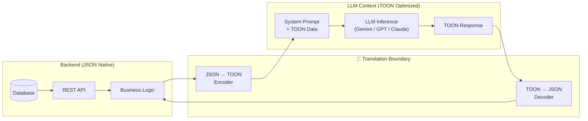
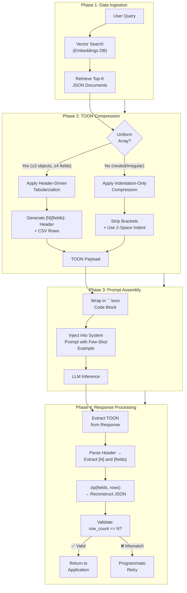
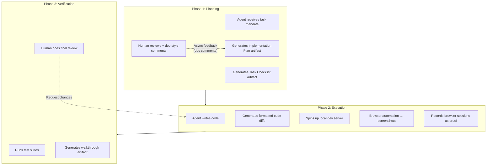

As LLMs transition from prototypes to mission-critical enterprise infrastructure, two fundamental bottlenecks define the landscape: **the economic ceiling of the token context window** and **the operational limits of synchronous, human-in-the-loop development**. Solving them requires architectural shifts at opposite ends of the stack — and that's exactly what **TOON** and **Google Antigravity** deliver.

---

## 1. The Token Economy: Why Every Byte Matters

### 1.1 How Tokenization Actually Works

LLMs don't read text — they consume **tokens**. Tokenization algorithms like **Byte Pair Encoding (BPE)** or **WordPiece** fracture input into discrete computational units: characters, word fragments, or full words. Every operation the model performs — attention calculation, sequence decoding, output sampling — is **linearly proportional to token volume**.

This means three things are directly bound to token count:

| Dimension | Impact |
|:---|:---|
| **Cost** | API pricing is per-token — more tokens = higher bill |
| **Latency** | More tokens = more compute cycles = slower response |
| **Context Window** | Fixed ceiling (e.g. 128K tokens) — waste tokens on structure, lose room for reasoning |

> **The core problem:** When structured data enters an LLM prompt, how that data is *serialized* directly determines how many tokens are consumed — and how much reasoning capacity remains.
{: .prompt-warning }


_JSON consumes massive context on structural overhead, leaving less room for actual model reasoning. TOON reclaims that space._

---

## 2. The JSON Bottleneck: Architecture of Waste

### 2.1 Why JSON is Hostile to LLM Tokenizers

For 20+ years, **JSON** has been the gold standard for data interchange. It's great for deterministic parsing by state machines and highly readable by humans. But it's **architecturally hostile** to LLM tokenization.

Here's *exactly* why — let's trace how a tokenizer processes JSON:

```json
{
  "inventory_items": [
    {"sku": "A101", "name": "Titanium Widget", "quantity": 250, "price": 49.99},
    {"sku": "B202", "name": "Carbon Gadget", "quantity": 15, "price": 129.50},
    {"sku": "C303", "name": "Steel Doohickey", "quantity": 800, "price": 12.25}
  ]
}
```

**Token breakdown of the structural overhead alone:**

| Structural Element | Count Per Record | Tokens Per Record | Across 3 Records |
|:---|:---|:---|:---|
| `{` and `}` (object braces) | 2 | ~2 | 6 |
| `"` (quotation marks) | 10 | ~5 | 15 |
| `:` (colon separators) | 4 | ~4 | 12 |
| `,` (comma separators) | 3 | ~3 | 9 |
| Repeated key names (`"sku"`, `"name"`, etc.) | 4 keys | ~8 | **24** |
| **Total structural overhead** | — | **~22** | **~66 tokens** |

That's **~66 tokens** of pure structural noise for just 3 records. The actual *data* (SKUs, names, quantities, prices) consumes roughly 30 tokens. **Over 68% of the payload is structural waste.**

### 2.2 The DRY Violation at Scale

The problem becomes exponential with uniform datasets. If an enterprise exports **1,000 user profiles**, every descriptive key — `"user_id"`, `"first_name"`, `"clearance_level"`, `"department"` — is reprinted **1,000 times**. This is a gross violation of the **DRY principle** (Don't Repeat Yourself) applied directly to the serialization layer.

```
┌─────────────────────────────────────────────────────────────────────┐
│           THE DRY VIOLATION IN JSON SERIALIZATION                  │
├─────────────────────────────────────────────────────────────────────┤
│                                                                     │
│  Record 1:  {"user_id": 1, "name": "Alice", "dept": "SEC"}        │
│  Record 2:  {"user_id": 2, "name": "Bob",   "dept": "ENG"}        │
│  Record 3:  {"user_id": 3, "name": "Carol", "dept": "OPS"}        │
│     ...                                                             │
│  Record 1000: {"user_id": 1000, "name": "Zara", "dept": "HR"}     │
│                                                                     │
│  "user_id" printed 1,000 times  ← ~2 tokens × 1000 = 2,000 tokens │
│  "name"    printed 1,000 times  ← ~1 token  × 1000 = 1,000 tokens │
│  "dept"    printed 1,000 times  ← ~1 token  × 1000 = 1,000 tokens │
│                                                                     │
│  ⚠️  4,000+ tokens burned on key repetition alone                  │
│                                                                     │
└─────────────────────────────────────────────────────────────────────┘
```

### 2.3 Attention Dilution: The Hidden Performance Killer

Beyond cost, there's a deeper architectural issue: **attention dilution**. Transformer models allocate their attention mechanisms across the *entire* context window. When 50%+ of the context is repeated dictionary keys and punctuation, the model must map this empty structural geography rather than reasoning over actual semantic data.

```
┌──────────────── CONTEXT WINDOW (128K tokens) ────────────────────┐
│                                                                    │
│  WITH JSON:                                                        │
│  ████████████████████████████████░░░░░░░░░░░░░░░                  │
│  ├───── Structural Noise ─────┤├── Actual Data ──┤                │
│  ~68% wasted                    ~32% useful                        │
│                                                                    │
│  Attention heads: scattered across noise ← DILUTED                │
│                                                                    │
│  ────────────────────────────────────────────────                  │
│                                                                    │
│  WITH TOON:                                                        │
│  ████░░░░░░░░░░░░░░░░░░░░░░░░░░░░░░░░░░░░░░░░░                  │
│  ├──┤├────────── Actual Data + Free Space ─────────┤              │
│  ~15% structure    ~85% useful                                     │
│                                                                    │
│  Attention heads: concentrated on data ← FOCUSED                  │
│                                                                    │
└──────────────────────────────────────────────────────────────────┘
```

> **Key insight:** TOON isn't just a cost optimization — it's a *reasoning quality* optimization. Less noise means better attention allocation means higher-quality model outputs.
{: .prompt-tip }

---

## 3. TOON Architecture: Deep Dive into Token-Oriented Object Notation

### 3.1 Core Design Principles

TOON was engineered from the ground up to solve JSON's token inefficiency. It operates on two foundational principles:

1. **Determinism** — Every TOON document has exactly one valid interpretation
2. **Minimalism** — Zero structural bytes that don't carry semantic value

The result is a text-based format that achieves **30–60% token reduction** over equivalent JSON while maintaining full structural fidelity.


_Side-by-side: JSON's verbose bracket-heavy syntax vs TOON's compressed header-driven tabular format._

### 3.2 The Header-Driven Tabularization Engine

TOON's killer innovation is **header-driven tabularization**. Instead of repeating keys per object, TOON extracts the shared schema into a single declarative header, then renders data as compressed CSV-style tuples.

**The same inventory data in TOON:**

```
inventory_items[3]{sku,name,quantity,price}:
A101,Titanium Widget,250,49.99
B202,Carbon Gadget,15,129.50
C303,Steel Doohickey,800,12.25
```

**Let's trace exactly what changed architecturally:**

```
┌─────────────────────────────────────────────────────────────────────┐
│              TOON TABULARIZATION ARCHITECTURE                       │
├─────────────────────────────────────────────────────────────────────┤
│                                                                     │
│  STEP 1: Schema Extraction                                         │
│  ┌──────────────────────────────────────────────┐                  │
│  │ Detect uniform array:                         │                  │
│  │   All objects share keys: sku, name,          │                  │
│  │                           quantity, price     │                  │
│  │ Extract → Header: {sku,name,quantity,price}   │                  │
│  └──────────────────────────────────────────────┘                  │
│                                                                     │
│  STEP 2: Length Declaration                                        │
│  ┌──────────────────────────────────────────────┐                  │
│  │ Count objects: 3                              │                  │
│  │ Declare → [3] in header                       │                  │
│  │ Purpose: Validation guardrail + generation    │                  │
│  │          commitment for LLMs                  │                  │
│  └──────────────────────────────────────────────┘                  │
│                                                                     │
│  STEP 3: Value Flattening                                          │
│  ┌──────────────────────────────────────────────┐                  │
│  │ Strip all brackets, quotes, colons            │                  │
│  │ Render values as comma-separated rows         │                  │
│  │ Maintain exact field order from header        │                  │
│  └──────────────────────────────────────────────┘                  │
│                                                                     │
│  RESULT:                                                            │
│  ┌──────────────────────────────────────────────┐                  │
│  │ inventory_items[3]{sku,name,quantity,price}:  │  ← ONE header   │
│  │ A101,Titanium Widget,250,49.99               │  ← raw values   │
│  │ B202,Carbon Gadget,15,129.50                 │  ← raw values   │
│  │ C303,Steel Doohickey,800,12.25               │  ← raw values   │
│  └──────────────────────────────────────────────┘                  │
│                                                                     │
│  Token savings: ~66 structural tokens → ~12 structural tokens      │
│  Reduction: ~82% structural overhead eliminated                    │
│                                                                     │
└─────────────────────────────────────────────────────────────────────┘
```

### 3.3 Hierarchical Nesting with Indentation

Unlike CSV (which can only represent flat tables), TOON preserves deep hierarchical relationships using **YAML-inspired two-space indentation**:

```
company:
  name: Acme Corp
  founded: 2019
  departments[2]{id,name,headcount}:
    D01,Engineering,150
    D02,Security,45
  locations[3]{city,country,is_hq}:
    Austin,US,true
    London,UK,false
    Singapore,SG,false
```

This gives TOON the **tabular compression of CSV** with the **nesting capabilities of JSON/YAML** — the optimal synthesis.

### 3.4 LLM-Targeted Guardrails

TOON's architecture includes two mandatory guardrails specifically designed for the unpredictability of generative models:

#### Guardrail 1: Explicit Array Length `[N]`

```
┌─────────────────────────────────────────────────────────────────┐
│  GUARDRAIL: Array Length Declaration [N]                        │
├─────────────────────────────────────────────────────────────────┤
│                                                                 │
│  Header: users[50]{id,name,role}:                              │
│                ^^                                               │
│                ││                                               │
│                │└─ Forces LLM to mathematically commit          │
│                │   to producing EXACTLY 50 rows before          │
│                │   writing any data                             │
│                │                                                │
│                └── Backend validation: if row_count ≠ 50,       │
│                    instantly flag as malformed → retry           │
│                                                                 │
│  WITHOUT [N]:  LLM might generate 47 rows, truncate mid-row,  │
│                or hallucinate extra entries                      │
│                                                                 │
│  WITH [N]:     LLM plans output length → structured generation │
│                Backend validates instantly → no full-text parse │
│                                                                 │
└─────────────────────────────────────────────────────────────────┘
```

#### Guardrail 2: Explicit Field List `{fields}`

```
┌─────────────────────────────────────────────────────────────────┐
│  GUARDRAIL: Schema Declaration {fields}                        │
├─────────────────────────────────────────────────────────────────┤
│                                                                 │
│  Header: users[50]{id,name,role}:                              │
│                    ^^^^^^^^^^^^^                                │
│                                                                 │
│  Acts as a RIGID SCHEMA CONTRACT:                              │
│  ┌──────────┬──────────┬──────────┐                            │
│  │ Column 1 │ Column 2 │ Column 3 │                            │
│  │    id    │   name   │   role   │                            │
│  ├──────────┼──────────┼──────────┤                            │
│  │    1     │  Alice   │  admin   │  ← guaranteed order        │
│  │    2     │   Bob    │  user    │  ← guaranteed order        │
│  └──────────┴──────────┴──────────┘                            │
│                                                                 │
│  Deserialization: zip(fields, row.split(',')) → perfect JSON   │
│                                                                 │
│  LLM benefit: Constrains generation sequence → predictable    │
│               output → fewer hallucinated/swapped columns     │
│                                                                 │
└─────────────────────────────────────────────────────────────────┘
```

---

## 4. TOON in the LLM Pipeline: The Boundary Translation Architecture

### 4.1 Where TOON Fits in the Stack

TOON is **not** designed to replace JSON across the entire software stack. The consensus architecture uses the **Boundary Translation Strategy**:



**The key principle:** JSON flows freely within your backend. Data is compressed to TOON **only** at the exact boundary of LLM interaction — injected into the prompt as TOON, and decoded back to JSON on receipt.

### 4.2 End-to-End RAG Pipeline with TOON

Here's how TOON integrates into a real Retrieval-Augmented Generation pipeline:



### 4.3 Python Implementation: The Boundary Translator

```python
from toon import parse, stringify

# ── ENCODING: JSON → TOON at LLM boundary ──
application_state = {
    'system_users': [
        {'id': 1, 'name': 'Alice', 'role': 'admin'},
        {'id': 2, 'name': 'Bob',   'role': 'user'},
        {'id': 3, 'name': 'Carol', 'role': 'auditor'},
    ]
}

# Automatically detects uniform arrays and tabularizes
toon_payload = stringify(application_state)
# Output: system_users[3]{id,name,role}:
#          1,Alice,admin
#          2,Bob,user
#          3,Carol,auditor

# ── DECODING: TOON → JSON from LLM response ──
llm_response = """
financial_records[3]{transaction_id,amount,currency}:
TXN-998,1500.00,USD
TXN-999,45.50,EUR
TXN-1000,2200.00,GBP
"""
parsed_data = parse(llm_response)
# Returns standard Python dict, ready for your backend
```

For dependency-free environments, the core algorithm is a simple ~30-line function:

```python
def json_to_toon(data: dict) -> str:
    """Minimal TOON encoder — detects uniform arrays and tabularizes."""
    lines = []
    for key, value in data.items():
        if isinstance(value, list) and len(value) >= 3:
            # Check if all items are dicts with identical keys
            if all(isinstance(v, dict) for v in value):
                fields = list(value[0].keys())
                if all(list(v.keys()) == fields for v in value):
                    # Header-driven tabularization
                    header = f"{key}[{len(value)}]{{{','.join(fields)}}}:"
                    lines.append(header)
                    for item in value:
                        row = ','.join(str(item[f]) for f in fields)
                        lines.append(row)
                    continue
        # Fallback: simple key-value
        lines.append(f"{key}: {value}")
    return '\n'.join(lines)
```

### 4.4 TypeScript/Node.js Integration

```typescript
import { encode, decode } from "@toon-format/toon";

const telemetryData = {
  server_logs: [
    { ts: "2026-04-13T10:00:00Z", level: "ERROR", msg: "Connection refused" },
    { ts: "2026-04-13T10:01:00Z", level: "WARN",  msg: "Retry attempt 3" },
    { ts: "2026-04-13T10:02:00Z", level: "INFO",  msg: "Connection restored" },
  ]
};

// Encode → token-optimized TOON string for LLM prompt
const tokenOptimized = encode(telemetryData);

// Decode → standard JSON from LLM response
const restored = decode(tokenOptimized);
```

**CLI bulk conversion** for migrating legacy datasets:
```bash
# Convert all JSON files in a directory to TOON
npx @toon-format/cli convert --input ./data/*.json --output ./toon/

# Advanced: handle nested commas and force tabular structure
npx @toon-format/cli convert --delimiter "|" --key-folding ./complex.json
```

---

## 5. Benchmarks: TOON vs JSON vs YAML vs CSV

### 5.1 Format Comparison Matrix

| Feature | JSON | YAML | CSV | **TOON** |
|:---|:---|:---|:---|:---|
| Token Efficiency | 🔴 Very Low | 🟡 Moderate | 🟢 Very High | **🟢 High (30–60% < JSON)** |
| Deep Nesting Support | ✅ Native | ✅ Indentation | ❌ Flat only | **✅ Hybrid indentation** |
| Schema Declaration | Implicit (per object) | Implicit (per object) | Header row only | **Explicit `[N]{fields}`** |
| LLM Pre-training Density | 🟢 Extremely High | 🟢 High | 🟢 High | **🔴 Low (emerging)** |
| Validation Speed | Parse-dependent | Parse-dependent | Row count only | **Instant (`[N]` check)** |
| Best For | Nested APIs | Config files | Flat exports | **LLM prompts, RAG, uniform arrays** |

### 5.2 Structural Correctness vs Token Efficiency

Empirical benchmarks reveal a critical trade-off:

| Metric | JSON | TOON | Delta |
|:---|:---|:---|:---|
| Structural correctness (strict) | **Baseline** | -38.9% | TOON degrades on deeply nested, irregular data |
| Mixed-structure accuracy | 75.0% | **76.4%** | TOON's schema guardrails prevent trailing comma errors |
| Avg tokens per payload (uniform) | ~300 | **~140** | **53% reduction** |
| Avg tokens per payload (complex) | ~300 | **~220** | **27% reduction** |

> **Critical finding:** The accuracy gap shrinks with model scale. Frontier models (Llama 3.3 70B, GPT-oss 120B) have sufficient cognitive overhead to execute TOON's zero-shot rules flawlessly. Smaller models struggle.
{: .prompt-info }

### 5.3 Environmental Efficacy Score (EES)

The generation phase of LLM inference is intensely compute-heavy. Fewer output tokens = less GPU time = lower carbon emissions.

| Model | JSON EES | **TOON EES** | Winner |
|:---|:---|:---|:---|
| Llama 3.3 70B | 0.875 | **0.980** | 🟢 TOON (+12%) |
| GPT-oss 120B | 0.868 | **0.890** | 🟢 TOON (+2.5%) |
| GCS_env (aggregate) | Baseline | **+3–12%** | 🟢 TOON |

TOON routinely generates complete sequences under **300 tokens** where XML might require **472 tokens** for the same data — a direct translation into lower power consumption at data center scale.

---

## 6. TOON Prompt Engineering: Best Practices

For TOON to work reliably with LLMs, specific prompt engineering patterns are required:

### 6.1 The Four Rules

```
┌─────────────────────────────────────────────────────────────────────┐
│           TOON PROMPT ENGINEERING — MANDATORY RULES                 │
├─────────────────────────────────────────────────────────────────────┤
│                                                                     │
│  RULE 1: CONTEXTUAL WRAPPING                                       │
│  ┌───────────────────────────────────────┐                         │
│  │ Always wrap TOON in labeled code      │                         │
│  │ blocks: ```toon ... ```               │                         │
│  │ This triggers LLM formatting          │                         │
│  │ heuristics for structured output      │                         │
│  └───────────────────────────────────────┘                         │
│                                                                     │
│  RULE 2: FEW-SHOT TEMPLATING                                      │
│  ┌───────────────────────────────────────┐                         │
│  │ Don't describe TOON rules in prose.   │                         │
│  │ Show ONE perfectly formatted example  │                         │
│  │ in the system prompt. LLMs learn      │                         │
│  │ format from examples, not rules.      │                         │
│  └───────────────────────────────────────┘                         │
│                                                                     │
│  RULE 3: OPTIMIZATION THRESHOLD                                    │
│  ┌───────────────────────────────────────┐                         │
│  │ TOON tabularization is ONLY           │                         │
│  │ beneficial when:                       │                         │
│  │   • Array has ≥ 3 objects             │                         │
│  │   • Each object has ≥ 4 fields        │                         │
│  │ Below this → header overhead > savings│                         │
│  │ Below this → use standard JSON        │                         │
│  └───────────────────────────────────────┘                         │
│                                                                     │
│  RULE 4: KEY FLATTENING                                            │
│  ┌───────────────────────────────────────┐                         │
│  │ Flatten deeply nested keys before     │                         │
│  │ TOON conversion:                      │                         │
│  │   user.address.city → user_city       │                         │
│  │ Keeps CSV rows legible to attention   │                         │
│  │ heads                                 │                         │
│  └───────────────────────────────────────┘                         │
│                                                                     │
└─────────────────────────────────────────────────────────────────────┘
```

### 6.2 Example System Prompt with TOON

```markdown
You are a data analyst. When outputting structured data, use TOON format.

Example TOON format:
```toon
employees[2]{id,name,department,salary}:
E001,Jane Smith,Engineering,95000
E002,John Doe,Marketing,78000
```

Rules:
- [N] must match exact row count
- {fields} defines column order
- Values are comma-separated, no quotes unless value contains commas
```

---

## 7. Google Antigravity: The Agent-First IDE Paradigm


_Antigravity splits the interface into Editor and Agent Manager, elevating the developer from syntax generator to orchestration director._

### 7.1 From Copilots to Autonomous Orchestration

Announced alongside **Gemini 3** in late 2025, Google Antigravity represents a fundamental paradigm shift. Where traditional AI coding tools (Copilot, Cursor) offer reactive autocomplete, Antigravity treats the LLM as an **autonomous actor** executing complex, multi-step engineering tasks.

The interface is bifurcated:

| Component | Purpose | Human Role |
|:---|:---|:---|
| **Editor** | Traditional code workspace | Review, annotate, approve |
| **Agent Manager** | Task orchestration, artifact tracking | Issue mandates, provide feedback |

### 7.2 The Artifact System: Solving the Black Box Problem

Antigravity mandates the generation of **Artifacts** — tangible intermediate deliverables:



### 7.3 Rules, Workflows, and Continuous Learning

| Feature | Function |
|:---|:---|
| **Rules** | Encode org standards (typing, naming, banned libraries) — agent follows across all sessions |
| **Workflows** | Reusable step-by-step procedures triggered by slash commands |
| **Knowledge Base** | Agent saves successful patterns, reduces repetitive prompting over time |

---

## 8. The Antigravity Enigma: Bridging Physics and Disinformation

The convergence of TOON-optimized data pipelines and agent-first IDEs unlocks powerful capabilities for technical research and content generation. To demonstrate this intersection, let's use these tools to explore one of physics' most captivating topics: **antigravity**.


_The Alcubierre metric proposes compressing space ahead and expanding it behind a vessel — mathematically valid but physically impossible without exotic "negative mass."_

### 8.1 Why True Antigravity is Impossible

Under Einstein's General Relativity, gravity isn't a *force* — it's the **geometric curvature of spacetime** caused by mass and energy. You can't "shield" a curvature in the fabric of reality itself the way you'd block a magnetic field.

| Model | Gravity Is... | Can You Shield It? |
|:---|:---|:---|
| **Newton** (1687) | Attractive force at a distance | Theoretically with negative mass |
| **Einstein** (1915) | Curvature of spacetime geometry | ❌ No — spacetime *is* the medium |
| **Quantum Gravity** (speculative) | Exchange of gravitons? | Unknown — no working theory |

### 8.2 The Alcubierre Warp Drive

Miguel Alcubierre's 1994 metric proposes a spacetime "bubble" that compresses space ahead and expands space behind — allowing faster-than-light travel without locally violating relativity.

**The catch:** Expanding spacetime requires **negative mass/negative energy** — a substance that:
- Has never been observed experimentally
- Would repel standard matter (true "antigravity")
- Is distinct from **antimatter** (which has normal positive mass)
- Has theoretical parallels to **Dark Energy** (the force expanding the universe)

### 8.3 From Pseudoscience to Viral Disinformation

| Year | Claim | Result |
|:---|:---|:---|
| **1992** | Evgeny Podkletnov's superconducting gravity shield | NASA failed to replicate; considered pseudoscience |
| **1996–2002** | NASA's Breakthrough Propulsion Physics Project | No actionable gravity modification technology produced |
| **2024** | "Project Anchor" viral hoax (AI-generated) | Falsely claimed Earth would lose gravity for 7 seconds on Aug 12, 2026 — debunked by Snopes |
| **Ongoing** | Dr. Charles Buhler's propellantless drive claims | Awaiting rigorous peer-reviewed replication |

> **The lesson:** Complex cosmological concepts are routinely weaponized for social media engagement. Always demand peer-reviewed replication before accepting extraordinary claims.
{: .prompt-warning }

---

## 9. Conclusion: The Dual Imperatives

The AI engineering landscape is defined by two converging revolutions:

1. **At the data layer** — TOON eliminates the token waste of legacy formats, reclaiming 30–60% of context window capacity for actual reasoning. Its header-driven tabularization, `[N]` validation guardrails, and `{fields}` schema declarations make it purpose-built for the LLM era.

2. **At the orchestration layer** — Google Antigravity shifts developers from writing syntax to directing autonomous agents, with artifacts providing transparent, verifiable execution trails.

Together, they represent the maturation of AI from experimental toy to enterprise infrastructure — where every token is optimized and every agent action is auditable.

---

## Resources

- [TOON GitHub Repository — Spec, Benchmarks, TypeScript SDK](https://github.com/toon-format/toon)
- [python-toon SDK](https://pypi.org/project/python-toon/)
- [Google Antigravity — Official Site](https://antigravity.google)
- [Getting Started with Google Antigravity — Codelabs](https://codelabs.developers.google.com)
- [Are LLMs Ready for TOON? — arXiv Benchmark Paper](https://arxiv.org/abs/toon-benchmarks)
- [Snopes: Will Earth Lose Gravity for 7 Seconds?](https://snopes.com)
- [Alcubierre Drive — Wikipedia](https://en.wikipedia.org/wiki/Alcubierre_drive)
