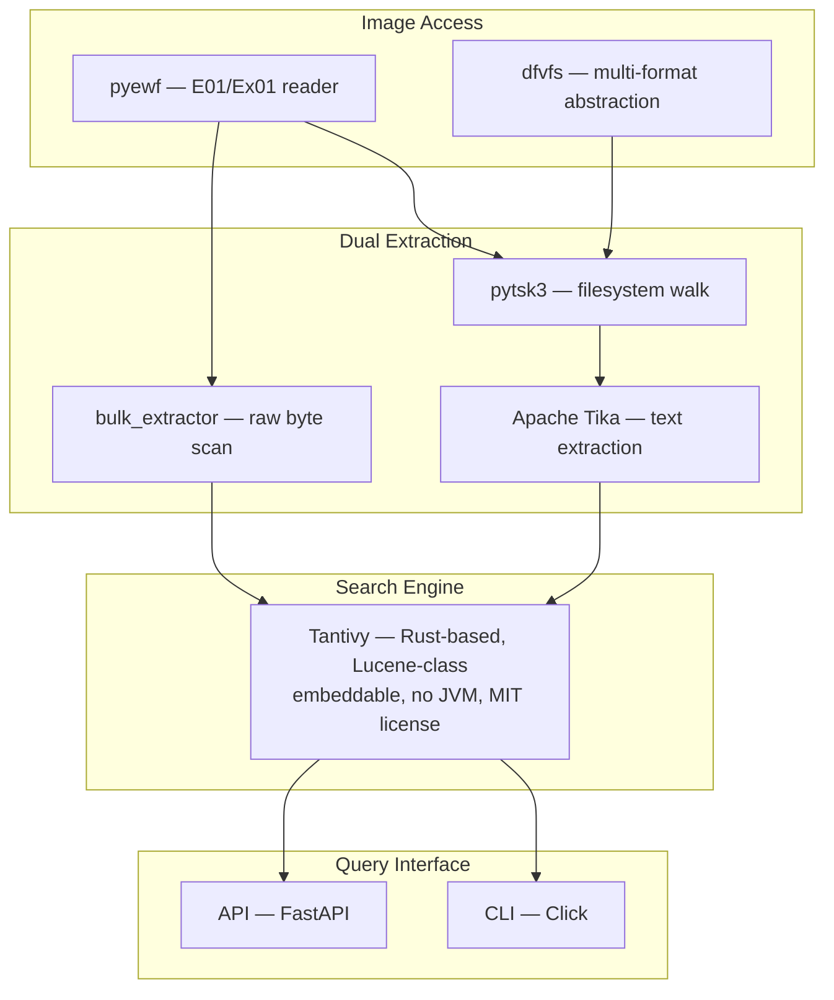

Every forensic examiner has done it — acquired a 500 GB E01, loaded it into FTK or Autopsy, hit "Index", gone for lunch, and come back to sub-second keyword searches across the entire disk. But **what actually happens** between "Index" and "Search"? This post breaks it down.

---

## What Is an E01, Really?

E01 (Expert Witness Format) is **EnCase's disk image container**. Think of it as a smart ZIP for raw disk bytes.

| Property | Detail |
|:---|:---|
| **Compression** | DEFLATE in 32 KiB chunks — each chunk independently decompressible |
| **Integrity** | Per-chunk CRC32 + per-section Adler-32 + image-wide MD5/SHA-1 |
| **Segmentation** | Splits into `.E01, .E02, … .E99, .EAA, .EAB …` (max ~2 GB per segment) |
| **Random Access** | Chunk table acts as an offset index — seek to any byte without decompressing the whole image |
| **Metadata** | Case info, examiner name, acquisition timestamps, device serial |

> **Key insight:** The chunk table is essentially an inverted index over the compressed data. `libewf` decompresses *only* the 32 KiB chunk containing the byte you requested. That's why random reads are fast.
{: .prompt-info }

**Reading an E01 in Python is ~5 lines:**

```python
import pyewf

filenames = pyewf.glob("evidence.E01")  # finds E01, E02, E03...
ewf = pyewf.handle()
ewf.open(filenames)

ewf.seek(0x7C00)                        # jump to any offset
data = ewf.read(4096)                   # read 4KB — only 1 chunk decompressed
print(ewf.get_media_size())             # total uncompressed image size
```

---

## The Universal Indexing Pipeline

Every major forensic tool — FTK, AXIOM, Autopsy, EnCase, X-Ways — follows the **exact same pattern** under the hood:


_From raw E01 bytes to sub-second keyword search in four stages._


**Stage 1 → Open the Image.** Mount or read the E01 via `libewf`/`pyewf`. Verify the stored MD5/SHA-1 hash.

**Stage 2 → Extract Text.** Two parallel approaches (more on this below).

**Stage 3 → Tokenize & Normalize.** Break text into searchable terms. Case-fold for search, preserve case for display.

**Stage 4 → Write to Inverted Index.** Map every term → list of locations where it appears. This is the data structure that makes search instant.

---

## The Inverted Index: Why Search Is Fast

An **inverted index** is the backbone of every forensic search engine. It maps each word to every location it appears:

```
Term            → Posting List (locations)
────────────────────────────────────────────
"garfinkel"     → [doc_42:pos_7, doc_891:pos_3, doc_2201:pos_15]
"password"      → [doc_5:pos_1, doc_5:pos_44, doc_1087:pos_9, ...]
"192.168.1.1"   → [doc_300:pos_22]
```

When you search `garfinkel AND password`, the engine:
1. Looks up both posting lists — **O(1)**
2. Intersects them (finds docs containing both) — **O(n)** on sorted lists
3. Returns results — **sub-millisecond** for millions of documents

> This is why indexing takes hours but searching takes milliseconds. You pay the cost once during ingest.
{: .prompt-tip }

---

## The Two Extraction Strategies

This is where forensic indexing diverges from Google-style web indexing. You need **two parallel extraction paths** because evidence hides in places a normal file browser never sees.

### Path 1: Filesystem-Aware (The Autopsy Model)

Walk the filesystem with The Sleuth Kit → extract text from each file using Apache Tika or format-specific parsers.

```
pytsk3 walks NTFS/FAT/ext4/HFS+
  ├── Allocated files     → Tika extracts text (Office, PDF, HTML, email)
  ├── Deleted files       → MFT still has metadata → recover + extract
  ├── File slack          → bytes after EOF within allocated cluster
  └── Orphan files        → MFT entries without parent directory
```

**Pros:** Rich metadata per hit — file path, timestamps, owner, MIME type, MD5 hash.

**Cons:** Misses everything **outside** the filesystem — unallocated space, page file, hibernation file, journal entries.

### Path 2: Raw Byte Scan (The bulk_extractor Model)

Treat the entire E01 as one giant byte stream. Slide scanners over fixed-size pages. Ignore the filesystem entirely.

```
16 MiB pages with overlap margin
  ├── ASCII string scanner (length ≥ 3)
  ├── UTF-16LE string scanner
  ├── UTF-16BE string scanner
  ├── Email/URL/IP/CC pattern matchers
  ├── Optimistic decompression (ZIP, GZIP, base64)
  └── Each hit annotated with byte offset in the image
```

**Pros:** Filesystem-agnostic — finds evidence in slack, unallocated, corrupt FS, hibernation files, page files, memory dumps. Trivially parallel (one page per CPU core).

**Cons:** No file paths, no timestamps, no user attribution. Many false positives from binary coincidences.

> **NIST and DFRWS testing repeatedly shows commercial tools miss:** UTF-16BE strings, DOCX files in unallocated space, strings spanning non-contiguous clusters. The raw-byte scan catches exactly these cases.
{: .prompt-warning }

### The Hybrid: Run Both

The strongest design feeds **both streams into the same index** with a `source_type` field:

```python
# Filesystem-extracted document
{
    "doc_id": "fs_00421",
    "source_type": "file",
    "path": "/Users/Greg/Documents/plans.docx",
    "mtime": "2024-03-15T10:22:00Z",
    "mime": "application/vnd.openxmlformats",
    "md5": "5d41402abc4b2a76b9719d911017c592",
    "content": "Project meeting notes for Q2..."
}

# Raw-byte-extracted hit
{
    "doc_id": "raw_1847201",
    "source_type": "unallocated",
    "image_offset": 0x1A3F7C00,
    "encoding": "utf-16le",
    "content": "deleted_secret_password_list",
    "raw_context": "00 64 00 65 00 6C 00 65 00 74 00 65..."
}
```

Query-time filter: `source_type:file` for attributed hits, `source_type:unallocated` for the stuff someone tried to delete.

---

## What Each Tool Uses Under the Hood


_All major forensic tools use the same extract → tokenize → index pattern, just with different engines._

| Tool | Search Engine | Index Size | Key Feature |
|:---|:---|:---|:---|
| **FTK** | dtSearch (commercial) | 12–33% of source | Fuzziness 0–10 at query time |
| **Magnet AXIOM** | Apache Lucene (since v4.0) | 15–25% | Proximity search (v4.5+) |
| **Autopsy** | Apache Solr/Lucene | 15–25% | Open source, Tika integration |
| **EnCase** | Custom + Outside In | Variable | GREP on raw byte stream |
| **X-Ways** | Custom indexer | Compact | Sparse-file aware, compound words |

They all support: **boolean** (AND/OR/NOT), **phrase** (`"exact match"`), **proximity** (W/N), **wildcards** (`gr*`), and **field-restricted** search.

---

## Forensic Tokenization ≠ NLP Tokenization

Standard text tokenizers break on forensic data. Here's why forensic indexers do it differently:

| Rule | Why |
|:---|:---|
| **Min word length: 3–4 chars** | Below that, hit volume explodes with no investigative value |
| **Index ASCII + UTF-16LE + UTF-16BE in parallel** | Windows stores everything as UTF-16LE; don't miss it |
| **Stemming OFF by default** | A misspelled name is evidence, not a stop word |
| **Case-fold the index, preserve case in stored fields** | Search is case-insensitive, display is faithful |
| **Punctuation = delimiter** | `.,:;"'~!@#$%^&*` breaks tokens (matches FTK behavior) |
| **Separate fields for emails, IPs, URLs, hashes** | `email:joe@example.com` needs its own keyword analyzer |
| **N-grams (3-gram) for substring search** | Makes `*ssn*` fast — O(1) postings lookup instead of full scan |

---

## The Index on Disk

Once built, the index is **self-contained** — the E01 is no longer needed for keyword queries:

```
case_xyz.fidx/
├── manifest.json          # tool version, image hash, scanner config
├── manifest.sig           # Ed25519 signature for integrity
├── index/                 # Tantivy/Lucene segments (immutable)
├── schema.json            # field definitions
└── logs/
    ├── ingest.log
    └── errors.log
```

| Metric | Typical Value |
|:---|:---|
| **Index size** | 15–35% of source data |
| **Indexing speed** | 50–300 MB/s (depends on scanners enabled) |
| **Query latency** | Sub-millisecond for most queries |
| **Resumability** | Checkpoint every segment commit → crash loses only in-flight batch |

> Store SHA-256 of every segment file in `manifest.json`, sign it with the examiner's key. Any segment modification = signature failure = fail closed. This is mandatory for court.
{: .prompt-warning }

---

## Building Your Own: The Recommended Stack

If you want to build a lightweight forensic index-search tool, here's the battle-tested stack:



**Why Tantivy over Lucene/Solr?** No JVM dependency, mmap-first design (tiny RAM footprint), Lucene-class performance, embeddable via a Python wheel (`pip install tantivy`). Switch to OpenSearch only if you cross 5 TB of indexed text or need multiple concurrent investigators.

---

## Quick Reference: Query Syntax

What your index should support (matches FTK/AXIOM/EnCase user expectations):

```
garfinkel                          # simple keyword
garfinkel AND (NPS OR NIST)        # boolean
"abandoned laptop"                 # exact phrase
"greg schardt"~10                  # proximity (within 10 words)
gre*                               # prefix wildcard
/[A-Z]{2}\d{6,8}/                  # regex
schardt~2                          # fuzzy (edit distance 2)
ext:docx                           # field-restricted
mtime:[2024-01-01 TO 2024-12-31]   # date range
md5:5d41402abc4b2a76b9719d911017c592  # hash search
source_type:slack                  # hit-source filter
```

---

## TL;DR

1. **E01** is a compressed, integrity-checked disk image container with a built-in chunk table for fast random access.
2. **Forensic indexing** = extract text (from files + raw bytes) → tokenize → write inverted index → query.
3. **Always run both** filesystem-aware and raw-byte extraction — neither alone catches everything.
4. **The inverted index** is why you can search a 500 GB disk in milliseconds — you pay the cost once at ingest.
5. **FTK uses dtSearch, AXIOM uses Lucene, Autopsy uses Solr** — all doing the exact same thing with different engines.
6. **For your own tool:** Python + pyewf + pytsk3 + bulk_extractor + Tantivy = production-grade in ~200 lines of orchestration code.

---

## Resources

- [libewf / pyewf — E01 reader (GitHub)](https://github.com/libyal/libewf)
- [The Sleuth Kit / pytsk3 — Filesystem parser](https://github.com/py4n6/pytsk)
- [bulk_extractor — Raw byte feature extraction](https://github.com/simsong/bulk_extractor)
- [Tantivy — Rust search engine with Python bindings](https://github.com/quickwit-oss/tantivy)
- [Apache Tika — Text extraction from 1400+ formats](https://tika.apache.org/)
- [NIST CFReDS — Test disk images](https://cfreds.nist.gov/)
- [Digital Corpora — M57 scenario images](https://digitalcorpora.org/)
- Garfinkel, S.L. "Digital media triage with bulk data analysis and bulk_extractor," *Computers & Security* 32 (2013)
- Carrier, B. *File System Forensic Analysis* (Addison-Wesley, 2005)
