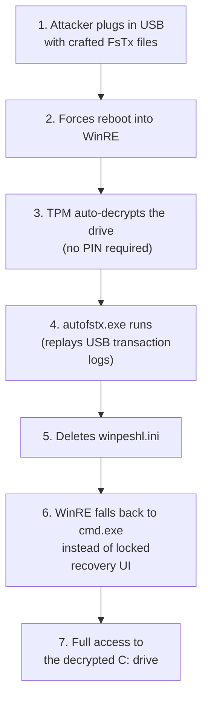

Your laptop gets stolen from a café table. No big deal — BitLocker is on, the drive is encrypted, the thief sees nothing. That's the promise. **YellowKey breaks that promise with a USB stick and a reboot.**

---

## What is BitLocker, in 30 Seconds?

BitLocker is Windows' built-in full-disk encryption. When enabled, every byte on your hard drive is encrypted with AES. The decryption key lives inside a chip on your motherboard called the **TPM (Trusted Platform Module)**. When you power on your laptop, the TPM checks that the hardware and boot sequence haven't been tampered with. If everything looks legit, it silently hands the key over, your drive decrypts, and Windows boots normally.

You never type a password for this. It's completely invisible. That's the convenience — and the vulnerability.

> Think of BitLocker + TPM-only like a house with a smart lock that recognizes your face. No key, no code — it just opens when it sees you. Convenient, until someone puts on a mask that looks like you.
{: .prompt-info }

---

## What is YellowKey?

**YellowKey** (CVE-2026-45585) is a vulnerability disclosed in May 2026 by a researcher known as **Nightmare-Eclipse**. It doesn't crack BitLocker's encryption — AES is untouched. Instead, it tricks the **Windows Recovery Environment (WinRE)** into giving an attacker a command prompt **after** the TPM has already decrypted the drive.

| Detail | Value |
|:---|:---|
| **CVE** | CVE-2026-45585 |
| **Nickname** | YellowKey |
| **CVSS** | 6.8 (Medium) |
| **Attack type** | Physical access only |
| **What it bypasses** | BitLocker (TPM-only configurations) |
| **What it doesn't break** | AES encryption itself |

---

## How It Works — The Café Analogy

Imagine your encrypted laptop is a bank vault:

1. **The vault door (BitLocker)** opens automatically when the bank's security system (TPM) recognizes the building is intact — walls, floor, ceiling all check out.

2. **The repair entrance (WinRE)** is a side door for emergencies. When Windows can't boot, WinRE opens so a technician can fix things. The vault door is *already open* at this point because the security system has already verified the building.

3. **YellowKey** is like slipping a fake work order under the repair entrance door. The maintenance system reads it, thinks "oh, I need to remove the lock on the repair console," and replaces the locked repair terminal with **an open one**.

4. The attacker walks in through the now-unlocked repair entrance, and the vault is already open. Game over.

Now here's what actually happens on the machine:

---

## The Technical Flow



Let's break that down:

**Step 1 — The crafted USB.** The attacker prepares a USB drive containing special files called **FsTx transaction logs**. These are part of an old Windows feature called Transactional NTFS — a system that lets file operations be "replayed" if they were interrupted by a crash.

**Step 2 — Boot into recovery.** The attacker forces the machine into WinRE (hold Shift + Restart, or interrupt the boot sequence three times).

**Step 3 — TPM hands over the keys.** Here's the critical part. Because the machine is using **TPM-only** BitLocker (no PIN, no password), the TPM checks the hardware, says "looks good," and **decrypts the drive automatically**. This happens *before* any user authentication.

**Step 4 — The hijack.** WinRE runs a utility called `autofstx.exe` early in its boot process. This utility is designed to replay any pending file-system transactions it finds. It picks up the attacker's crafted logs from the USB and **executes them** — specifically, deleting a file called `winpeshl.ini`.

**Step 5 — Shell access.** `winpeshl.ini` is the configuration file that tells WinRE to launch its restricted, locked-down recovery interface. Without it, WinRE doesn't know what to show — so it falls back to a plain `cmd.exe` command prompt.

**Step 6 — Access.** The attacker now has an unrestricted command prompt on a fully decrypted drive. They can read, copy, or modify any file.

> The encryption was never broken. The *process around it* was tricked into unlocking the door before checking who was standing there.
{: .prompt-warning }

---

## What's Affected?

| OS | Version | Affected? |
|:---|:---|:---:|
| Windows 11 | 24H2, 25H2, 26H1 (x64) | ✅ Yes |
| Windows Server | 2025 (Full & Server Core) | ✅ Yes |
| Windows 10 | All versions | ❌ No |

Windows 10 is not affected — its WinRE handles the TxF replay mechanism differently.

---

## How to Protect Yourself

### 1. Enable TPM + PIN (Most Important)

This is the single most effective mitigation. Instead of the TPM silently decrypting the drive, it **requires you to type a PIN at boot**. Without the PIN, the drive stays encrypted — even in WinRE.

```powershell
# Add a PIN protector to an already-encrypted drive
Add-BitLockerKeyProtector -MountPoint "C:" -TPMandPinProtector
```

> Yes, you'll need to type a PIN every time you boot. That's a small price for stopping a USB stick from reading your entire drive.
{: .prompt-tip }

### 2. Remove the Vulnerable Utility from WinRE

Microsoft's official fix: remove `autofstx.exe` from WinRE's boot sequence so the crafted files on the USB are never processed.

The short version:
1. Mount the WinRE image
2. Load its offline registry
3. Remove `autofstx.exe` from the `BootExecute` value
4. Unmount and re-seal BitLocker trust

Microsoft released a PowerShell script that automates this.

### 3. Physical Security

The attack requires hands-on access to the machine. BIOS passwords, disabled USB boot, and cable locks all raise the bar significantly.

---

## Why This Matters

BitLocker with TPM-only is the **default** on most enterprise-managed Windows 11 devices. Millions of laptops trust the TPM to handle decryption silently. YellowKey shows that silent trust has a blind spot: the recovery environment runs with the vault already open, and it blindly processes files from any attached USB.

The proof-of-concept is public. Independent researchers at Eclypsium and Bitdefender confirmed it works. As of today (June 2, 2026), there is **no official patch** — only the manual mitigations above.

---

## TL;DR

- **YellowKey** doesn't crack encryption — it tricks the recovery environment into giving shell access after the TPM has already decrypted the drive.
- Requires **physical access** + a prepared USB stick.
- Affects **Windows 11 (24H2+)** and **Server 2025**. Not Windows 10.
- **Fix:** Enable TPM+PIN, or remove `autofstx.exe` from WinRE.
- **No patch exists yet** — only manual mitigations.

---

## Resources

- [SOCPrime — CVE-2026-45585: YellowKey BitLocker Bypass](https://socprime.com/blog/cve-2026-45585-yellowkey-bitlocker-bypass/)
- [Microsoft Security Update Guide — CVE-2026-45585](https://msrc.microsoft.com/update-guide/vulnerability/CVE-2026-45585)
- [Eclypsium — YellowKey Technical Analysis](https://eclypsium.com)
- [The Hacker News — CVE-2026-45585 Coverage](https://thehackernews.com)
