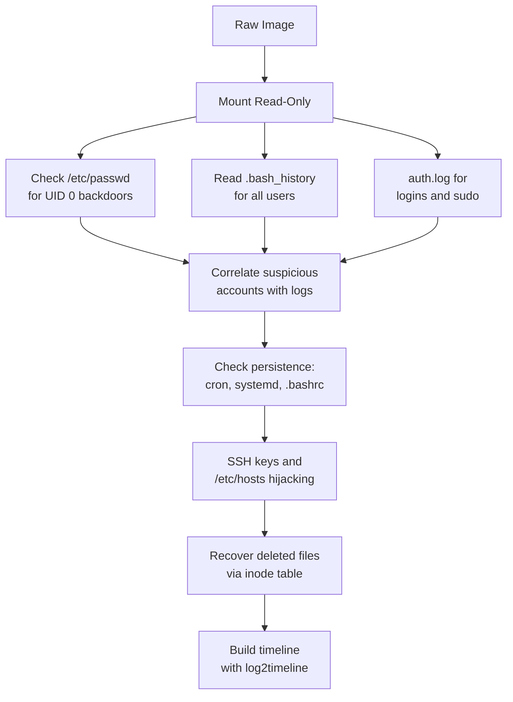

You have a raw `.img` or `.dd` file. No running system. No documentation. Just bytes. Here is exactly what to check and why — in order of priority.

---

## Rule Zero: Mount Read-Only First

```bash
# Find partition offset (sectors × 512 = byte offset)
fdisk -l suspect.img

# Mount read-only, suppress atime updates
sudo mount -o ro,loop,offset=1048576,noatime suspect.img /mnt/img
```

> Never mount writable. Even a single `ls` will modify access timestamps and corrupt your timeline.
{: .prompt-danger }

---

## The 7 Questions Every Linux Investigation Must Answer

| # | Question | Artifacts |
|:---|:---|:---|
| 1 | Who existed on this system? | `/etc/passwd`, `/etc/shadow` |
| 2 | What commands did they run? | `~/.bash_history` |
| 3 | When did logins happen? | `wtmp`, `btmp`, `auth.log` |
| 4 | How did malware survive reboots? | Cron, systemd units, `.bashrc` |
| 5 | What tools were installed? | `apt/history.log`, `dnf.log` |
| 6 | Was the network used? | `authorized_keys`, `known_hosts` |
| 7 | Was evidence destroyed? | Log gaps, deleted inodes |

---

## Linux Artifact Map — What Is What

Before you dig, understand what each path *is*, what it *stores*, and what it *controls* on the system. This is the map every Linux forensics investigator needs.

### Identity & Access Control

| Path | What It Is | What It Stores | What It Controls |
|:---|:---|:---|:---|
| `/etc/passwd` | Plain-text user database | Username, UID, GID, home dir, login shell | Who can log in and as what |
| `/etc/shadow` | Hashed password store | Password hashes, expiry dates, last-changed epoch | Who can authenticate |
| `/etc/group` | Group definitions | Group names, GIDs, member lists | File permission groups |
| `/etc/sudoers` | Sudo policy file | Who can run what as root | Privilege escalation rules |
| `/etc/sudoers.d/` | Drop-in sudo rules | Per-user/app sudo overrides | Granular root access grants |

### Shell & Command History

| Path | What It Is | What It Stores | What It Controls |
|:---|:---|:---|:---|
| `~/.bash_history` | Bash command log | Every command typed in bash (buffered) | User's entire terminal activity |
| `~/.zsh_history` | Zsh command log | Every command typed in zsh | Same, for zsh users |
| `~/.bashrc` | Bash config (non-login shells) | Aliases, functions, env vars, startup commands | Runs automatically on every new bash session |
| `~/.bash_profile` / `~/.profile` | Bash config (login shells) | Login-time commands, env setup | Runs once on SSH login or tty login |
| `/etc/profile.d/*.sh` | System-wide shell init scripts | Global environment settings | Runs for every user at login |

### Logs

| Path | What It Is | What It Stores | What It Controls |
|:---|:---|:---|:---|
| `/var/log/auth.log` | Authentication log (Debian) | SSH logins, sudo use, PAM events, account changes | Tracks every login and priv-esc event |
| `/var/log/secure` | Authentication log (RHEL) | Same as above | Tracks every login and priv-esc event |
| `/var/log/syslog` | General system log (Debian) | Kernel messages, daemon output, service events | Broad system activity record |
| `/var/log/messages` | General system log (RHEL) | Same as syslog | Broad system activity record |
| `/var/log/kern.log` | Kernel log | Hardware events, kernel warnings, USB attach/detach | Low-level system events |
| `/var/log/cron` | Cron execution log | Every cron job trigger with timestamp | Scheduled task execution record |
| `/var/log/wtmp` | Binary login database | Successful logins, logouts, reboots | Session history (parse with `last`) |
| `/var/log/btmp` | Binary failed login database | Every failed login attempt | Brute-force evidence (parse with `lastb`) |
| `/var/log/lastlog` | Binary last-login database | Most recent login per user account | Quick "who last logged in" reference |
| `/var/log/journal/` | systemd binary journal | Structured log entries from all services | Central log store for systemd systems |
| `/var/log/apt/history.log` | APT package history (Debian) | Install, remove, upgrade operations with timestamps | Software change audit trail |
| `/var/log/dpkg.log` | Low-level dpkg log | Individual package file operations | Package-level install detail |
| `/var/log/dnf.log` | DNF/YUM package history (RHEL) | Package installs, removals, updates | Software change audit trail |

### Persistence Mechanisms

| Path | What It Is | What It Stores | What It Controls |
|:---|:---|:---|:---|
| `/etc/crontab` | System cron table | Scheduled jobs with user context | System-wide scheduled execution |
| `/var/spool/cron/crontabs/<user>` | Per-user cron table | User-owned scheduled jobs | Per-user recurring execution |
| `/etc/cron.d/` | Drop-in cron directory | App/package-added cron jobs | Additional scheduled tasks |
| `/etc/cron.daily/` `/cron.hourly/` etc. | Time-based script dirs | Scripts run at fixed intervals | Interval-based automation |
| `/etc/systemd/system/` | systemd system service dir | `.service`, `.timer`, `.socket` unit files | What starts on boot (system-level) |
| `~/.config/systemd/user/` | User systemd service dir | User-owned service units | What starts on user login |
| `/etc/rc.local` | Legacy startup script | Commands run at boot (pre-systemd) | Old-style boot-time persistence |
| `/etc/init.d/` | SysV init scripts | Service start/stop scripts | Legacy service management |

### Network & Remote Access

| Path | What It Is | What It Stores | What It Controls |
|:---|:---|:---|:---|
| `~/.ssh/authorized_keys` | SSH public key whitelist | Public keys allowed to authenticate as this user | Who can SSH in without a password |
| `~/.ssh/known_hosts` | SSH server fingerprint cache | Fingerprints of SSH servers this user connected to | Prevents MITM, reveals SSH history |
| `~/.ssh/id_rsa` / `id_ed25519` | SSH private key | User's private key for outbound SSH | Identity for outbound SSH connections |
| `~/.ssh/config` | SSH client config | Host aliases, jump hosts, key mappings | Shorthand for SSH connections |
| `/etc/ssh/sshd_config` | SSH server config | Allowed auth methods, ports, root login toggle | Controls how inbound SSH works |
| `/etc/hosts` | Local DNS override | IP-to-hostname mappings, bypasses DNS | Controls name resolution before DNS |
| `/etc/resolv.conf` | DNS client config | DNS server IPs | Controls what DNS server is used |
| `/var/lib/dhcp/dhclient.leases` | DHCP lease history | Past IP addresses, gateway, DNS server | Shows network identity over time |

### Filesystem Artifacts

| Path | What It Is | What It Stores | What It Controls |
|:---|:---|:---|:---|
| `/tmp/` | Temporary filesystem | Short-lived files, often world-writable | Cleared on reboot — malware staging area |
| `/var/tmp/` | Persistent temp filesystem | Temp files that survive reboots | Longer-lived staging area |
| `/dev/shm/` | Shared memory filesystem | RAM-backed files (disappear on reboot) | Inter-process memory sharing |
| Inode table (EXT4) | Per-file metadata record | MACB timestamps, permissions, owner, data block pointers | File identity — survives filename deletion |

---

## 1. User Accounts — Establish the Cast

```
/etc/passwd       → All accounts (UID, shell, home dir)
/etc/shadow       → Password hashes + last-changed date
/etc/group        → Group memberships
```

**Red flags in `/etc/passwd`:**

```
backdoor:x:0:0::/root:/bin/bash   ← UID 0 = root — this is a planted account
service_acct:x:1001:1001::/home/svc:/bin/bash   ← service account with interactive shell?
```

Any account with `UID 0` besides `root` is almost certainly a backdoor. Check when `/etc/passwd` was last modified:

```bash
stat /mnt/img/etc/passwd
```

---

## 2. Bash History — The Command Diary

```
/home/<user>/.bash_history
/root/.bash_history
/home/<user>/.zsh_history
```

**Entries that immediately matter:**

| Command Pattern | What It Suggests |
|:---|:---|
| `wget` / `curl` to unknown IP | Malware download |
| `nc`, `ncat`, `socat` | Reverse shell or listener |
| `chmod +x` on `/tmp/*` file | Payload execution |
| `history -c` / `rm ~/.bash_history` | Anti-forensics attempt |
| `tar czf /tmp/` + `curl -X POST` | Data staging and exfiltration |
| `useradd` / `passwd` | Account backdooring |
| `crontab -e` | Persistence installation |

> `history -c` clears in-memory history but does **not** erase the `.bash_history` file on disk. Attackers forget this constantly.
{: .prompt-tip }

---

## 3. Logs — The System's Timeline

### `/var/log/auth.log` (Debian) or `/var/log/secure` (RHEL)

This single file answers most "who did what" questions.

```
# Critical entries to search for:
grep -E "(Accepted|sudo|useradd|COMMAND)" /mnt/img/var/log/auth.log
```

| Log Pattern | Meaning |
|:---|:---|
| `Accepted password for root` | Root SSH login — almost always suspicious |
| `sudo: john : COMMAND=/bin/bash` | Full root shell via sudo |
| `new user: name=X, UID=0` | Backdoor account created |
| `Failed password` × hundreds | Brute-force attack |

### Other Key Logs

```
/var/log/syslog           → General system activity
/var/log/cron             → Cron job executions
/var/log/dpkg.log         → Package installs (Debian)
/var/log/apt/history.log  → Human-readable apt history
/var/log/journal/         → Binary systemd journal (use journalctl)
```

> **Log gap = red flag.** If `syslog` runs from midnight to 2 AM then jumps to 5 AM, those hours were deleted or the service was intentionally stopped.
{: .prompt-warning }

---

## 4. Persistence — How It Survived Reboots

Check these locations for anything that doesn't belong:

```
/etc/crontab
/var/spool/cron/crontabs/<user>
/etc/cron.d/
/etc/systemd/system/          ← Service unit files
/home/<user>/.config/systemd/user/
/etc/rc.local
/home/<user>/.bashrc          ← Runs on every shell open
/home/<user>/.bash_profile    ← Runs on login
/etc/profile.d/               ← Runs for all users on login
```

**Malicious cron:**
```
* * * * * /tmp/.x > /dev/null 2>&1    ← Every minute, from /tmp, output hidden
```

**Malicious systemd unit:**
```ini
[Service]
ExecStart=/var/tmp/.payload.py
Restart=always          ← Restarts if killed
```

---

## 5. Login Records — Who Was Actually Here

| File | Parse With | Contains |
|:---|:---|:---|
| `/var/log/wtmp` | `last -f wtmp` | All successful logins |
| `/var/log/btmp` | `lastb -f btmp` | Failed login attempts |
| `/var/log/lastlog` | `lastlog -R /mnt/img` | Last login per account |

```bash
last -f /mnt/img/var/log/wtmp | head -20
```

---

## 6. Network Artifacts — Who Did It Talk To?

```
~/.ssh/authorized_keys    ← Planted keys = backdoor SSH access
~/.ssh/known_hosts        ← Every server this user SSH'd to
/etc/hosts                ← Look for AV/security domains redirected to 127.0.0.1
/var/lib/dhcp/dhclient.leases  ← Past IP addresses of this machine
```

**`authorized_keys` planted key:**
```bash
cat /mnt/img/root/.ssh/authorized_keys
# Any key here grants passwordless SSH access as root
```

**`/etc/hosts` hijack:**
```
127.0.0.1    virustotal.com        ← Blocked AV lookups
127.0.0.1    windowsupdate.com     ← Blocked OS updates
```

---

## 7. Filesystem — The Invisible Evidence

### MACB Timestamps on Every File

```bash
stat /mnt/img/tmp/suspicious_file

# Access  (A): last read
# Modify  (M): content changed
# Change  (C): inode/metadata changed
# Birth   (B): file created (EXT4 only)
```

> **Timestomping:** `touch -t 202001010000 file` fakes `mtime` and `atime` — but cannot fake `ctime` or `crtime`. A file claiming 2020 with a 2026 `ctime` was tampered with.
{: .prompt-warning }

### Deleted File Recovery

```bash
# List deleted files (marked with *)
fls -r -l /dev/loop0p1 | grep "^\*"

# Recover by inode number
icat /dev/loop0p1 <inode_number> > recovered_file
```

### SUID Binaries (Privilege Escalation)

```bash
find /mnt/img -perm -4000 -type f 2>/dev/null
# Anything unusual here = check GTFOBins for exploitation path
```

---

## 10-Minute Triage Checklist

```bash
IMG=/mnt/img

# 1. Backdoor accounts (UID 0)?
awk -F: '$3 == 0' $IMG/etc/passwd

# 2. Recent logins
last -f $IMG/var/log/wtmp | head -20

# 3. Root bash history
tail -100 $IMG/root/.bash_history

# 4. All user bash histories
for h in $IMG/home/*; do echo "=== $h ==="; tail -30 "$h/.bash_history" 2>/dev/null; done

# 5. Auth log highlights
grep -E "(Accepted|sudo|useradd)" $IMG/var/log/auth.log | tail -50

# 6. Suspicious temp files
ls -laR $IMG/tmp $IMG/var/tmp 2>/dev/null

# 7. User cron jobs
ls -la $IMG/var/spool/cron/crontabs/

# 8. Planted SSH keys
cat $IMG/root/.ssh/authorized_keys 2>/dev/null
for h in $IMG/home/*; do echo "=== $h ==="; cat "$h/.ssh/authorized_keys" 2>/dev/null; done

# 9. Suspicious SUID binaries
find $IMG -perm -4000 -type f 2>/dev/null | grep -vE "(passwd|sudo|su$|ping|mount)"

# 10. Attack tools installed via apt
grep -iE "(nmap|netcat|hydra|john|hashcat|nikto|sqlmap)" $IMG/var/log/apt/history.log 2>/dev/null
```

---

## Investigation Flow



---

## Complete Artifact Quick Reference

| Artifact | Path | Key Question |
|:---|:---|:---|
| User list | `/etc/passwd` | Any UID 0 non-root accounts? |
| Password dates | `/etc/shadow` | When were accounts created? |
| Command history | `~/.bash_history` | What did they run? |
| Auth events | `/var/log/auth.log` | Who logged in, sudo usage |
| Logins | `/var/log/wtmp` | When, from what IP |
| Cron jobs | `/var/spool/cron/crontabs/` | Scheduled execution |
| systemd services | `/etc/systemd/system/` | Persistence units |
| Shell init | `~/.bashrc`, `~/.profile` | Code injected into shell |
| SSH backdoors | `~/.ssh/authorized_keys` | Planted access keys |
| SSH destinations | `~/.ssh/known_hosts` | Where they connected to |
| Package installs | `/var/log/apt/history.log` | Attack tools installed |
| Temp malware | `/tmp/`, `/var/tmp/` | Staged payloads |
| SUID binaries | `find -perm -4000` | Priv-esc vectors |
| DNS hijacking | `/etc/hosts` | Security domains blocked |

---

## Tools

| Tool | Use |
|:---|:---|
| **Autopsy** | GUI forensics for disk images |
| **The Sleuth Kit** | `fls`, `icat` for filesystem analysis |
| **log2timeline / Plaso** | Unified multi-source timeline |
| **Arsenal Image Mounter** | Safe mounting on Windows |
| **Volatility** | Memory analysis if RAM dump available |
