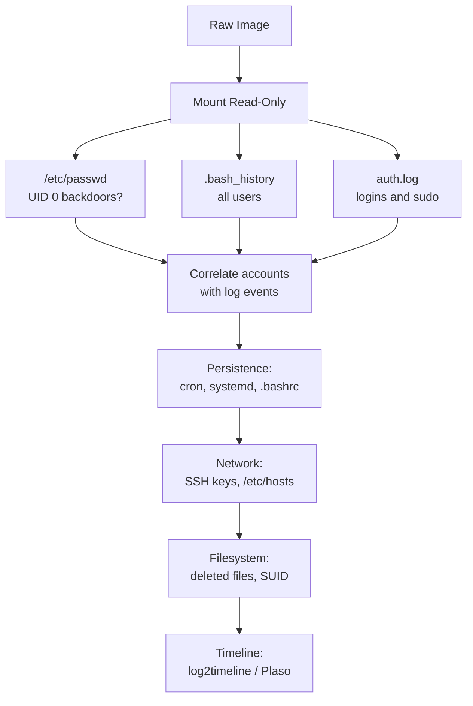

You have a raw `.img` or `.dd` file. No running machine. No credentials. Just bytes. Here is exactly where to look — and why it matters.

---

## Step 0 — Mount Read-Only

Mount the image before touching anything. **Read-only** — any write operation modifies timestamps and destroys evidence.

```bash
fdisk -l suspect.img                  # find partition offset (sector × 512)
sudo mount -o ro,loop,offset=1048576,noatime suspect.img /mnt/img
```

> On Windows use **Arsenal Image Mounter** for write-blocked mounting.
{: .prompt-tip }

---

## The Artifact Map

Every key location on a Linux system — what it is and what it controls:


| Category | Key Paths | Controls |
|:---|:---|:---|
| **Identity** | `/etc/passwd`, `/etc/shadow` | Who can log in and as what |
| **History** | `~/.bash_history`, `~/.zsh_history` | Every command the user typed |
| **Logs** | `/var/log/auth.log`, `syslog`, `wtmp` | What happened and when |
| **Persistence** | `/etc/crontab`, `/etc/systemd/system/` | What auto-runs after reboot |
| **Network** | `~/.ssh/authorized_keys`, `/etc/hosts` | Who can connect in, where it called out |
| **Filesystem** | `/tmp/`, `/var/tmp/`, EXT4 inodes | Where payloads hide, deleted file ghosts |

---

## 1. User Accounts

`/etc/passwd` stores every account. Format: `username:x:UID:GID:info:home:shell`

**UID 0 = root (full admin).** Any account with UID 0 that isn't named `root` is a backdoor.

```bash
awk -F: '$3 == 0' /mnt/img/etc/passwd      # flag all UID-0 accounts instantly
stat /mnt/img/etc/passwd                   # check when the file was last modified
```

---

## 2. Bash History

Every terminal command a user typed, saved automatically to `.bash_history`.

| Suspicious Entry | What It Means |
|:---|:---|
| `wget`/`curl` to an unknown IP | File downloaded from attacker infrastructure |
| `nc`, `ncat`, `socat` | Reverse shell — attacker remote control |
| `chmod +x /tmp/file` | Made a file executable (payload staging) |
| `history -c` or `rm ~/.bash_history` | Tried to erase tracks — file on disk often survives |
| `tar czf /tmp/` + `curl -X POST` | Data theft — compress then exfiltrate |
| `useradd` / `crontab -e` | Backdoor account or scheduled persistence |

> `history -c` clears in-memory history only. The `.bash_history` **file on disk is untouched**. Attackers miss this constantly.
{: .prompt-tip }

---

## 3. Logs

**`/var/log/auth.log`** (Debian) or **`/var/log/secure`** (RHEL) — one file that answers most "who did what" questions.

```bash
grep -E "(Accepted|sudo|useradd|COMMAND)" /mnt/img/var/log/auth.log
```

| Log Entry | Meaning |
|:---|:---|
| `Accepted password for root from 45.x.x.x` | Remote root login — almost always an attacker |
| `sudo: john : COMMAND=/bin/bash` | User got a full admin shell |
| `new user: name=X, UID=0` | Backdoor account created |
| `Failed password` × hundreds | Brute-force in progress |

Other logs:

```
/var/log/syslog          → General system events
/var/log/cron            → Every scheduled task execution
/var/log/apt/history.log → Every package installed (human-readable)
```

> A gap in the logs — say nothing from 2 AM to 5 AM — is as suspicious as the logs themselves. Real systems generate entries continuously.
{: .prompt-warning }

---

## 4. Persistence

How malware survives after a reboot. Check these locations for anything that doesn't belong:

```
/etc/crontab                     → System-wide scheduled tasks
/var/spool/cron/crontabs/<user>  → Per-user scheduled tasks
/etc/systemd/system/             → Services that start on boot
~/.bashrc / ~/.bash_profile      → Code that runs on every login
/etc/rc.local                    → Legacy startup script
```

**Malicious cron** (runs every minute, hidden output):
```
* * * * * /tmp/.x > /dev/null 2>&1
```

**Malicious systemd service** (restarts itself if killed):
```ini
[Service]
ExecStart=/var/tmp/.payload.py
Restart=always
```

---

## 5. Login Records

Three binary files track all login activity (not plain text — use the commands below):

| File | Command | Contains |
|:---|:---|:---|
| `/var/log/wtmp` | `last -f /mnt/img/var/log/wtmp` | All successful logins with source IP |
| `/var/log/btmp` | `lastb -f /mnt/img/var/log/btmp` | All failed login attempts |
| `/var/log/lastlog` | `lastlog -R /mnt/img` | Last login per user account |

---

## 6. Network & SSH

```
~/.ssh/authorized_keys   → Public keys that can SSH in WITHOUT a password
~/.ssh/known_hosts       → Every server this machine connected to via SSH
/etc/hosts               → Local DNS override — check for security domains blocked
```

An attacker who plants their public key in `authorized_keys` gets **silent, passwordless access** — even after a password change. Any key in `/root/.ssh/authorized_keys` that you can't account for is a backdoor.

**`/etc/hosts` hijack** — attackers block their tracks:
```
127.0.0.1    virustotal.com      ← AV scanning disabled
127.0.0.1    windowsupdate.com   ← OS updates blocked
```

---

## 7. Filesystem — The Evidence That Survives Deletion

Every file has **4 timestamps** stored in its inode (a metadata record separate from the file itself):

| Letter | Timestamp | Updated When |
|:---|:---|:---|
| M | Modified | File content was written |
| A | Accessed | File was read |
| C | Changed | Metadata changed (rename, permissions) |
| B | Birth | File was first created |

> **Timestomping:** Attackers fake `M` and `A` timestamps using `touch -t`. They cannot easily fake `C` (ctime). A file that claims 2020 but has a 2026 `ctime` was tampered with.
{: .prompt-warning }

Deleting a file removes its name — not the data. Recover it:

```bash
fls -r -l /dev/loop0p1 | grep "^\*"        # list deleted files (marked with *)
icat /dev/loop0p1 <inode_number> > file    # recover by inode number
```

---

## 10-Minute Triage

Run this on your mounted image for an immediate picture:

```bash
IMG=/mnt/img

awk -F: '$3 == 0' $IMG/etc/passwd                                        # UID 0 backdoors?
last -f $IMG/var/log/wtmp | head -20                                     # recent logins
tail -100 $IMG/root/.bash_history                                        # root commands
grep -E "(Accepted|sudo|useradd)" $IMG/var/log/auth.log | tail -50       # auth events
ls -laR $IMG/tmp $IMG/var/tmp                                            # hidden files in /tmp
cat $IMG/etc/crontab; ls $IMG/var/spool/cron/crontabs/                  # cron jobs
cat $IMG/root/.ssh/authorized_keys                                       # planted SSH keys
find $IMG -perm -4000 -type f 2>/dev/null | grep -vE "(passwd|sudo|ping)" # SUID files
grep -iE "(nmap|netcat|hydra|john|hashcat)" $IMG/var/log/apt/history.log # attack tools
```

---

## Investigation Flow



---

## Quick Reference

| Artifact | Path | Key Question |
|:---|:---|:---|
| User accounts | `/etc/passwd` | Any UID 0 accounts besides root? |
| Password dates | `/etc/shadow` | When were accounts created? |
| Command history | `~/.bash_history` | What did they run? |
| Auth events | `/var/log/auth.log` | Who logged in? Sudo abuse? |
| Login sessions | `/var/log/wtmp` | When, from what IP? |
| Scheduled tasks | `/var/spool/cron/crontabs/` | Anything set to auto-run? |
| Boot services | `/etc/systemd/system/` | Malicious startup service? |
| Shell init | `~/.bashrc`, `~/.profile` | Code injected on every login? |
| SSH backdoor | `~/.ssh/authorized_keys` | Planted passwordless key? |
| SSH history | `~/.ssh/known_hosts` | Where did it connect out to? |
| Software installs | `/var/log/apt/history.log` | Attack tools installed? |
| Temp staging | `/tmp/`, `/var/tmp/` | Payloads or stolen data? |
| DNS hijack | `/etc/hosts` | Security domains blocked? |

---

## Tools

| Tool | Use |
|:---|:---|
| **Autopsy** | GUI forensics — good starting point for disk images |
| **The Sleuth Kit** | `fls` (list files + deleted), `icat` (recover by inode) |
| **Plaso / log2timeline** | Merge all artifact timelines into one sorted view |
| **Arsenal Image Mounter** | Write-blocked image mounting on Windows |
| **Volatility** | Memory forensics if a RAM dump is also available |
