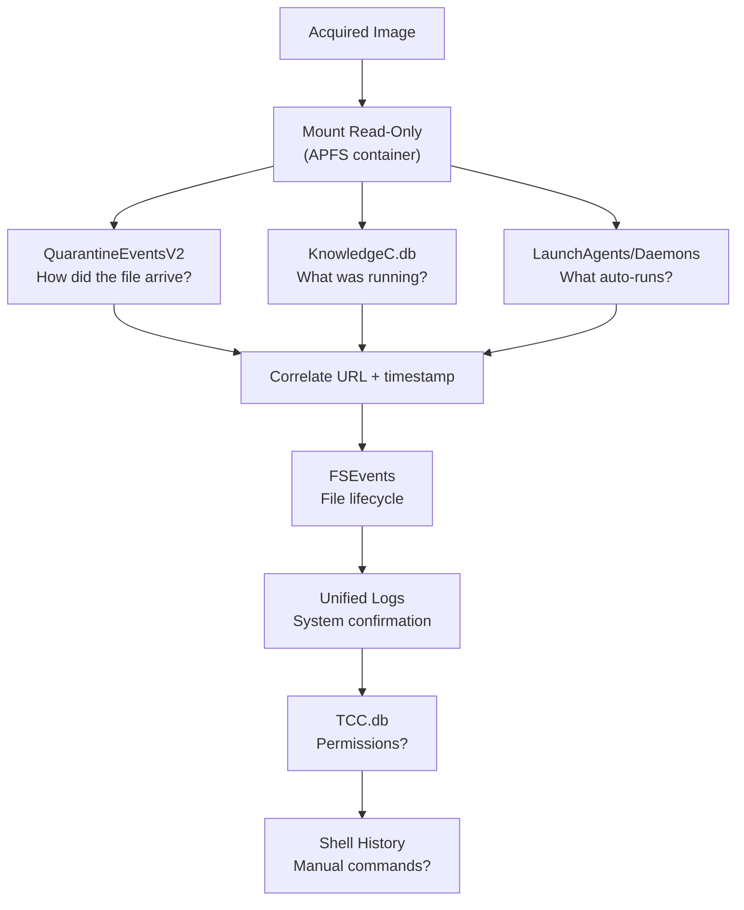

macOS is built on a Unix core and leaves a rich trail of SQLite databases, binary logs, and property list files. This is a reference for where to look and what each artifact answers.

> Always acquire a full **container-level** APFS image with a write blocker. Never plug in a suspect Mac and browse — every click modifies timestamps.
{: .prompt-danger }

---

## Artifact Map

| Artifact | Location | Answers |
|:---|:---|:---|
| **KnowledgeC.db** | `~/Library/Application Support/Knowledge/knowledgeC.db` | What was the user doing and when? |
| **QuarantineEventsV2** | `~/Library/Preferences/com.apple.LaunchServices.QuarantineEventsV2` | Where did that file come from? |
| **FSEvents** | `/.fseventsd/` | What files were created, moved, or deleted? |
| **Unified Logs** | `/var/db/diagnostics/` | What did the system do at the micro level? |
| **LaunchAgents / Daemons** | `~/Library/LaunchAgents/`, `/Library/LaunchDaemons/` | What auto-runs on login or boot? |
| **TCC.db** | `~/Library/Application Support/com.apple.TCC/TCC.db` | What was the app allowed to access? |
| **Spotlight** | `/.Spotlight-V100/` | What file metadata survived deletion? |
| **Plist files** | `~/Library/Preferences/` | What did the user configure / recently open? |
| **Shell History** | `~/.zsh_history`, `~/.bash_history` | What did they type in Terminal? |

---

## 1. KnowledgeC.db — Pattern-of-Life

A SQLite database (CoreDuet framework) that acts as a diary of user and system activity: app launches, durations, screen lock/unlock events, battery state.

> macOS 13 Ventura+ migrates this data to **Biome** at `/private/var/db/biome/`. Check both locations.
{: .prompt-warning }

**Key streams:**

| Stream | Contains |
|:---|:---|
| `/app/usage` | Every app that ran — start time and duration |
| `/device/isLocked` | Screen lock / unlock events |
| `/safari/history` | Browsing sessions (older macOS) |

**When used:**
- **Alibi contradiction** — suspect claims they were not on the Mac over the weekend; KnowledgeC shows Finder and an archiving app active from 11 PM to 2 AM.
- **Malware attribution** — `/device/isLocked` shows the screen was locked at 3 AM; Unified Logs show a process calling out at 3:07 AM — malware was operating autonomously, not the user.

---

## 2. QuarantineEventsV2 — File Provenance

Logs every file that arrives from the internet via Safari, Chrome, Mail, AirDrop, or Slack. macOS also stamps a `com.apple.quarantine` extended attribute directly on the file.

**Key fields:**

| Field | Meaning |
|:---|:---|
| `LSQuarantineAgentName` | App that downloaded it |
| `LSQuarantineDataURLString` | Direct download URL |
| `LSQuarantineOriginURLString` | Referring page — often the phishing page |
| `LSQuarantineTimeStamp` | When the file landed |

**When used:**
- **Infection vector** — suspicious process found running; QuarantineEventsV2 shows a Safari download from `hxxp://fake-adobe-update[.]com` three days earlier, complete with timestamp.
- **Phishing confirmation** — matching `LSQuarantineAgentName = "Mail"` entry at the time of email delivery proves the attachment was opened and extracted.

> Records persist even after the file is deleted — the database only purges entries when it hits its size limit.
{: .prompt-tip }

---

## 3. FSEvents — The File System's Memory

macOS's filesystem journal. Records every file creation, deletion, modification, and rename on every APFS volume — including for files that no longer exist.

```
/.fseventsd/    ← root of every APFS volume (binary, needs parser)
```

Each record holds the full file path, the operation flags (create / remove / rename), and a monotonically increasing event ID.

**When used:**
- **Deleted malware** — attacker wiped `/private/tmp/` before seizure; FSEvents shows create → modify → remove with timestamps, proving the payload existed.
- **USB exfiltration** — external drives carry their own `.fseventsd/`; it records source paths from the Mac, proving which files were copied onto the drive.

> Check external drives for their own `.fseventsd/` directory — it captures what was written *onto* the drive from the host.
{: .prompt-tip }

---

## 4. Unified Logs — System Black Box

Replaced all scattered `.log` files in macOS Sierra (10.12). Single binary format capturing kernel, framework, and application events. Rolls over based on space, not time.

```
/var/db/diagnostics/    ← active .tracev3 files
/var/db/uuidtext/       ← string metadata needed for decoding
```

```bash
# Live system
log show --predicate 'subsystem == "com.apple.launchd"' --info --last 1h

# Offline image — use UnifiedLogReader or Magnet AXIOM
```

**When used:**
- **AirDrop tracking** — AWDL framework events log every AirDrop session including device name and transfer result; used to place a device at a scene.
- **First-run timing** — launchd logs every agent start with microsecond accuracy, establishing *when* a persistence mechanism first executed.

---

## 5. LaunchAgents & LaunchDaemons — Persistence

`.plist` files in specific directories define programs that start automatically. The macOS equivalent of Windows Run keys — where virtually every macOS malware lives.

| Type | Location | Runs As |
|:---|:---|:---|
| User LaunchAgent | `~/Library/LaunchAgents/` | Logged-in user |
| System LaunchAgent | `/Library/LaunchAgents/` | All users |
| System LaunchDaemon | `/Library/LaunchDaemons/` | root |

**Red flags in a plist:**
- `Label` mimics a real Apple service (e.g., `com.apple.softwareupdate.helper`)
- `ProgramArguments` points to a hidden path inside `~/Library/`
- `KeepAlive = true` — restarts itself if killed

**When used:**
- Compare `ctime` of suspicious plists against `knowledgeC.db` — `ctime` cannot be forged with standard tools, unlike `mtime`.
- **XCSSET** used the label `com.apple.security.XXX` to blend in; identified by diffing against a clean macOS baseline.

---

## 6. TCC.db — Permission Records

Logs every privacy decision: camera, microphone, contacts, desktop, Full Disk Access. One database per user plus a system-level copy.

```
~/Library/Application Support/com.apple.TCC/TCC.db    ← user
/Library/Application Support/com.apple.TCC/TCC.db     ← system
```

| `auth_value` | Meaning |
|:---|:---|
| 0 | Denied |
| 2 | Allowed |
| 3 | Always allow |

`kTCCServiceSystemPolicyAllFiles` = Full Disk Access — if an unknown process holds this, it could read everything including TCC.db itself.

**When used:**
- **TCC bypass** — CVE-2021-30713 let malware inherit permissions silently; TCC.db entries cross-referenced with `tccd` Unified Log events reveal whether consent was genuine.
- **Spyware** — `kTCCServiceMicrophone` and `kTCCServiceCamera` entries show which apps ever had mic/camera access; correlate with KnowledgeC app usage to see *when*.

---

## 7. Spotlight — Metadata That Outlives the File

Spotlight indexes every file for fast search. The index often **retains metadata for deleted files** until a full rebuild.

```
/.Spotlight-V100/    ← root of every volume (proprietary format)
```

Parse on a live system with `mdimport`, or offline with `mac_apt`.

**When used:**
- File deleted before laptop was surrendered — Spotlight index still held the filename, path, and partial content as corroborating evidence.
- Inode gone and FSEvents rolled over — Spotlight preserves the original path, giving investigators a target to chase in cloud sync or email logs.

---

## 8. Plist Files — macOS's Registry

Configuration files for every app and system service. Can be XML or binary. Convert binary plists before reading:

```bash
plutil -p ~/Library/Preferences/com.apple.finder.plist
```

**High-value plists:**

| File | Contains |
|:---|:---|
| `com.apple.finder.plist` | Recent folders |
| `com.apple.recentitems.plist` | Recent documents per app |
| `com.apple.sidebarlists.plist` | Sidebar items — hints at connected drives |
| `com.apple.safari.plist` | Last URL, search history |
| `com.apple.dock.plist` | Recently added/removed apps |

**When used:** `LSSharedFileList` plists hold recently opened files per application — even after the file is deleted, the path lingers until the list rotates out.

---

## 9. Shell History — What They Typed

macOS defaulted to zsh in Catalina (10.15). Both bash and zsh maintain history files on disk.

```
~/.zsh_history        ← default since Catalina
~/.bash_history       ← older systems or manually switched
~/.bash_sessions/     ← session-based history (Mavericks+)
```

**Suspicious commands to flag:**

| Command | Suggests |
|:---|:---|
| `curl -O http://…` | Downloading from attacker infra |
| `chmod +x /tmp/x && /tmp/x` | Staging and running a payload |
| `zip -r /tmp/out.zip ~/Docs` | Data staging for exfiltration |
| `history -c` / `rm ~/.zsh_history` | Anti-forensics — disk file often survives |
| `launchctl load ~/Library/LaunchAgents/x.plist` | Manual persistence load |

> `history -c` only clears in-memory history. The file on disk is untouched unless explicitly deleted. The Unified Log shows the `zsh` process ran regardless.
{: .prompt-tip }

---

## Real Cases

### OSX.WindTail — WindShift APT (2018)

State-sponsored group targeted Middle East government officials via spear-phishing `.zip` files.

- **QuarantineEventsV2** → `.zip` arrived via Safari from the phishing domain; referring URL matched the email lure
- **FSEvents** → payload extracted to `~/Library/.hidden/`
- **LaunchAgents** → plist `com.apple.questhelper.plist` pointed to the hidden binary
- **Unified Logs** → confirmed launchd loaded the plist at each startup with microsecond timestamps

### XCSSET (2020 — ongoing)

Malware embedded in Xcode projects; deployed on compile, then stole browser cookies, Notes, and crypto wallets.

- **KnowledgeC.db** → Xcode ran unusually long; new binary appeared immediately after in app usage
- **TCC.db** → malware prompted for Full Disk Access (`kTCCServiceSystemPolicyAllFiles`)
- **FSEvents** → files written to `~/Library/Application Scripts/` (legit-looking path)
- **QuarantineEventsV2** → *no entry* proved it did not arrive from the internet — supply chain confirmed

### Corporate Insider Threat

Engineer exfiltrated 40 GB of source code to an external drive before resigning.

- **KnowledgeC.db** → work pattern anomaly: Finder and a compression app active at 11 PM on multiple nights
- **FSEvents on USB volume** → source repository paths recorded on the drive itself
- **QuarantineEventsV2** → personal Dropbox `.dmg` downloaded during work hours
- **Shell History** → `zip -r ~/Desktop/source.zip ~/Projects/` commands found before the transfer

---

## Investigation Flow



---

## 10-Minute Triage (Live Mac)

```bash
# Users
dscl . list /Users | grep -v "_"

# Auto-run entries
ls -la ~/Library/LaunchAgents/ /Library/LaunchAgents/ /Library/LaunchDaemons/

# Hidden dirs in Library
find ~/Library -name ".*" -type d 2>/dev/null

# Recent app usage
sqlite3 ~/Library/Application\ Support/Knowledge/knowledgeC.db \
  "SELECT ZVALUESTRING, datetime(ZSTARTDATE+978307200,'unixepoch') \
   FROM ZOBJECT WHERE ZSTREAMNAME='/app/usage' ORDER BY ZSTARTDATE DESC LIMIT 30;"

# Files from internet
sqlite3 ~/Library/Preferences/com.apple.LaunchServices.QuarantineEventsV2 \
  "SELECT LSQuarantineAgentName, LSQuarantineDataURLString, datetime(LSQuarantineTimeStamp+978307200,'unixepoch') \
   FROM LSQuarantineEvent ORDER BY LSQuarantineTimeStamp DESC LIMIT 20;"

# App permissions granted
sqlite3 ~/Library/Application\ Support/com.apple.TCC/TCC.db \
  "SELECT client, service, auth_value FROM access WHERE auth_value = 2;"

# Terminal history
tail -100 ~/.zsh_history

# launchd last hour
log show --predicate 'subsystem == "com.apple.launchd"' --last 1h --info
```

---

## Tools

| Tool | Use |
|:---|:---|
| **mac_apt** | Parses most macOS artifacts into CSV/SQLite |
| **APOLLO** | Parses KnowledgeC.db and Biome pattern-of-life data |
| **UnifiedLogReader** | Offline `.tracev3` parsing |
| **DB Browser for SQLite** | Manual artifact inspection |
| **Magnet AXIOM** | Commercial — integrated macOS artifact suite |
| **Arsenal Image Mounter** | Write-blocked DMG/raw image mounting on Windows |
| **plutil** | Built-in — converts binary plists to readable XML |
